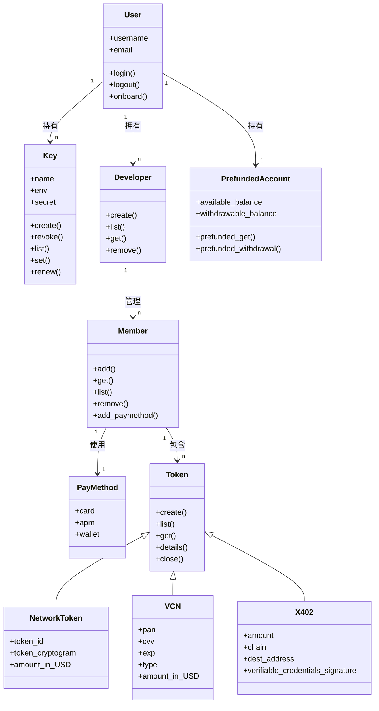

# AgentToken CLI 设计规范与数据模型

> 本文档整理自 AgentToken（Agenzo）产品的原始 CLI 设计稿，翻译为中文并补充背景说明。
> AgentToken 是一个 Agent 支付中间件，通过 `agent-token-admin` CLI 工具管理用户、密钥、成员和支付凭证。
> 建议先阅读 01（支付基础）和 04（AgentToken 产品分析）后再看本文。

---

## 一、数据模型总览

AgentToken 的核心设计思想是三层分离：User 管账号合规，Member 管支付责任，Token 管具体凭证。



### 1.1 层级关系

```text
User（用户账号）
  ├── Developer（开发者/应用）
  │     └── Member（成员 — 真正绑定支付方式、发起交易的实体）
  │           ├── PayMethod（支付方式，当前默认信用卡）
  │           └── Token（支付凭证）
  │                 ├── VCN（一次性虚拟卡：卡号 + CVV + 有效期）
  │                 ├── NetworkToken（网络令牌：令牌 ID + 动态密码）
  │                 └── X402（稳定币凭证：金额 + 链 + 目标地址 + VC 签名）
  ├── Key（API 密钥，用于程序化调用）
  └── PrefundedAccount（预充值账户，用于收取佣金/分润）
```

### 1.2 各层职责

| 层级 | 职责 | 为什么需要这一层 |
|------|------|-----------------|
| User | 账号管理、KYC/KYB 合规、API Key 管理、计费 | 企业需要统一管理入口，合规要求有明确的法律实体 |
| Developer | 应用隔离，一个用户可以有多个应用 | 不同业务线（如国内旅行 vs 海外旅行）需要独立管理 |
| Member | 绑定支付方式、承担支付责任 | 合规要求：每笔支付必须有可追责的真人（详见 04 文档"Token 持有者必须是人"） |
| Token | 实际支付凭证，带策略约束 | 最小权限原则：Agent 只拿到它需要的能力，用完即废 |

### 1.3 User（用户）

用户分两种类型，对应不同的合规流程：

| 类型 | 说明 | 合规流程 |
|------|------|---------|
| 个人用户 | 个人开发者或独立使用者 | KYC（身份证件 + 活体检测 + 风险筛查） |
| 企业用户 | 公司或组织 | KYB（营业执照 + 股权穿透 + UBO 的 KYC） |

User 是系统概念，不直接参与交易。要发起交易，必须在 User 下创建 Member。

User 拥有三类子对象：
1. Developer：可创建多个应用，每个应用独立管理
2. Key：API 密钥，不同应用可以用不同的密钥
3. PrefundedAccount：预充值账户，用于接收佣金或分润

### 1.4 Member（成员）

Member 是真正绑定支付方式、发起交易的实体。可以理解为"有支付能力的人或 Agent"。

关键规则：
- 每个 Member 必须绑定至少一种支付方式（当前阶段默认信用卡）
- Member 可以持有多个 Token（VCN、Network Token、X402 VC）
- Member 归属于某个 Developer
- 新增 Member 时，如果对方没有 AgentToken 账号，系统会发送 Magic Link 邀请注册

### 1.5 Token（支付凭证）

Token 是 Agent 实际用来付款的凭证，有三种类型：

| 类型 | 说明 | 适用场景 | 关键字段 |
|------|------|---------|---------|
| VCN | 一次性虚拟 Visa/Mastercard 卡 | 电商购物、SaaS 订阅 | PAN（卡号）、CVV、有效期、金额上限 |
| NetworkToken | 卡组织网络令牌 | 跨平台支付、高安全场景 | 令牌 ID、动态 Cryptogram、金额 |
| X402 | 稳定币可验证凭证 | Agent 间微支付、API 按次计费 | 金额、链（如 Base）、目标地址、VC 签名 |

详细的技术原理参见 01 文档（第二章 Tokenization、第九章稳定币）和 04 文档（竞品对比）。

---

## 二、CLI 工具：`agent-token-admin`

`agent-token-admin` 是 AgentToken 的主要管理工具，通过命令行完成用户管理、密钥管理、成员管理和 Token 操作。

### 2.1 前置条件

用户需要先在 [www.agenzo.ai](http://www.agenzo.ai) 注册账号，完成 KYC/KYB 后才能使用 CLI。

### 2.2 命令分组

| 命令组 | 说明 | 认证方式 |
|--------|------|---------|
| `login` / `logout` | 用户认证（Magic Link 或 API Key） | — |
| `developer` | 创建和管理开发者应用 | 需要登录 |
| `keys` | 创建、列出、切换、撤销、轮换 API 密钥 | 需要登录 |
| `members` | 添加、列出、移除成员 | 需要登录 |
| `token` | 创建、列出、查看、关闭支付凭证 | 需要 API Key |

全局选项：

```bash
-V, --version   # 显示版本号
-h, --help      # 显示帮助信息
```

### 2.3 认证：login / logout

#### 登录（Magic Link 方式）

```bash
$ agent-token-admin login
? 请输入邮箱地址: alice@example.com
✓ Magic Link 已发送到 alice@example.com
  请检查收件箱并点击链接继续...
⠋ 等待验证中...
✓ 已登录为 alice@example.com
  凭证已保存到 ~/.agent-cards-admin.json
```

#### 登录（API Key 方式）

```bash
$ agent-token-admin login -apikey "sk_test_xxx"
✓ 已登录为 alice@example.com
```

#### 登出

```bash
$ agent-token-admin logout
# 清除所有本地存储的凭证
```

### 2.4 开发者管理：developer

#### 创建开发者

```bash
$ agent-token-admin developer create
? 组织名称: Acme Inc
? 计费邮箱: billing@acme.com
? 确认创建 "Acme Inc" (billing@acme.com)? Yes
✓ 开发者已创建

  ID    org_abc123
  Name  Acme Inc
  Email billing@acme.com

? 是否为该开发者创建 API Key? Yes

  沙箱模式 — 所有 API Key 均为沙箱环境 (sk_test_*)

? Key 名称 (如 "production", "ci-pipeline"): dev-key
✓ API Key 已创建

  ⚠️ 警告：请立即保存此 Key，之后将无法再次查看。

  Key    sk_test_a1b2c3d4e5f6...
  ID     key_abc123
  Prefix sk_test_a1b2
  Name   dev-key
```

#### 列出开发者

```bash
$ agent-token-admin developer list
┌──────────────┬──────────┬──────────────────┬────────┬────────────┐
│ ID           │ 名称     │ 计费邮箱         │ 状态   │ 创建时间   │
├──────────────┼──────────┼──────────────────┼────────┼────────────┤
│ org_abc123   │ Acme Inc │ billing@acme.com │ active │ 3/1/2026   │
│ org_def456   │ Beta Co  │ team@beta.co     │ active │ 3/5/2026   │
└──────────────┴──────────┴──────────────────┴────────┴────────────┘
```

#### 查看开发者详情

```bash
# 交互式选择
$ agent-token-admin developer get

# 或直接传 ID
$ agent-token-admin developer get org_abc123

  ID            org_abc123
  Name          Acme Inc
  Billing Email billing@acme.com
  Status        active
  Members       3
  API Keys      2
  Created       3/1/2026, 12:00:00 PM
```

### 2.5 API Key 管理：keys

API Key 用于程序化调用 AgentToken API（如创建 Token）。Key 格式为 `sk_test_*`（沙箱）或 `sk_live_*`（生产）。

#### 创建 Key

```bash
$ agent-token-admin keys create
? 选择开发者: Acme Inc (billing@acme.com)
? Key 名称: dev-key
✓ API Key 已创建

  ⚠️ 警告：请立即保存此 Key，之后将无法再次查看。

  Key    sk_test_a1b2c3d4e5f6...
  ID     key_abc123
  Prefix sk_test_a1b2
  Name   dev-key

  此 Key 已设为当前活跃 Key。
```

非交互式：`agent-token-admin keys create --user org_abc123 --name "dev-key"`

#### 列出 Key

```bash
$ agent-token-admin keys list --user org_abc123
┌─────────────┬──────────────┬─────────┬────────┬───────────┬────────────┐
│ ID          │ Prefix       │ 名称    │ 状态   │ 最后使用  │ 创建时间   │
├─────────────┼──────────────┼─────────┼────────┼───────────┼────────────┤
│ key_abc123  │ sk_test_a1b2 │ dev-key │ active │ 3/10/2026 │ 3/1/2026   │
│ key_def456  │ sk_test_x9y8 │ ci      │ active │ never     │ 3/5/2026   │
└─────────────┴──────────────┴─────────┴────────┴───────────┴────────────┘
```

#### 切换活跃 Key

```bash
# 交互式
$ agent-token-admin keys set

# 非交互式
$ agent-token-admin keys set --key sk_test_a1b2c3d4e5f6...
```

Key 解析优先级：`--key` 参数 > 本地存储的活跃 Key > 交互式选择 > 手动粘贴

#### 撤销 Key

```bash
$ agent-token-admin keys revoke
? 选择开发者: Acme Inc
? 选择要撤销的 Key: sk_test_a1b2 — dev-key
? 确认撤销？此操作不可逆。 Yes
✓ Key sk_test_a1b2 已撤销
```

撤销后立即失效，自动从本地存储中移除。

#### 轮换 Key

```bash
$ agent-token-admin keys renew
? 选择开发者: Acme Inc
? 选择要轮换的 Key: sk_test_a1b2 — dev-key
? 确认轮换？旧 Key 将立即失效。 Yes
✓ Key 已轮换

  ⚠️ 警告：请立即保存此 Key。

  Key    sk_test_n3w4k3y5...
  ID     key_ghi789
  Name   dev-key

  新 Key 已设为当前活跃 Key。
```

旧 Key 立即失效，新 Key 自动设为活跃。

### 2.6 成员管理：members

#### 添加成员

```bash
$ agent-token-admin members add
? 选择开发者: Acme Inc (billing@acme.com)
? 成员邮箱: bob@acme.com
? 将 bob@acme.com 添加为管理员? Yes
✓ 成员已添加

  Member ID mem_abc123
  Email     bob@acme.com
  Pay_ID    pay_evo_xxx
  Role      admin
```

如果对方没有 AgentToken 账号：

```bash
  未找到 new@acme.com 的账号
? 发送注册邀请? Yes
✓ 邀请已发送，成员已添加

  new@acme.com 将收到 Magic Link 完成注册设置。
  设置包括：1. 添加支付方式  2. 完成 KYC 验证
```

非交互式：`agent-token-admin members add --org org_abc123 --email bob@acme.com`

#### 列出成员

```bash
$ agent-token-admin members list --user org_abc123
┌─────────────┬──────────────────┬────────┬────────────┐
│ ID          │ 邮箱             │ 角色   │ 添加时间   │
├─────────────┼──────────────────┼────────┼────────────┤
│ mem_abc123  │ alice@acme.com   │ owner  │ 3/1/2026   │
│ mem_def456  │ bob@acme.com     │ admin  │ 3/5/2026   │
└─────────────┴──────────────────┴────────┴────────────┘
```

#### 移除成员

```bash
$ agent-token-admin members remove
? 选择开发者: Acme Inc
? 选择要移除的成员: bob@acme.com (admin)
? 确认移除? Yes
✓ bob@acme.com 已移除
```

### 2.7 Token 管理：token

Token 操作需要 API Key 认证（不是登录认证）。

#### 创建 Token

支持三种类型：`token-card`（VCN）、`token-network`（Network Token）、`token-x402`（X402 VC）

```bash
$ agent-token-admin token-card create
? API key: sk_test_a1b2c3d4e5f6...
? 选择成员: Alice Smith (alice@example.com)
? 金额（美元）: 10.00
? 确认创建 $10.00 限额的虚拟卡? Yes
✓ Token 已创建

  ID          cm3abc123
  类型        VCN
  尾号        4242
  有效期      03/28
  余额        $10.00
  消费限额    $10.00
  状态        OPEN
```

如果成员未绑定支付方式：

```bash
✗ 该成员未绑定支付方式，请先完成设置。
```

#### 列出 Token

```bash
$ agent-token-admin token list
┌─────────────┬────────┬────────┬─────────┬─────────────┬────────────┐
│ ID          │ 尾号   │ 状态   │ 余额    │ 消费限额    │ 创建时间   │
├─────────────┼────────┼────────┼─────────┼─────────────┼────────────┤
│ cm3abc123   │ 4242   │ OPEN   │ $7.50   │ $10.00      │ 3/10/2026  │
│ cm3def456   │ 1234   │ CLOSED │ $0.00   │ $25.00      │ 3/8/2026   │
└─────────────┴────────┴────────┴─────────┴─────────────┴────────────┘
```

#### 查看 Token 摘要

```bash
$ agent-token-admin token get
? 选择 Token: **** 4242 | OPEN | $7.50

  ID          cm3abc123
  类型        VCN
  尾号        4242
  有效期      03/28
  余额        $7.50
  消费限额    $10.00
  状态        OPEN
  创建时间    3/10/2026, 12:00:00 PM
```

#### 查看 Token 敏感信息

```bash
$ agent-token-admin token details
? 选择 Token: **** 4242 | OPEN | $7.50

  ⚠️ 警告：以下为敏感卡片数据，请勿分享或记录。

  ID          cm3abc123
  类型        VCN
  PAN         4242424242424242
  CVV         123
  有效期      03/28
  余额        $7.50
  消费限额    $10.00
  状态        OPEN
```

也可以直接传 ID：`agent-token-admin token-card details cm3abc123`

#### 关闭 Token

关闭后不可恢复，未消费的预扣金额自动释放。

```bash
$ agent-token-admin token close
? 选择要关闭的 Token: **** 4242 | $7.50
? 确认关闭？此操作不可逆。 Yes
✓ Token 已关闭

  ID     cm3abc123
  状态   CLOSED
```

也可以直接传 ID：`agent-token-admin token close cm3abc123`

---

## 三、设计亮点与行业对比

### 3.1 CLI 优先的开发者体验

AgentToken 选择 CLI 作为主要管理工具，这在支付行业不常见但很聪明：

- AI Agent 开发者习惯命令行操作
- CLI 天然适合自动化和 CI/CD 集成
- Magic Link 登录降低使用门槛（无需记密码）
- 交互式 + 非交互式两种模式兼顾人工操作和脚本调用

### 3.2 与同类产品的 CLI/API 对比

| 维度 | AgentToken CLI | Stripe CLI | AgentCard.sh API |
|------|---------------|------------|-----------------|
| 认证方式 | Magic Link + API Key | API Key | Bearer Token |
| 交互式操作 | ✅ 完整的交互式提示 | ✅ | ❌ 纯 REST API |
| 多环境支持 | `sk_test_*` / `sk_live_*` | `sk_test_*` / `sk_live_*` | `sk_test_*` |
| Key 轮换 | ✅ `keys renew` | ✅ Dashboard | ❌ 需手动 |
| 多令牌类型 | ✅ VCN + NetworkToken + X402 | 仅虚拟卡 | 仅虚拟卡 |
| 成员管理 | ✅ 邀请 + KYC 流程 | ✅ Team 管理 | ✅ Cardholder |

### 3.3 设计决策解读

1. User → Developer → Member 三层模型：对应 01 文档第七章的详细分析。核心原因是合规要求（每笔支付必须追溯到真人）和业务隔离需求（不同应用独立管理）。

2. Token 操作用 API Key 而非登录认证：因为 Token 操作通常由 Agent 程序化调用，不适合交互式登录。API Key 可以嵌入代码或环境变量。

3. 沙箱模式默认：所有新创建的 Key 都是 `sk_test_*`，开发者可以安全测试全流程。这是支付行业的标准做法（Stripe 也是如此）。

4. PrefundedAccount（预充值账户）：为未来的佣金/分润场景预留。当 Agent 帮用户完成购买后，平台可以从中抽取佣金。

---

## 四、相关文档

- 支付基础知识 → `01-支付与Agent支付知识深度详解.md`（四方模型、Tokenization、KYC/KYB）
- AgentToken 产品分析 → `04-AgentToken产品设计分析与竞品对比.md`（层级模型、策略引擎、竞品对比）
- Agent 支付协议 → `02-Agent协议/05-Agent支付协议.md`（ACP/AP2/x402/Mastercard Agent Pay）
- Agent 发卡 SaaS 赛道 → `04` 文档第 5 节（AgentCard/Ramp/Slash/Crossmint 等）
