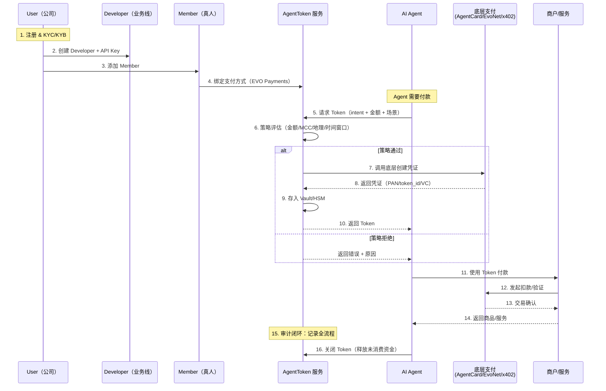
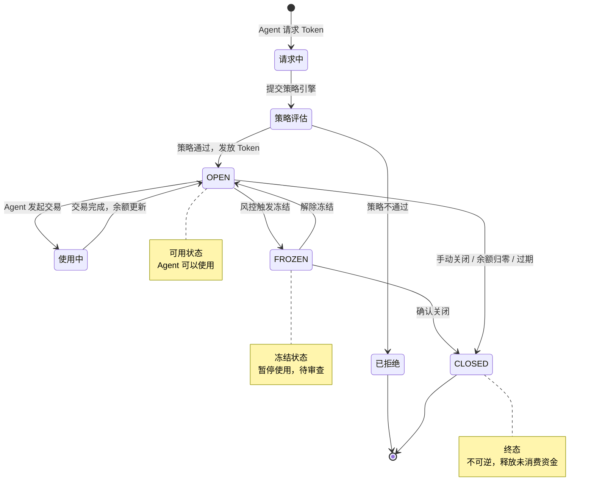
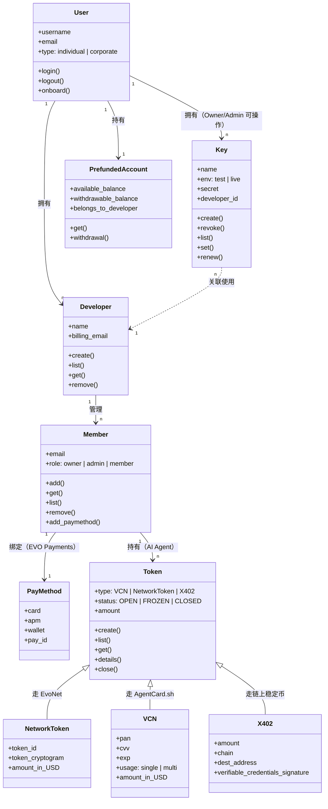
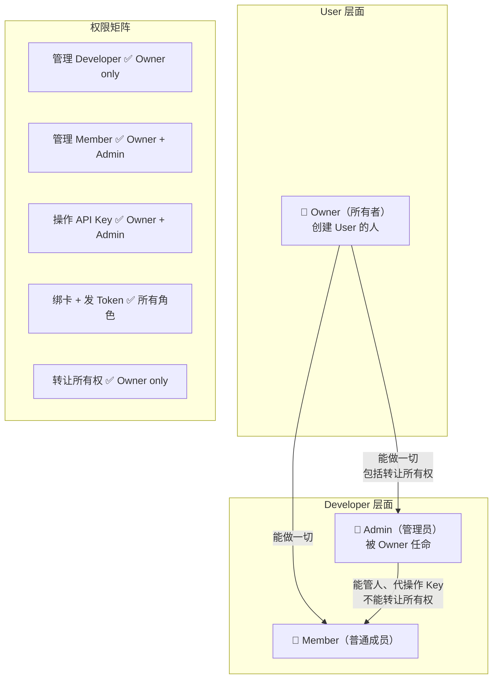

# AgentToken CLI 设计规范与数据模型分析

> Author: Walter Wang
>
> 本文档基于 AgentToken（Token Issuance Service）的产品蓝图和 CLI 设计草案，
> 分析其数据模型、CLI 工具设计和底层技术实现。
> AgentToken 是一个 Agent 支付中间件——让 AI Agent 能安全地帮人花钱。
> 建议先阅读 01（支付基础）和 04（AgentToken 产品分析）后再看本文。
>
> 声明：本文为第三方产品分析学习笔记，所有内容基于公开可获取的信息整理。

---

## 一、AgentToken 是什么？

用一句话说：AgentToken 坐在"用户的真实支付方式"和"AI Agent 的支付请求"之间，
提供一个统一的、可控的、可审计的 Token 发放层。

```text
你对 Agent 说："帮我在亚马逊买一本《AI Agent 实战》，预算 50 美元。"

Agent 需要做什么？
  1. 它需要一张"信用卡"去亚马逊结账
  2. 但不能用你的真实信用卡（万一 Agent 被劫持，你的卡就暴露了）
  3. 所以需要一张"一次性虚拟卡"，限额 50 美元，用完即废
  4. 这张虚拟卡的钱从哪来？从你绑定的真实信用卡扣
  5. 出了问题谁负责？你负责（你授权了这笔支付）

AgentToken 就是解决这个问题的中间件：
  你的真实信用卡 → AgentToken → 生成受限支付凭证 → Agent 拿去付款
```

AgentToken 要解决的四个核心问题（蓝图原文）：

1. 授权边界不清：给 Agent 完整的卡/账户访问权限不安全、不可控
2. 场景高度碎片化：网络令牌、虚拟卡、稳定币凭证各有不同的能力和约束
3. 问责和审计能力弱：无法结构化地还原"谁授权了什么、为了什么意图、在什么策略下"
4. 协议碎片化：MCP、UCP 等标准还在演进，支付需要一个协议友好的中间层

---

## 二、数据模型

### 2.1 层级关系

```text
User（公司/个人账户 —— 顶层管理实体）
  ├── Developer（业务线/应用，可以有多个）
  │     └── Member（真人，绑定支付方式，承担支付责任）
  │           ├── PayMethod（真实支付方式：信用卡/APM/钱包）
  │           └── Token（给 AI Agent 的支付凭证，可以有多个）
  │                 ├── VCN（一次性虚拟信用卡）
  │                 ├── NetworkToken（卡组织网络令牌）
  │                 └── X402（稳定币可验证凭证）
  ├── Key（API 密钥）
  └── PrefundedAccount（预充值账户）
```

### 2.2 每一层解决什么问题

```text
为什么不能只有 User + Token 两层？为什么要搞四层？

因为支付行业有严格的合规要求，加上多业务线管理的实际需求，
每一层都有存在的理由：
```

**User（账户层）—— 解决"谁在用这个系统"**

```text
→ 这是顶层管理实体，可以是个人，也可以是公司
→ 个人用户：完成 KYC（身份证 + 人脸识别）
→ 企业用户：完成 KYB（营业执照 + 股权穿透 + 实际控制人验证）
→ 类比：公司在银行开户，公司本身不刷卡，但管理谁能刷卡

关键设计：User 本身不参与交易生命周期！
  蓝图原文："user is a system concept. It doesn't involve any transaction lifecycle."
  User 的职责只有三个：管理 API Key、管理 Developer、管理计费。
  如果 User 想发起交易，必须先在 User 下面创建 Member。

  注意：蓝图中有一句 "add a payment method to this User"，
  这里的意思不是 User 本身绑卡，而是"在 User 账户下创建 Member，由 Member 绑定支付方式"。
  User（公司）不能绑卡，只有 Member（真人）才能绑卡。
  数据模型中 PayMethod 挂在 Member 下面，不是 User 下面。

为什么这样设计？
  1. 管理权和支付权分离——公司 CEO 管账户，但不一定亲自刷卡
  2. 合规要求——支付行为必须追溯到具体的真人（Member），不能只追溯到公司（User）
  3. 多人协作——一个公司下可以有多个 Member，各自独立绑卡和管理 Token
```

**Developer（业务线层）—— 解决"哪个业务在花钱"**

```text
→ 一个 User（公司）可以有多个 Developer（业务线/应用）
→ 旅行助手 Agent 花了多少？购物助手 Agent 花了多少？
→ 每个 Developer 独立管理自己的 Member
→ PrefundedAccount 也可以按 Developer 维度分配预算
→ 类比：公司有多个部门，每个部门独立预算和人员

为什么需要这一层？（对比 AgentCard.sh）
  AgentCard.sh 的模型是 Organization → Cardholder → Card，没有 Developer 层。
  这对个人开发者或单一业务场景够用了。
  但企业客户需要多业务线管理：

  Acme Inc（User）
    ├── 旅行助手（Developer A）
    │     ├── 张三（Member）→ 绑定公司信用卡 → 发 Token 给旅行 Agent
    │     └── 李四（Member）→ 绑定个人信用卡 → 发 Token 给旅行 Agent
    └── 采购助手（Developer B）
          └── 王五（Member）→ 绑定企业账户 → 发 Token 给采购 Agent

  如果没有 Developer 层，所有 Member 和 Token 都混在一个 User 下面，
  企业客户很难做精细化管理。

  Developer 层带来的好处：
    1. 独立计费：旅行助手花了多少、采购助手花了多少，一目了然
    2. 独立管理：不同业务线的 Member 互不干扰
    3. 独立审计：出了问题可以精确定位到哪个业务线
    4. 独立预算：PrefundedAccount 可以按 Developer 维度分配
```

**Member（责任层）—— 解决"谁为这笔钱负责"**

```text
→ 这是整个模型中最关键的一层！
→ 合规要求：每笔支付必须追溯到一个真人
→ Agent 不是法律主体，不能为支付负责
→ 必须有一个人说"我授权了这笔支付，出了问题我负责"
→ 类比：部门里有权刷公司卡的员工

蓝图原文："the token holder must be a human"

每个 Member 必须满足两个条件：
  1. 绑定至少一种支付方式（信用卡/APM/钱包，通过 EVO Payments 系统）
  2. 完成 KYC 身份验证

一个 Member 可以持有多个 Token（即多个 AI Agent）。
蓝图原文："Members can hold multiple AI agents."

Member 有两种角色：
  Admin：管理成员，代为操作 User 层面的 API Key，不能转让所有权
  Member：只读访问支付方式，不能管人，不能碰 API Key
```

**Member 角色设计详解：RBAC 权限模型**

先搞清楚一个关键问题：**API Key 属于谁？**

```text
API Key 属于 User（公司账户），不属于任何 Member。
但不同角色的 Member 对 API Key 有不同的操作权限。

这和 Stripe 的设计一模一样：
  Stripe 的 API Key 属于 Account（账户）
  Administrator 角色可以创建/删除 API Key
  Developer 角色也可以创建/删除 API Key
  Analyst 角色不能碰 API Key
  → Key 始终属于 Account，角色只决定"谁有权操作"

AgentToken 的设计：
  API Key 属于 User（公司账户）
  Admin 角色可以代为创建/撤销 API Key
  Member 角色不能碰 API Key
  → Key 始终属于 User，角色只决定"谁有权操作"

类比：
  公司的门禁系统（API Key）属于公司（User）
  部门经理（Admin）被授权可以帮公司申请/注销门禁卡
  但门禁卡属于公司，不属于经理个人
  普通员工（Member）没有这个权限
```

用一个完整的例子来说明。假设 Acme Inc 的老板创建了"采购助手"这个 Developer，
然后加了三个人进来：

```text
Acme Inc（User）—— 拥有 API Key
  └── 采购助手（Developer）
        ├── 张三（Admin）—— 财务总监，老板任命的管理员
        ├── 李四（Member）—— 采购员
        └── 王五（Member）—— 采购员

各自能做什么：

张三（Admin）：
  ✅ 添加新成员（招了新采购员赵六，可以直接加进来）
  ✅ 移除成员（李四离职了，可以把他踢出去）
  ✅ 代为操作 API Key（帮公司创建/撤销 Key，Key 属于 Acme Inc）
  ✅ 绑定自己的信用卡
  ✅ 给 Agent 创建 Token
  ❌ 不能删除整个"采购助手"这个业务线
  ❌ 不能把"采购助手"转让给别的公司

李四 / 王五（Member）：
  ✅ 绑定自己的信用卡
  ✅ 给 Agent 创建 Token
  ✅ 只能看到自己绑定的支付方式（看不到张三和王五的卡）
  ❌ 不能添加/移除任何人
  ❌ 不能操作 API Key（Key 是 User 层面的资源，Member 角色无权触碰）
```

```text
为什么李四不能有 Admin 权限？

  场景 1：李四不小心撤销了 API Key
    → API Key 属于 User（Acme Inc），影响的是整个公司的 Agent 服务
    → 所有正在运行的 Agent 突然拿不到 Token 了
    → 采购流程全部中断

  场景 2：李四和王五闹矛盾，李四把王五移除了
    → 王五绑定的卡上还有正在使用的 Token
    → 归属关系乱了，审计说不清楚

  场景 3：李四离职前把张三降级了
    → 没人能管理这个业务线了

  所以李四只需要做两件事：绑自己的卡 + 给 Agent 发 Token。
  其他管理操作，交给张三（Admin）来做。

为什么张三（Admin）不能转让所有权？

  蓝图特意写了 "Cannot transfer ownership"。
  这意味着还有一个隐含的第三级角色：Owner（所有者）。
  Owner 是创建这个 User 的人（通常是公司老板或 CTO）。

  三级权限对应企业里的真实权限结构：
    Owner（老板）→ 能做一切，包括删除业务线、转让所有权
    Admin（部门经理）→ 能管人、代操作 Key，但不能动业务线本身
    Member（普通员工）→ 只能管自己（绑卡、发 Token）

  类比：
    老板能卖掉整个部门
    部门经理能管部门里的人，能帮公司申请门禁卡，但不能卖部门
    普通员工只能干自己的活
```

**与 Stripe RBAC 的对比**

```text
| AgentToken 角色 | Stripe 对应角色              | 能管人 | 能管 Key | 能管支付 | 能转让 |
|----------------|------------------------------|--------|---------|---------|--------|
| Owner（隐含）   | Super Admin                  | ✅     | ✅      | ✅      | ✅     |
| Admin          | Administrator                | ✅     | ✅      | ✅      | ❌     |
| （暂无）        | Developer（Stripe 的角色名）  | ❌     | ✅      | ✅      | ❌     |
| Member         | Analyst                      | ❌     | ❌      | ✅      | ❌     |

注意：这里 Stripe 的 "Developer" 是一个权限角色的名字，
不是 AgentToken 数据模型里的 Developer（业务线/应用）层。
两者名字相同但含义完全不同：
  → Stripe Developer 角色 = 能管 API Key 但不能管人的工程师
  → AgentToken Developer 层 = User 下面的业务线/应用（如旅行助手、采购助手）

Stripe 的 Developer 角色适合开发工程师：
  → 需要创建/查看 API Key 来做集成开发
  → 但不需要管理团队成员
  → AgentToken 目前没有这个角色，Admin 同时管人和管 Key
  → 如果未来需要让工程师独立管理 Key 而不给 Admin 权限，
    可以考虑加入类似角色（建议命名避开 "Developer"，防止和数据模型混淆）

关键共同点：
  1. API Key 都属于账户（User / Account），不属于个人
  2. 角色只决定"操作权限"，不决定"资源归属"
  3. 最高权限（Owner / Super Admin）才能转让所有权
  4. 管人和管 Key 是高权限操作，普通角色不能碰
```

**Token（凭证层）—— 解决"Agent 拿什么去付款"**

```text
→ 最小权限原则：Agent 只拿到它需要的能力
→ 限额 50 美元的虚拟卡 → Agent 最多花 50 美元
→ 用完即废 → 即使泄露也没用
→ 根据商家接受什么，选择不同的 Token 类型（VCN / NetworkToken / X402）
→ 类比：给保姆一张限额购物卡，而不是把银行卡给她

Token 的生命周期：
  创建 → 策略评估（金额/MCC/地理/时间窗口）→ 发放 → Agent 使用 → 关闭/过期
  全程可审计、可撤销、可冻结

为什么 Token 挂在 Member 下面而不是 Developer 下面？
  因为每笔支付必须追溯到真人。
  Token 的资金来源是 Member 绑定的支付方式，
  所以 Token 必须归属于 Member，而不是 Developer。
  Developer 只是管理维度，Member 才是支付责任主体。
```

### 2.3 层级关系总结：谁管谁、谁负责什么

```text
User（公司）
  → 管理 Developer、Key、计费
  → 不参与交易

Developer（业务线）
  → 管理 Member
  → 独立计费和审计

Member（真人）
  → 绑定支付方式
  → 持有 Token（AI Agent）
  → 承担支付责任

Token（AI Agent 的支付凭证）
  → 受限的一次性凭证
  → 资金来源 = Member 的支付方式
  → 三种类型对应三种底层网络（见 2.6）

一句话总结：
  公司（User）开账户 → 建业务线（Developer）→ 加人（Member）→ 人绑卡 → 给 Agent 发凭证（Token）
```

### 2.4 其他关键对象的设计

**Key（API 密钥）—— 归属关系**

```text
类图中 Key 挂在 User 下面（User "1" --> "n" Key）。
但 CLI 中 keys create 要选择 Developer。这不矛盾吗？

不矛盾。设计意图是：
  → Key 在系统层面属于 User（User 是 Key 的所有者）
  → 但 Key 在使用时关联到 Developer（一个 Key 用于一个业务线）
  → 一个 User 可以为不同的 Developer 创建不同的 Key

这样做的好处：
  1. User 层面可以统一管理所有 Key（列出、撤销、轮换）
  2. Developer 层面可以用不同的 Key 做权限隔离
  3. 如果一个 Developer 的 Key 泄露，不影响其他 Developer

类比：公司（User）统一管理所有门禁卡（Key），
      但每张卡只能进特定部门（Developer）的门。
```

**PayMethod（支付方式）—— 绑定流程**

```text
每个 Member 必须绑定至少一种支付方式，否则无法创建 Token。

支持的支付方式类型：
  1. card（信用卡/借记卡）—— 当前阶段的默认方式
  2. apm（替代支付方式，如银行转账等）
  3. wallet（钱包）

绑定流程：
  → Member 通过 Developer Portal 或 API 接口绑定
  → 底层通过 EVO Payments 系统完成支付方式的验证和存储
  → 绑定成功后，Member 获得一个 Pay_ID（EVO Payments 的 recurring ID）
  → 后续创建 Token 时，资金从这个支付方式预扣

为什么绑定在 Member 而不是 User 或 Developer？
  → 合规要求：支付方式必须绑定到具体的真人
  → 一个公司（User）的不同员工（Member）可以绑定不同的卡
  → 张三用公司信用卡，李四用个人信用卡，各自独立
```

**PrefundedAccount（预充值账户）—— 预算控制**

```text
PrefundedAccount 是一个可选能力，用于两种场景：

场景 1：给 Agent 设定预算上限
  → 给某个 Developer 分配一笔预充值余额（如 $1000）
  → 该 Developer 下的所有 Token 请求，只能在余额范围内
  → 余额用完就不能再创建新 Token
  → 蓝图原文："Assign a prefunded account per agent;
    the agent requests tokens strictly within the available balance."

场景 2：佣金/分润
  → Agent 帮用户买了东西 → 平台从中抽取佣金
  → 佣金进入 PrefundedAccount
  → 可以提现（withdrawal）

PrefundedAccount 的属性：
  → available_balance：可用余额（USD）
  → withdrawable_balance：可提现余额（USD）
  → 归属维度：蓝图中挂在 User 下面，
    但早期草案的类图中 PrefundedAccount 有 "Belongs_to_which_developer" 字段，
    说明实际使用时可以按 Developer 维度分配
```

**个人用户 vs 企业用户**

```text
AgentToken 支持两种用户类型，层级结构相同，区别在于：

| 维度 | 个人用户 | 企业用户 |
|------|---------|---------|
| 身份验证 | KYC（个人身份证明） | KYB（企业营业执照 + 股权穿透） |
| 支付方式 | 个人信用卡/借记卡 | 企业账户，可覆盖子账户/子卡 |
| 定价 | 免费层 + 月度订阅 | 定制化定价，线下协商 |
| 配额 | 免费层 20 次 Token 请求，付费层 50/100 次 | 可配置，支持组织层级 |
| 审计 | 基础 | 完整（合规和争议处理） |

蓝图原文：
  "The individual user refers to an individual person...
   While a corporate user refers to a company or an organization,
   the hierarchy level is the same."
```

### 2.5 Token 的策略评估（Policy Engine）

```text
Token 不是随便发的。每次创建 Token 时，AgentToken 会做策略评估：

Agent 请求 Token（带上 intent + scenario + risk parameters）
       |
       v
  [策略评估引擎]
  - 金额是否在限额内？
  - 商户类别（MCC）是否允许？
  - 地理位置是否允许？
  - 时间窗口是否有效？
  - 频率是否超限？
  - 一次性还是可复用？
  - Member 的支付方式是否有效？
  - PrefundedAccount 余额是否充足？
       |
   +---+---+
   |       |
  通过    拒绝
   |       |
 发放    返回错误
 Token   + 原因

蓝图原文：
  "The service evaluates policy (limits, time window,
   merchant/category constraints, one-time vs reusable, etc.)
   and issues purpose-specific tokens."

这个策略引擎是 AgentToken 相比 AgentCard.sh 的另一个差异化：
  → AgentCard.sh 靠预付模式控制（单卡 ≤$500，用完即废）
  → Stripe Issuing for Agents 靠 Webhook 实时审批
  → AgentToken 规划的是服务端策略引擎，在 Token 发放前就做评估
```

### 2.6 三种 Token 类型与底层实现

这是 AgentToken 最核心的差异化——一个统一接口，对接三种底层支付网络。

```text
AgentToken 不是自己做发卡或做链上结算，
而是作为中间层统一封装三种底层能力：

┌─────────────────────────────────────────────┐
│           AgentToken 统一接口                 │
│  token-card / token-network / token-x402     │
└──────┬──────────────┬──────────────┬─────────┘
       │              │              │
       ▼              ▼              ▼
  AgentCard.sh    EvoNet API     x402 协议
  (Stripe发卡)   (网络令牌)     (链上稳定币)
       │              │              │
       ▼              ▼              ▼
  Visa/MC网络    Visa/MC TSP    Base/USDC
```

#### 2.6.1 VCN（一次性虚拟信用卡）

```text
底层实现：AgentCard.sh（基于 Stripe Issuing）
底层 API：https://api.agentcard.sh/api/v1

工作原理：
  1. AgentToken 调用 AgentCard.sh API 创建虚拟 Visa 卡
  2. AgentCard.sh 通过 Stripe Issuing 发卡
  3. 资金从 Member 的支付方式预扣（PaymentIntent Hold，不立即扣款）
  4. Agent 拿到卡号去商户网站结账
  5. 商户发起扣款时，Hold 的资金被 Capture
  6. 用完关卡，未消费的 Hold 自动释放

底层 API 调用流程：
  创建：POST /api/v1/cards
    请求：{ spendLimitCents: 5000, cardholderId: "ch_abc123" }
    响应：{ id, last4, expiry, spendLimitCents, balanceCents, status: "OPEN" }

  获取敏感信息：GET /api/v1/cards/{id}/details
    响应：{ pan: "4242424242424242", cvv: "123", expiry: "03/28", ... }
    ⚠️ 每次调用都有审计日志

  关卡：DELETE /api/v1/cards/{id}
    → 不可逆，未消费的 Hold 自动释放

AgentToken 封装后暴露给开发者的字段：
  → pan（卡号）、cvv（安全码）、exp（有效期）
  → type: single（一次性）或 multi（多次使用）
  → amount_in_USD（消费限额）

约束和限制：
  → 单卡上限 $500（AgentCard.sh 的限制）
  → 仅支持 Visa 网络
  → 预付模式：不可能超支（资金已预扣）
  → 卡号是静态的（虽然一次性，但在有效期内卡号不变）

适合场景：
  ✅ 电商购物（亚马逊、eBay 等）
  ✅ SaaS 订阅（一次性试用）
  ✅ 任何接受信用卡的在线商户
  ❌ 不适合微支付（卡网络有最低手续费）
  ❌ 不适合 Agent 间交易（对方不是商户）
```

#### 2.6.2 NetworkToken（卡组织网络令牌）

```text
底层实现：EvoNet（EVO Payment）Network Token Management
底层 API：https://docs.everonet.com

工作原理：
  1. AgentToken 调用 EvoNet API，用 Member 的真实卡号申请网络令牌
  2. EvoNet 向 Visa/Mastercard Token Service（TSP）请求 Token 化
  3. TSP 返回一个 token_id（替代卡号）+ 域控制信息
  4. 每次交易时，AgentToken 调用 EvoNet 获取一次性 cryptogram（动态密码）
  5. Agent 用 token_id + cryptogram 发起交易（不接触真实卡号）
  6. 商户的支付网关用 token_id + cryptogram 向卡组织请求授权

底层 API 调用流程：
  申请令牌：POST /paymentMethod
    请求：{
      networkTokenOnly: true,
      paymentMethod.type: "card",
      paymentMethod.card: { cardSource: "PAN", ... },
      userInfo: { email: "...", locale: "en_US" }
    }
    响应：{ paymentMethod.status, paymentMethod.networkToken: { tokenID, ... } }

  获取动态密码：POST /cryptogram
    请求：{
      paymentMethod.type: "networkToken",
      paymentMethod.networkToken.tokenID: "tok_xxx"
    }
    响应：{ cryptogram.status, paymentMethod.networkToken: { cryptogram, ... } }
    ⚠️ 每次交易都要重新获取 cryptogram

  删除令牌：DELETE /paymentMethod?networkTokenID=tok_xxx
    → 令牌状态变为 INACTIVE

  异步通知：
    → tokenUpdate：令牌状态变更（如卡片换卡、过期）
    → paymentMethod：令牌申请成功/失败
    → Cryptogram：动态密码生成完成

AgentToken 封装后暴露给开发者的字段：
  → token_id（网络令牌 ID，替代真实卡号）
  → token_cryptogram（一次性动态密码）
  → amount_in_USD（消费限额）

与 VCN 的关键区别：
  → VCN 给 Agent 一个"假卡号"（PAN），卡号是静态的
  → NetworkToken 给 Agent 一个"令牌 ID + 动态密码"，每次交易密码都不同
  → NetworkToken 更安全：即使 token_id 泄露，没有 cryptogram 也无法交易

约束和限制：
  → 商户的支付网关必须支持 Visa/Mastercard Token 化
  → 不是所有商户都支持（中小商户可能不支持）
  → 需要 EvoNet 作为中间方
  → 令牌有生命周期管理（换卡、过期等需要处理异步通知）

适合场景：
  ✅ 大型电商平台（支持 Token 化的支付网关）
  ✅ 高安全要求的交易（不暴露任何卡号）
  ✅ 重复交易场景（同一商户多次购买，令牌可复用）
  ❌ 不适合不支持 Token 化的小商户（退回用 VCN）
  ❌ 不适合微支付（仍然走卡网络，有手续费）
```

#### 2.6.3 X402（稳定币可验证凭证）

```text
底层实现：x402 协议（Coinbase 主导的开放标准）
底层链：Base（Coinbase L2）、Solana 等支持智能合约的链
结算币种：USDC（稳定币）

工作原理：
  1. Agent 向目标服务发送 HTTP 请求
  2. 服务端返回 HTTP 402 Payment Required + 支付要求（JSON）
  3. Agent 用钱包私钥签名支付授权
  4. Agent 重新发送请求，附带 PAYMENT-SIGNATURE 头
  5. 服务端验证签名 → 链上结算（USDC 转账）→ 返回资源

x402 支付流程详解：
  步骤 1：Agent → 服务端：GET /api/market-data
  步骤 2：服务端 → Agent：HTTP 402 + 支付要求
    {
      "maxAmountRequired": "0.10",        // 最多 $0.10
      "resource": "/api/market-data",     // 请求的资源
      "payTo": "0xABC...",                // 收款地址
      "asset": "USDC",                   // 支付币种
      "network": "base-mainnet"          // 链网络
    }
  步骤 3：Agent 签名支付授权（Ed25519 或 ECDSA）
  步骤 4：Agent → 服务端：GET /api/market-data + PAYMENT-SIGNATURE 头
  步骤 5：服务端验证签名 → 调用 Facilitator /verify → /settle
  步骤 6：链上 USDC 转账确认
  步骤 7：服务端 → Agent：HTTP 200 + 数据 + PAYMENT-RESPONSE 头

AgentToken 封装后暴露给开发者的字段：
  → amount（支付金额）
  → chain（链网络，如 base-mainnet、solana-mainnet）
  → dest_address（收款地址）
  → verifiable_credentials_signature（签名后的可验证凭证）

与 VCN/NetworkToken 的根本区别：
  → VCN 和 NetworkToken 走传统卡网络（Visa/Mastercard）
  → X402 走区块链（Base/Solana），用稳定币结算
  → 完全不同的支付轨道，覆盖传统卡网络无法触达的场景

x402 的核心优势：
  → 无最低手续费：链上交易费 ~$0.00025，可以做亚美分级微支付
  → 无需商户接入：任何 HTTP 服务都可以用 402 状态码收费
  → 无需账户体系：不需要 API Key、订阅、KYC
  → 即时结算：Solana ~400ms，Base 几秒
  → 可编程授权：支付条件可以写在凭证里（金额、过期时间、用途）

约束和限制：
  → 需要加密钱包（Agent 需要持有 USDC）
  → 对方服务必须支持 x402 协议
  → 目前生态还在早期（但增长很快，已有 1.6 亿+ 笔交易）
  → 不适合传统商户（亚马逊不接受 x402）
  → 监管不确定性（各国对稳定币支付的态度不同）

适合场景：
  ✅ Agent 间 API 调用（Agent A 调用 Agent B 的能力并付费）
  ✅ 按次计费的 API 服务（每次请求 $0.01）
  ✅ 数据/内容微支付（按篇付费、按条付费）
  ✅ MCP 工具调用付费
  ❌ 不适合传统电商（商户不支持）
  ❌ 不适合大额交易（稳定币流动性和监管风险）
```

#### 2.6.4 三种类型对比总结

| 维度 | VCN | NetworkToken | X402 |
| ---- | --- | ------------ | ---- |
| 底层 | AgentCard.sh / Stripe Issuing | EvoNet / Visa·MC TSP | 链上稳定币 |
| 支付轨道 | 传统卡网络 | 传统卡网络 | 区块链 |
| Agent 拿到什么 | PAN + CVV + Expiry | token_id + cryptogram | 签名凭证 |
| 安全性 | 中（静态卡号） | 高（动态密码） | 高（链上验证） |
| 最低交易额 | 有（卡网络手续费） | 有（卡网络手续费） | 几乎无（~$0.00025） |
| 商户要求 | 接受信用卡即可 | 需支持 Token 化 | 需支持 x402 |
| 适合 | 通用电商 | 高安全卡支付 | Agent 间微支付 |
| 单笔上限 | $500 | 取决于卡额度 | 取决于钱包余额 |
| 结算速度 | T+1~T+3（卡网络） | T+1~T+3（卡网络） | 秒级（链上） |

```text
选择决策树：
  商家接受什么？
    ├─ 只接受信用卡
    │   ├─ 支持 Token 化 → NetworkToken（更安全，走 EvoNet）
    │   └─ 不支持 → VCN（万能兜底，走 AgentCard.sh）
    └─ 接受 x402 / 稳定币
        └─ X402（最适合 Agent 间微支付）
```

### 2.7 资金池运作机制：钱从哪来？

不管是 VCN 还是 X402，AgentToken 都需要一个"资金池"来支撑 Token 的发放。
两种 Token 类型的资金池形态不同，但运作模式是一样的：**总池子 → 创建临时凭证 → Agent 使用 → 回收剩余 → 销毁凭证**。

#### 2.7.1 VCN 的资金池（Stripe Issuing Balance）

```text
什么是 Stripe Issuing Balance？
  → 这是 AgentToken 在 Stripe 里的一个法币（美元）余额账户
  → 法币 = 法定货币 = 政府发行的钱（美元、欧元、人民币等）
  → 和你银行账户里的美元一样，是真实的钱，不是加密货币
  → 每次创建虚拟卡时，Stripe 从这个余额里冻结对应金额

VCN 的完整资金流：

  Member 的真实信用卡
       │
       │ ① Member 绑卡时不扣钱，只是验证卡有效
       │
       ▼
  AgentToken 内部账本（记录 Member 的可用额度）
       │
       │ ② 创建 Token 时，AgentToken 做两件事：
       │    a. 内部账本：冻结 Member 的额度（member_available → member_held）
       │    b. Stripe Issuing：从 Issuing Balance 创建虚拟卡
       │
       ▼
  Stripe Issuing Balance（AgentToken 的法币资金池）
       │
       │ ③ Agent 拿虚拟卡去商家消费
       │    Stripe 从 Issuing Balance 扣款给商家
       │
       ▼
  商家收到钱

  ④ 关卡时：
     Stripe 释放未消费的冻结金额回 Issuing Balance
     AgentToken 内部账本释放 Member 的冻结额度

  ⑤ 定期结算：
     AgentToken 从 Member 的真实信用卡扣款，补充 Issuing Balance

Issuing Balance 的钱从哪来？三种方式：

  方式 A：AgentToken 自己垫资
    → 先往 Issuing Balance 充一笔钱（如 $10,000）
    → 每次发虚拟卡从池子里扣
    → 定期从 Member 的真实信用卡收款补充
    → 风险：AgentToken 需要垫资，有资金压力
    → 好处：发卡速度快

  方式 B：实时从 Member 扣款
    → 创建虚拟卡时，先从 Member 的信用卡扣款
    → 扣款成功后资金进入 Issuing Balance
    → 再创建虚拟卡
    → 风险：Member 的卡可能扣款失败
    → 好处：不用垫资

  方式 C：PrefundedAccount 预充值
    → Member 先充值到 AgentToken 的 PrefundedAccount
    → 创建虚拟卡时从 PrefundedAccount 扣减
    → AgentToken 用这笔钱补充 Issuing Balance
    → 风险：最小（钱已经在手里了）
    → 好处：发卡快、无垫资、无扣款失败风险

  实际生产中大概率是混合模式：
    → 企业客户用 PrefundedAccount（先充值）
    → 个人用户用实时扣款（方式 B）
    → AgentToken 维护 Issuing Balance 的最低水位线
```

#### 2.7.2 X402 的资金池（链上钱包）

```text
X402 的资金池是一个链上钱包，里面存的是 USDC（稳定币，1 USDC ≈ 1 美元）。

X402 有三种设计方案：

方案 A：总钱包直接付款（不创建临时钱包）

  AgentToken 总钱包（$10,000 USDC）
       │
       │ Agent 需要付 $0.10
       │ 直接从总钱包转 $0.10 USDC 到服务方
       │
       ▼
  服务方收到 $0.10

  优点：简单
  缺点：总钱包私钥暴露风险大，泄露就全丢

方案 B：创建临时钱包（推荐，和 VCN 思路一致）

  AgentToken 总钱包（$10,000 USDC）
       │
       │ ① 创建 X402 Token（$10 额度）
       │    创建临时钱包 → 转 $10 USDC 进去
       │
       ▼
  临时钱包（$10 USDC）
       │
       │ ② Agent 用临时钱包付 $0.10
       │ ③ 再付 $0.05
       │ ④ 任务完成，关闭 Token
       │    剩余 $9.85 转回总钱包
       │    销毁临时钱包私钥
       │
       ▼
  总钱包收回 $9.85

  优点：安全隔离（最多丢 $10）、审计清晰、和 VCN 设计一致
  缺点：多两笔 Gas 费（转入 + 转回）

方案 C：智能合约授权（不转账，只授权）

  AgentToken 总钱包（$10,000 USDC）
       │
       │ ① 通过 USDC 合约的 approve 功能
       │    授权临时地址最多可以花 $10
       │
       │ ② Agent 用临时地址调用 transferFrom
       │    从总钱包转 $0.10 给服务方
       │
       │ ③ 任务完成，撤销授权
       │
       ▼
  总钱包余额：$9,999.85

  优点：省 Gas（不需要转入转回）
  缺点：临时地址私钥泄露可花掉授权额度

推荐方案 B（临时钱包），因为和 VCN 的设计思路完全一致。

X402 资金池的钱从哪来？详见 09 文档第五章：
  → 方案一：交易所购买 USDC
  → 方案二：OTC 大宗购买
  → 方案三：法币入金 API（Circle / MoonPay）
  → 方案四：预充值模式（平台预购 USDC，用户付法币给平台）
```

#### 2.7.3 统一模型：VCN 和 X402 本质上是一样的

```text
不管是 VCN 还是 X402，资金流的模式完全一样：

  VCN：
    Issuing Balance（法币资金池）
      → 创建虚拟卡（临时凭证，限额 $50）
        → Agent 拿虚拟卡去商家刷卡
          → 关卡，未消费金额回到 Issuing Balance

  X402（方案 B）：
    总钱包（USDC 资金池）
      → 创建临时钱包（临时凭证，转入 $50 USDC）
        → Agent 拿临时钱包去链上付款
          → 销毁临时钱包，剩余 USDC 回到总钱包

  统一模型：
    总池子 → 创建临时受限凭证 → Agent 使用 → 回收剩余 → 销毁凭证

  对比表：
  | 维度 | VCN | X402 |
  |------|-----|------|
  | 资金池形态 | Stripe Issuing Balance（法币/美元） | 链上钱包（USDC/稳定币） |
  | 临时凭证 | 虚拟信用卡（PAN + CVV） | 临时钱包（私钥 + 地址） |
  | 充值方式 | 银行转账 / Stripe 内部转入 | 交易所购买 USDC / 法币入金 API |
  | 创建凭证时 | 从 Balance 冻结金额 | 从总钱包转 USDC 到临时钱包 |
  | Agent 消费时 | Stripe 从 Balance 扣款给商家 | 临时钱包链上转账给服务方 |
  | 关闭凭证时 | 释放冻结金额回 Balance | 剩余 USDC 转回总钱包 |
  | 结算速度 | T+1~T+3 | 秒级 |
  | 退款 | 可以（卡组织争议） | 不可逆 |

  在 AgentToken 的内部账本里，两种模式的记账方式也是一样的：
    创建 Token：member_available → member_held（冻结）
    Agent 消费：member_held → system_settlement（扣款）
    关闭 Token：member_held → member_available（释放剩余）
    详见 10 文档第三章"复式账本系统"
```

---

## 三、CLI 工具：`agent-token-admin`

### 3.1 完整流程

```text
步骤 1：注册并登录
  → 在 agenzo.ai 注册 User 账号（完成 KYC/KYB）
  $ agent-token-admin login
  → Magic Link 邮箱验证

步骤 2：创建业务线（Developer）
  $ agent-token-admin developer create
  → 输入名称和计费邮箱 → 创建 API Key

步骤 3：添加成员（Member）
  $ agent-token-admin members add
  → 成员绑定支付方式（EVO Payments）→ 完成 KYC

步骤 4：创建 Token
  $ agent-token-admin token-card create    # → 调用 AgentCard.sh API
  $ agent-token-admin token-network create # → 调用 EvoNet API
  $ agent-token-admin token-x402 create    # → 生成链上凭证

步骤 5：Agent 使用 Token 付款
  $ agent-token-admin token details <id>
  → VCN：返回 PAN/CVV/Expiry
  → NetworkToken：返回 token_id/cryptogram
  → X402：返回 verifiable_credentials/signature

步骤 6：关闭 Token
  $ agent-token-admin token close <id>
```

### 3.2 命令速查表

| 命令组 | 做什么 | 认证方式 |
| ------ | ------ | ------- |
| `login` / `logout` | 登录登出 | Magic Link 或 API Key |
| `developer` | 管理业务线（创建/列出/查看/删除） | 需要登录 |
| `keys` | 管理 API Key（创建/列出/切换/撤销/轮换） | 需要登录 |
| `members` | 管理成员（添加/列出/查看/移除） | 需要登录 |
| `token` | 管理 Token（创建/列出/查看详情/关闭） | 需要 API Key |

### 3.3 认证

```bash
# Magic Link 登录
$ agent-token-admin login
? Enter your email address: alice@example.com
✓ Magic link sent to alice@example.com
  Check your inbox and click the link to continue...
✓ Signed in as alice@example.com
  Credentials saved to ~/.agent-token-admin.json

# 如果已登录
$ agent-token-admin login
? You are already logged in as alice@example.com. Log out first? Yes

# API Key 登录（适合脚本/CI）
$ agent-token-admin login -apikey "sk_test_xxx"

# 登出
$ agent-token-admin logout
```

### 3.4 Developer 管理

```bash
# 创建
$ agent-token-admin developer create
? Organization name: Acme Inc
? Billing email: billing@acme.com
✓ Developer created
  ID    org_abc123
  Name  Acme Inc
  Email billing@acme.com

? Create an API key for this developer? Yes
  SANDBOX MODE — All API keys are sandbox-only (sk_test_*)
✓ API key created
  WARNING: Save this key now. You will not see it again.
  Key    sk_test_a1b2c3d4e5f6...

# 列出
$ agent-token-admin developer list

# 查看详情
$ agent-token-admin developer get org_abc123
```

### 3.5 API Key 管理

Key 格式：`sk_test_*`（沙箱）/ `sk_live_*`（生产）。默认沙箱。

```bash
agent-token-admin keys create                          # 创建（会提示选择 Developer）
agent-token-admin keys list --user org_abc123          # 列出
agent-token-admin keys set                             # 切换活跃 Key
agent-token-admin keys renew                           # 轮换（旧 Key 立即失效）
agent-token-admin keys revoke                          # 撤销（不可逆）
```

Key 解析优先级：`--key` 参数 > 本地存储 > 交互式选择 > 粘贴输入

### 3.6 Member 管理

Member 有两种角色：

| 角色 | 权限 |
| ---- | ---- |
| Admin | 管理成员，代为操作 User 层面的 API Key，不能转让所有权 |
| Member | 只读访问支付方式，不能管人，不能碰 API Key |

```bash
# 添加成员
$ agent-token-admin members add
? Select developer: Acme Inc (billing@acme.com)
? Member email: bob@acme.com
✓ Member added
  Member ID mem_abc123
  Email     bob@acme.com
  Role      admin

# 对方没有账号时自动发邀请
  No account found for new@acme.com
? Send them an invite to sign up? Yes
✓ Invite sent and member added
  # 对方需完成：1. 绑定支付方式（EVO Payments）2. KYC

# 列出 / 移除
$ agent-token-admin members list --user org_abc123
$ agent-token-admin members remove

# 非交互式
$ agent-token-admin members add --org org_abc123 --email bob@acme.com
```

### 3.7 Token 管理

三种类型创建用不同子命令，查询/关闭用统一命令。

```bash
# ===== 创建 =====
$ agent-token-admin token-card create      # VCN → 调用 AgentCard.sh
$ agent-token-admin token-network create   # NetworkToken → 调用 EvoNet
$ agent-token-admin token-x402 create      # X402 → 链上凭证

# VCN 创建示例
$ agent-token-admin token-card create
? API key: sk_test_a1b2c3d4e5f6...
? Select member: Alice Smith (alice@example.com)
? Amount in dollars (e.g. 5.00): 10.00
? Create a token with $10.00 spend limit? Yes
✓ Token created
  ID          cm3abc123
  Type        VCN
  Last 4      4242
  Expiry      03/28
  Balance     $10.00
  Spend Limit $10.00
  Status      OPEN

# Member 没绑支付方式时
✗ Member has no payment method. Set one up first.

# ===== 查询 =====
$ agent-token-admin token list
$ agent-token-admin token get cm3abc123
$ agent-token-admin token details cm3abc123   # 含敏感数据

# details 返回内容因类型而异：
#   VCN：PAN + CVV + Expiry
#   NetworkToken：token_id + cryptogram
#   X402：amount + chain + dest_address + VC signature

# ===== 关闭 =====
$ agent-token-admin token close cm3abc123     # 不可逆，未消费金额释放
```

---

## 四、技术流程（蓝图 Section 6）

### 4.1 端到端支付流程



### 4.2 后端五步流程

```text
1. 卡/账户 Token 化
   → VCN：通过 AgentCard.sh 创建虚拟卡
   → NetworkToken：通过 EvoNet POST /paymentMethod 申请网络令牌
   → X402：生成链上可验证凭证

2. 安全存储
   → 敏感底层 Token 存入 Vault/HSM
   → 业务层只操作引用 + 策略，不接触原始卡号

3. 策略评估与发放
   → 评估场景参数和策略（金额、频率、商户、MCC、地理、时间窗口、一次性/可复用）
   → 发放目的特定的 Token

4. 使用与召回
   → Agent 使用 Token 交易
   → 需要时撤销/冻结/降低限额

5. 审计闭环
   → 记录意图、授权、发放、使用、结果和异常
   → 用于合规和争议处理
```

### 4.3 Token 生命周期



---

## 五、设计亮点与行业对比

### 5.1 与竞品对比

| 维度 | AgentToken | AgentCard.sh | Stripe Issuing for Agents | Ramp Agent Cards |
| ---- | ---------- | ------------ | ------------------------- | ---------------- |
| 定位 | 多令牌类型中间层 | 轻量级虚拟卡 | Stripe 生态发卡 | 企业费控 |
| 层级 | User→Developer→Member→Token | Org→Cardholder→Card | Account→Cardholder→Card | Company→User→Card |
| 令牌类型 | VCN + NetworkToken + X402 | 仅 VCN | 仅 VCN | 仅 VCN |
| 策略引擎 | 规划中 | ❌ 靠预付 | ✅ Webhook 审批 | ✅ 策略 Agent |
| 微支付 | ✅ X402 | ❌ | ❌ | ❌ |
| 多业务线 | ✅ Developer 层 | ❌ | ❌ | ✅ Department |
| 底层 | EvoNet + AgentCard + 链上 | Stripe Issuing | Stripe Issuing | Visa |

### 5.2 关键设计决策

```text
1. "Token 持有者必须是人"
   合规要求：每笔支付必须追溯到真人。
   Agent 不是法律主体，不能为支付负责。

2. User 不参与交易
   管理权和支付权分离。公司管账户，员工刷卡。

3. 统一接口，三种底层
   开发者不需要分别对接 EvoNet、AgentCard.sh、x402 协议。
   一个 CLI / API 搞定，大幅降低集成复杂度。

4. 沙箱模式默认
   新 Key 都是 sk_test_*，安全测试全流程。

5. Token 操作用 API Key 认证
   Agent 程序化调用，不适合交互式登录。

6. PrefundedAccount
   可选能力：给 Agent 分配预充值余额，
   Agent 只能在余额范围内请求 Token。
```

---

## 六、数据模型详图

### 6.1 核心类图



### 6.2 RBAC 权限模型



---

## 七、相关文档

- 支付基础知识 → `01-支付与Agent支付知识深度详解.md`
- AgentToken 产品分析 → `04-AgentToken产品设计分析与竞品对比.md`
- Agent 支付协议 → `02-Agent协议/05-Agent支付协议.md`
- AgentCard.sh 官方文档 → [docs.agentcard.sh](https://docs.agentcard.sh/)（VCN 底层）
- EvoNet 官方文档 → [docs.everonet.com](https://docs.everonet.com/en-us/gateway/developer-portal/online/network-token-management)（NetworkToken 底层）
- x402 协议 → [chainstack.com/x402-protocol](https://chainstack.com/x402-protocol-for-ai-agents/)（X402 底层）
- Stripe Issuing for Agents → [docs.stripe.com/issuing/agents](https://docs.stripe.com/issuing/agents)（行业参考）
