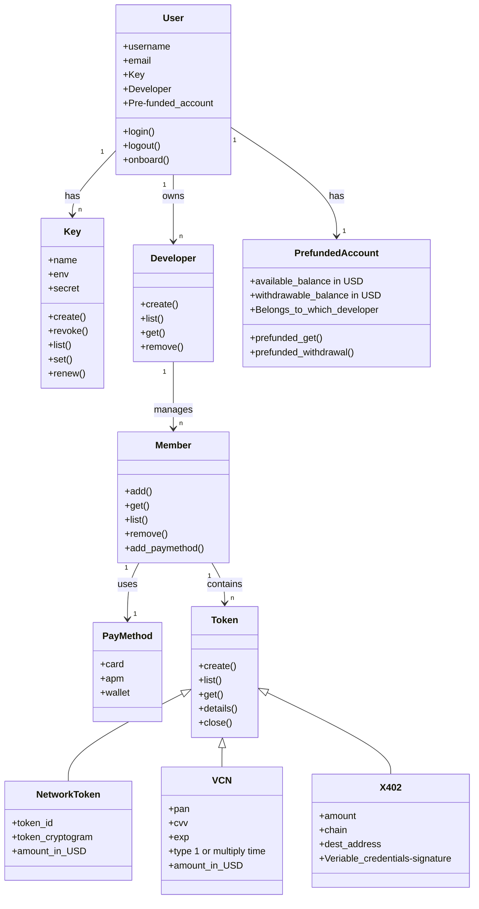

# Markdown CLI interface

## 1.  Structure overview



### 1.1 Users

In our design, we have two types of users:

1. Individual users
2. Corporate users

The individual user refers to an individual person who can create tokens and other things in his/her account. While a corporate user refers to a company or an organization, the hierarchy level is the same. There are different KYC or KYB processes that apply to individual users and corporate users.

So here, "user" is a system concept. It doesn't involve any transaction lifecycle. If a user is created with an agent token and they want to perform transactions, they must create a member under that user.

- Users has three objects:
    1. developers: Users can create multiple apps which belongs to different developer
    2. keys: Users may hold multiple keys for different developers
    3. pre-funded_account: user holds this account for receive money / commissions

### 1.2 Member

- member is a the real user/agents under one developer,  users can create members under specified developers.
- each member must have at least one payment methods, in this phase, the payment method defaults to credit card(objects)
- member can have multiple  tokens , like vcn, network token or x402 verifiable credentials
- members belongs to Developer objects

## 2. Command Line Interface

The **`agent-token-admin`** CLI is the primary tool for managing your AgentToken account. It handles Users setup, API key management, and other operations. 

### 2.1 Preparations

User need to login to website = [www.agenzo.ai](http://www.agenzo.ai) to register an User account, 

### 2.2 Command line group

The command includes several categories: 

| **Group** | **Description** | **Auth** |
| --- | --- | --- |
| **`login`** / **`logout`** | Authenticate with Agent Token | — |
| **`developer`** | Create and manage developers | Login |
| **`keys`** | Create, list, set, revoke, and rotate API keys | Login |
| **`members`** | Add, list, and remove org members from users  | Login |
| **`token`** | Create, list, inspect, and close virtual cards | API key |

Global Options 

```jsx
-V, --version   Show version number
-h, --help      Show help for any command
```

Use **`--help`** on any subcommand for details:

### 2.3. Login/logout (authentication)

#### Login

Login action can be done via a magic link 

```jsx
agent-token-admin login 
```

Example 

```jsx
$ agent-token-admin login
? Enter your email address: alice@example.com
✓ Magic link sent to alice@example.com
  Check your inbox and click the link to continue...
⠋ Waiting for verification...
✓ Signed in as alice@example.com
  Credentials saved to ~/.agent-cards-admin.json
```

if already logged in, the CLI will ask if you want to logot first:

```jsx
$ agent-token-admin login
? You are already logged in as alice@example.com. Log out first? Yes
? Enter your email address: bob@example.com
✓ Magic link sent to bob@example.com
```

api key login 

```jsx
$ agent-token-admin login -apikey "xxx"
? Signed in as alice@example
```

#### Logout

when user logout, it will clear all stored credentials 

### 2.4 Developer

#### 2.4.1 Developer Creation

Creates a new user. Prompts for the developer name and billing email, then offers to create an API key.

```jsx
agent-token-admin developer create
```

Example

```jsx
$ agent-token-admin developer create
? Organization name: Acme Inc
? Billing email: billing@acme.com
? Create user "Acme Inc" (billing@acme.com)? Yes
✓ developer created

  ID    org_abc123
  Name  Acme Inc
  Email billing@acme.com

? Create an API key for this user? Yes

  SANDBOX MODE — All API keys are sandbox-only (sk_test_*)

? Key name (e.g. "production", "ci-pipeline"): dev-key
? Create sandbox API key "dev-key" for this org? Yes
✓ API key created

  WARNING: Save this key now. You will not see it again.

  Key    sk_test_a1b2c3d4e5f6...
  ID     key_abc123
  Prefix sk_test_a1b2
  Name   dev-key
```

#### 2.4.2 developer List

List all users in the ENV

```jsx
agent-token-admin developer list
```

Example 

```jsx
$ agent-token-admin orgs list
┌──────────────┬──────────┬──────────────────┬────────┬────────────┐
│ ID           │ Name     │ Billing Email    │ Status │ Created    │
├──────────────┼──────────┼──────────────────┼────────┼────────────┤
│ org_abc123   │ Acme Inc │ billing@acme.com │ active │ 3/1/2026   │
│ org_def456   │ Beta Co  │ team@beta.co     │ active │ 3/5/2026   │
└──────────────┴──────────┴──────────────────┴────────┴────────────┘
```

#### 2.4.3 Users Get

Show details of a developer

```jsx
agent-token-admin developer get
```

example

```jsx
$ agent-token-admin developer get
? Select users: Acme Inc (billing@acme.com)

  ID            org_abc123
  Name          Acme Inc
  Billing Email billing@acme.com
  Status        active
  Members       3
  API Keys      2
  Created       3/1/2026, 12:00:00 PM
  Updated       3/10/2026, 9:30:00 AM
```

Users can also get by developer id , like 

```mermaid
agent-token-admin developer get org_abc123
```

### 2.5 API Keys

#### 2.5.1 keys create

Create a new API key

Creates a new sandbox API key for an user. You are prompted to select the user and name the key. The key is displayed once — save it immediately.

```jsx
agent-token-admin keys create
```

example

```jsx
$ agent-token-admin keys create

  SANDBOX MODE — All API keys are sandbox-only (sk_test_*)

? Select users: Acme Inc (billing@acme.com)
? Key name (e.g. "production", "ci-pipeline"): dev-key
? Create sandbox API key "dev-key" for this org? Yes
✓ API key created

  WARNING: Save this key now. You will not see it again.

  Key    sk_test_a1b2c3d4e5f6...
  ID     key_abc123
  Prefix sk_test_a1b2
  Name   dev-key

  This key has been set as your active API key.
```

The created key is automatically stored locally and set as your active API key. You can switch keys later with

[**`keys set`**](https://docs.agentcard.sh/cli/keys-set)

.You can also pass options to skip the prompts:

```jsx
agent-token-admin keys create --user org_abc123 --name "dev-key"
```

#### 2.5.2  Keys list

List API keys for an user

Lists all API keys for a given user in a table. Keys are shown with their prefix only (not the full secret).

```jsx
agent-token-admin keys list --user <user-id>
```

Example

```jsx
$ agent-token-admin keys list --user org_abc123

  SANDBOX MODE — All API keys are sandbox-only (sk_test_*)

┌─────────────┬──────────────┬─────────┬────────┬───────────┬────────────┐
│ ID          │ Prefix       │ Name    │ Status │ Last Used │ Created    │
├─────────────┼──────────────┼─────────┼────────┼───────────┼────────────┤
│ key_abc123  │ sk_test_a1b2 │ dev-key │ active │ 3/10/2026 │ 3/1/2026   │
│ key_def456  │ sk_test_x9y8 │ ci      │ active │ never     │ 3/5/2026   │
└─────────────┴──────────────┴─────────┴────────┴───────────┴────────────┘
```

#### 2.5.3 Keys Set

Sets which API key the CLI uses for token and other commands. The active key is stored locally so you don’t need to pass **`--key`** on every command.

```jsx
agent-token-admin keys set

```

it can be done via interactive flow or non-interactive flow 

example

```jsx
$ agent-token-admin keys set
? Select an API key to activate:
  sk_test_a1b2... — dev-key (Acme Inc)
  sk_test_x9y8... — ci-key (Acme Inc)
  Choose from server...
  Enter a different key
```

or in a non-interactive flow

```jsx
agent-token-admin keys set --key sk_test_a1b2c3d4e5f6...
```

Commands that require an API key resolve the key in this order:

1. **`-key`** flag passed to the command
2. Active key stored locally (set via **`keys set`**, **`keys create`**, or **`keys rotate`**)
3. Interactive selection from stored keys (if multiple exist)
4. Paste prompt as a fallback

#### 2.5.4 key revoke

Revokes an API key. You are prompted to select an user and then an active key to revoke. Revoked keys immediately stop working. This cannot be undone.

```jsx
agent-token-admin keys revoke

```

example

```jsx
$ agent-token-admin keys revoke
? Select user: Acme Inc (billing@acme.com)
? Select key to revoke: sk_test_a1b2 — dev-key
? Revoke key sk_test_a1b2 (dev-key)? This cannot be undone. Yes
✓ Key sk_test_a1b2 revoked
```

The revoked key is automatically removed from local storage. If it was the active key, you will be prompted to select a key on the next command that requires one.

#### 2.5.5 keys renew

renew an API key. The old key is revoked and a new one is generated. You are prompted to select an user and key. The old key stops working immediately.

```jsx
agent-token-admin keys renew

```

example

```jsx
$ agent-token-admin keys renew
? Select user: Acme Inc (billing@acme.com)
? Select key to rotate: sk_test_a1b2 — dev-key
? Rotate key sk_test_a1b2 (dev-key)? The old key will stop working immediately. Yes
✓ Key rotated

  WARNING: Save this key now. You will not see it again.

  Key    sk_test_n3w4k3y5...
  ID     key_ghi789
  Prefix sk_test_n3w4
  Name   dev-key

  New key has been set as your active API key.
```

The old key is removed from local storage and the new key is automatically stored and set as your active API key.

### 2.6 Member

#### 2.6.1 member add

Add a member to an developer

Adds a member to an developer by email. If the email doesn’t have an AgentToken account, the CLI offers to send an invite.

The logic is that everyone who accesses the AI Agent token services must complete a setup first.

The key points of the setup are:

1. Adding a payment method
2. Completing the KYC

If a user has already been registered with AI Agent and someone adds them as a member to Useepay, they already have an account. If they do not have an account, we will provide a magic link to them.

```jsx
agent-token-admin members add
```

example

```jsx
$ agent-token-admin members add
? Select user: Acme Inc (billing@acme.com)
? Member email: bob@acme.com
? Add bob@acme.com as admin to this User? Yes
✓ Member added

  Member ID mem_abc123
  Email     bob@acme.com
  Pay_ID    xxxx(evopayment) //recurring id?
  Role      admin
```

If the user doesn’t have an account yet:

```jsx
$ agent-token-admin members add
? Select user: Acme Inc (billing@acme.com)
? Member email: new@acme.com
? Add new@acme.com as admin to this user? Yes
  No account found for new@acme.com
? Send them an invite to sign up? Yes
✓ Invite sent and member added

  Member ID mem_def456
  Email     new@acme.com
  Role      admin

  new@acme.com will receive a magic link to complete setup.
```

You can also pass options to skip the prompts:

```jsx
agent-token-admin members add --org org_abc123 --email bob@acme.com
```

#### 2.6.2 member lists

Lists all members of an user and their roles in a table. If no org ID is provided, you are prompted to select one.

```jsx
agent-token-admin members list

```

example

```jsx
$ agent-token-admin members list
? Select user: Acme Inc (billing@acme.com)
┌─────────────┬──────────────────┬────────┬────────────┐
│ ID          │ Email            │ Role   │ Added      │
├─────────────┼──────────────────┼────────┼────────────┤
│ mem_abc123  │ alice@acme.com   │ owner  │ 3/1/2026   │
│ mem_def456  │ bob@acme.com     │ admin  │ 3/5/2026   │
└─────────────┴──────────────────┴────────┴────────────┘
```

You can also pass the user ID directly:

```jsx
agent-token-admin members list --user org_abc123
```

#### 2.6.3 members remove

Removes a member from an user. You are prompted to select an user and then a member to remove.

```jsx
agent-token-admin members remove
```

example

```mermaid
$ agent-token-admin members remove
? Select organization: Acme Inc (billing@acme.com)
? Select member to remove: bob@acme.com (admin)
? Remove bob@acme.com from this user? Yes
✓ bob@acme.com removed
```

### 2.7 Token

#### 2.7.1 Token Create

Creates a new token. You are prompted to select a **Member** and enter an amount. The **Member** must have a payment method attached. A PaymentIntent hold is placed on their payment method for the token spend limit.

```jsx
agent-token-admin token-{xx} create
```

Here we can provide three types:

1. card: VCC card
2. token: Network token
3. 402: X402

example 

```jsx
$ agent-token-admin token-card/x402/network create
? API key: sk_test_a1b2c3d4e5f6...
? Select member: Alice Smith (alice@example.com)
? Card amount in dollars (e.g. 5.00): 10.00
? Create a card with $10.00 spend limit? Yes
✓ token created

  ID          cm3abc123
	type.       VCC
  Last 4      4242
  Expiry      03/28
  Balance     $10.00
  Spend Limit $10.00
  Status      OPEN
```

if there is no payment method attached 

```jsx
$ agent-token-admin token-{} create
? API key: sk_test_a1b2c3d4e5f6...
? Select Member: Alice Smith (alice@example.com)
? Card amount in dollars (e.g. 5.00): 25.00
✗ Member has no payment method. Set one up first.
```

#### 2.7.2 Token Lists

lists all token under User objects 

```jsx
agent-token-admin token list
```

example

```jsx
$ agent-token-admin token list
┌─────────────┬────────┬────────┬─────────┬─────────────┬────────────┐
│ ID          │ Last 4 │ Status │ Balance │ Spend Limit │ Created    │
├─────────────┼────────┼────────┼─────────┼─────────────┼────────────┤
│ cm3abc123   │ 4242   │ OPEN   │ $7.50   │ $10.00      │ 3/10/2026  │
│ cm3def456   │ 1234   │ CLOSED │ $0.00   │ $25.00      │ 3/8/2026   │
└─────────────┴────────┴────────┴─────────┴─────────────┴────────────┘
```

#### 2.7.3 Token Gets

show token summary

```jsx
agent-token-admin token get
```

example

```jsx
$ agent-token-admin token get
? API key: sk_test_a1b2c3d4e5f6...
? Select token: **** 4242 | OPEN | $7.50

  ID          cm3abc123
  type.       VCC
  Last 4      4242
  Expiry      03/28
  Balance     $7.50
  Spend Limit $10.00
  Status      OPEN
  Created     3/10/2026, 12:00:00 PM
```

#### 2.7.4 Token details

show token details

```jsx
agent-token-admin token details
```

example 

```jsx
$ agent-token-admin token details
? API key: sk_test_a1b2c3d4e5f6...
? Select token: **** 4242 | OPEN | $7.50

  WARNING: Sensitive card data below. Do not share or log this output.

  ID          cm3abc123
  type.       VCC
  PAN         4242424242424242
  CVV         123
  Expiry      03/28
  Last 4      4242
  Balance     $7.50
  Spend Limit $10.00
  Status      OPEN
```

or direct pass id to view details

```jsx
agent-token-admin token-{xx} details cm3abc123
```

#### 2.7.5 Token Close

close a token

Closes a token and revokes it at the provider. Any uncaptured payment hold is cancelled to release funds. This cannot be undone. If no token ID is provided, you are prompted to select from open cards.

```jsx
agent-token-admin token close
```

example

```jsx
$ agent-token-admin token close
? API key: sk_test_a1b2c3d4e5f6...
? Select token to close: **** 4242 | $7.50
? Are you sure you want to close token cm3abc123? This cannot be undone. Yes
✓ Card closed

  ID     cm3abc123
  Status CLOSED
```

or pass id to direct close

```mermaid
agent-token-admin token close cm3abc123
```