## 容器与 bean
‍‍​​​​​​​​​‌​‌​‌‌‌​​​​​​​​​‌‌​​​​‌​​​​​​​​​‌‌​‌‌​​​​​​​​​​​‌‌‌​‌​​​​​​​​​​​‌‌​​‌​‌​​​​​​​​​‌‌‌​​‌​​​​​​​​​​​‌​​​​​​​​​​​​​​‌​‌​‌‌‌​​​​​​​​​‌‌​​​​‌​​​​​​​​​‌‌​‌‌‌​​​​​​​​​​‌‌​​‌‌‌‍‍
> Author: Walter Wang

### 1) 容器接口

- BeanFactory 接口，典型功能有：

  - getBean

- ApplicationContext 接口，是 BeanFactory 的子接口。它扩展了 BeanFactory 接口的功能，如：
  - 国际化
  - 通配符方式获取一组 Resource 资源
  - 整合 Environment 环境（能通过它获取各种来源的配置信息）
  - 事件发布与监听，实现组件之间的解耦

可以看到，我们课上讲的，都是 BeanFactory 提供的基本功能，ApplicationContext 中的扩展功能都没有用到。

#### 演示 1 - BeanFactory 与 ApplicationContext 的区别

##### 代码参考

**com.itheima.a01** 包

#### 收获 💡

通过这个示例结合 debug 查看 ApplicationContext 对象的内部结构，学到：

1. 到底什么是 BeanFactory

   - 它是 ApplicationContext 的父接口
   - 它才是 Spring 的核心容器, 主要的 ApplicationContext 实现都【组合】了它的功能，【组合】是指 ApplicationContext 的一个重要成员变量就是 BeanFactory

2. BeanFactory 能干点啥
   - 表面上只有 getBean
   - 实际上控制反转、基本的依赖注入、直至 Bean 的生命周期的各种功能，都由它的实现类提供
   - 例子中通过反射查看了它的成员变量 singletonObjects，内部包含了所有的单例 bean
3. ApplicationContext 比 BeanFactory 多点啥

   - ApplicationContext 组合并扩展了 BeanFactory 的功能
   - 国际化、通配符方式获取一组 Resource 资源、整合 Environment 环境、事件发布与监听
   - 新学一种代码之间解耦途径，事件解耦

建议练习：完成用户注册与发送短信之间的解耦，用事件方式、和 AOP 方式分别实现

> **_注意_**
>
> - 如果 jdk > 8, 运行时请添加 --add-opens java.base/java.lang=ALL-UNNAMED，这是因为这些版本的 jdk 默认不允许跨 module 反射
> - 事件发布还可以异步，这个视频中没有展示，请自行查阅 @EnableAsync，@Async 的用法

#### 演示 2 - 国际化

```java
public class TestMessageSource {
    public static void main(String[] args) {
        GenericApplicationContext context = new GenericApplicationContext();

        context.registerBean("messageSource", MessageSource.class, () -> {
            ResourceBundleMessageSource ms = new ResourceBundleMessageSource();
            ms.setDefaultEncoding("utf-8");
            ms.setBasename("messages");
            return ms;
        });

        context.refresh();

        System.out.println(context.getMessage("hi", null, Locale.ENGLISH));
        System.out.println(context.getMessage("hi", null, Locale.CHINESE));
        System.out.println(context.getMessage("hi", null, Locale.JAPANESE));
    }
}
```

国际化文件均在 src/resources 目录下

messages.properties（空）

messages_en.properties

```properties
hi=Hello
```

messages_ja.properties

```properties
hi=こんにちは
```

messages_zh.properties

```properties
hi=你好
```

> **_注意_**
>
> - ApplicationContext 中 MessageSource bean 的名字固定为 messageSource
> - 使用 SpringBoot 时，国际化文件名固定为 messages
> - 空的 messages.properties 也必须存在

### 2) 容器实现

Spring 的发展历史较为悠久，因此很多资料还在讲解它较旧的实现，这里出于怀旧的原因，把它们都列出来，供大家参考

- DefaultListableBeanFactory，是 BeanFactory 最重要的实现，像**控制反转**和**依赖注入**功能，都是它来实现
- ClassPathXmlApplicationContext，从类路径查找 XML 配置文件，创建容器（旧）
- FileSystemXmlApplicationContext，从磁盘路径查找 XML 配置文件，创建容器（旧）
- XmlWebApplicationContext，传统 SSM 整合时，基于 XML 配置文件的容器（旧）
- AnnotationConfigWebApplicationContext，传统 SSM 整合时，基于 java 配置类的容器（旧）
- AnnotationConfigApplicationContext，Spring boot 中非 web 环境容器（新）
- AnnotationConfigServletWebServerApplicationContext，Spring boot 中 servlet web 环境容器（新）
- AnnotationConfigReactiveWebServerApplicationContext，Spring boot 中 reactive web 环境容器（新）

另外要注意的是，后面这些带有 ApplicationContext 的类都是 ApplicationContext 接口的实现，但它们是**组合**了 DefaultListableBeanFactory 的功能，并非继承而来

#### 演示 1 - DefaultListableBeanFactory

##### 代码参考

**com.itheima.a02.TestBeanFactory**

#### 收获 💡

- beanFactory 可以通过 registerBeanDefinition 注册一个 bean definition 对象
  - 我们平时使用的配置类、xml、组件扫描等方式都是生成 bean definition 对象注册到 beanFactory 当中
  - bean definition 描述了这个 bean 的创建蓝图：scope 是什么、用构造还是工厂创建、初始化销毁方法是什么，等等
- beanFactory 需要手动调用 beanFactory 后处理器对它做增强
  - 例如通过解析 @Bean、@ComponentScan 等注解，来补充一些 bean definition
- beanFactory 需要手动添加 bean 后处理器，以便对后续 bean 的创建过程提供增强
  - 例如 @Autowired，@Resource 等注解的解析都是 bean 后处理器完成的
  - bean 后处理的添加顺序会对解析结果有影响，见视频中同时加 @Autowired，@Resource 的例子
- beanFactory 需要手动调用方法来初始化单例
- beanFactory 需要额外设置才能解析 ${} 与 #{}

#### 演示 2 - 常见 ApplicationContext 实现

##### 代码参考

**com.itheima.a02.A02**

#### 收获 💡

1. 常见的 ApplicationContext 容器实现
2. 内嵌容器、DispatcherServlet 的创建方法、作用

### 3) Bean 的生命周期

一个受 Spring 管理的 bean，生命周期主要阶段有

1. 创建：根据 bean 的构造方法或者工厂方法来创建 bean 实例对象
2. 依赖注入：根据 @Autowired，@Value 或其它一些手段，为 bean 的成员变量填充值、建立关系
3. 初始化：回调各种 Aware 接口，调用对象的各种初始化方法
4. 销毁：在容器关闭时，会销毁所有单例对象（即调用它们的销毁方法）
   - prototype 对象也能够销毁，不过需要容器这边主动调用

一些资料会提到，生命周期中还有一类 bean 后处理器：BeanPostProcessor，会在 bean 的初始化的前后，提供一些扩展逻辑。但这种说法是不完整的，见下面的演示 1

#### 演示 1 - bean 生命周期

##### 代码参考

**com.itheima.a03** 包

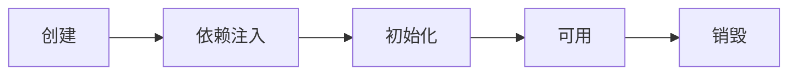

创建前后的增强

- postProcessBeforeInstantiation
  - 这里返回的对象若不为 null 会替换掉原本的 bean，并且仅会走 postProcessAfterInitialization 流程
- postProcessAfterInstantiation
  - 这里如果返回 false 会跳过依赖注入阶段

依赖注入前的增强

- postProcessProperties
  - 如 @Autowired、@Value、@Resource

初始化前后的增强

- postProcessBeforeInitialization
  - 这里返回的对象会替换掉原本的 bean
  - 如 @PostConstruct、@ConfigurationProperties
- postProcessAfterInitialization
  - 这里返回的对象会替换掉原本的 bean
  - 如代理增强

销毁之前的增强

- postProcessBeforeDestruction
  - 如 @PreDestroy

#### 收获 💡

1. Spring bean 生命周期各个阶段
2. 模板设计模式, 指大流程已经固定好了, 通过接口回调（bean 后处理器）在一些关键点前后提供扩展

#### 演示 2 - 模板方法设计模式

##### 关键代码

```java
public class TestMethodTemplate {

    public static void main(String[] args) {
        MyBeanFactory beanFactory = new MyBeanFactory();
        beanFactory.addBeanPostProcessor(bean -> System.out.println("解析 @Autowired"));
        beanFactory.addBeanPostProcessor(bean -> System.out.println("解析 @Resource"));
        beanFactory.getBean();
    }

    // 模板方法  Template Method Pattern
    static class MyBeanFactory {
        public Object getBean() {
            Object bean = new Object();
            System.out.println("构造 " + bean);
            System.out.println("依赖注入 " + bean); // @Autowired, @Resource
            for (BeanPostProcessor processor : processors) {
                processor.inject(bean);
            }
            System.out.println("初始化 " + bean);
            return bean;
        }

        private List<BeanPostProcessor> processors = new ArrayList<>();

        public void addBeanPostProcessor(BeanPostProcessor processor) {
            processors.add(processor);
        }
    }

    static interface BeanPostProcessor {
        public void inject(Object bean); // 对依赖注入阶段的扩展
    }
}
```

#### 演示 3 - bean 后处理器排序

##### 代码参考

**com.itheima.a03.TestProcessOrder**

#### 收获 💡

1. 实现了 PriorityOrdered 接口的优先级最高
2. 实现了 Ordered 接口与加了 @Order 注解的平级, 按数字升序
3. 其它的排在最后

### 4) Bean 后处理器

#### 演示 1 - 后处理器作用

##### 代码参考

**com.itheima.a04** 包

#### 收获 💡

1. @Autowired 等注解的解析属于 bean 生命周期阶段（依赖注入, 初始化）的扩展功能，这些扩展功能由 bean 后处理器来完成
2. 每个后处理器各自增强什么功能
   - AutowiredAnnotationBeanPostProcessor 解析 @Autowired 与 @Value
   - CommonAnnotationBeanPostProcessor 解析 @Resource、@PostConstruct、@PreDestroy
   - ConfigurationPropertiesBindingPostProcessor 解析 @ConfigurationProperties
3. 另外 ContextAnnotationAutowireCandidateResolver 负责获取 @Value 的值，解析 @Qualifier、泛型、@Lazy 等

#### 演示 2 - @Autowired bean 后处理器运行分析

##### 代码参考

**com.itheima.a04.DigInAutowired**

#### 收获 💡

1. AutowiredAnnotationBeanPostProcessor.findAutowiringMetadata 用来获取某个 bean 上加了 @Value @Autowired 的成员变量，方法参数的信息，表示为 InjectionMetadata
2. InjectionMetadata 可以完成依赖注入
3. InjectionMetadata 内部根据成员变量，方法参数封装为 DependencyDescriptor 类型
4. 有了 DependencyDescriptor，就可以利用 beanFactory.doResolveDependency 方法进行基于类型的查找

### 5) BeanFactory 后处理器

#### 演示 1 - BeanFactory 后处理器的作用

##### 代码参考

**com.itheima.a05** 包

- ConfigurationClassPostProcessor 可以解析
  - @ComponentScan
  - @Bean
  - @Import
  - @ImportResource
- MapperScannerConfigurer 可以解析
  - Mapper 接口

#### 收获 💡

1. @ComponentScan, @Bean, @Mapper 等注解的解析属于核心容器（即 BeanFactory）的扩展功能
2. 这些扩展功能由不同的 BeanFactory 后处理器来完成，其实主要就是补充了一些 bean 定义

#### 演示 2 - 模拟解析 @ComponentScan

##### 代码参考

**com.itheima.a05.ComponentScanPostProcessor**

#### 收获 💡

1. Spring 操作元数据的工具类 CachingMetadataReaderFactory
2. 通过注解元数据（AnnotationMetadata）获取直接或间接标注的注解信息
3. 通过类元数据（ClassMetadata）获取类名，AnnotationBeanNameGenerator 生成 bean 名
4. 解析元数据是基于 ASM 技术

#### 演示 3 - 模拟解析 @Bean

##### 代码参考

**com.itheima.a05.AtBeanPostProcessor**

#### 收获 💡

1. 进一步熟悉注解元数据（AnnotationMetadata）获取方法上注解信息

#### 演示 4 - 模拟解析 Mapper 接口

##### 代码参考

**com.itheima.a05.MapperPostProcessor**

#### 收获 💡

1. Mapper 接口被 Spring 管理的本质：实际是被作为 MapperFactoryBean 注册到容器中
2. Spring 的诡异做法，根据接口生成的 BeanDefinition 仅为根据接口名生成 bean 名

### 6) Aware 接口

#### 演示 - Aware 接口及 InitializingBean 接口

##### 代码参考

**com.itheima.a06** 包

#### 收获 💡

1. Aware 接口提供了一种【内置】 的注入手段，例如
   - BeanNameAware 注入 bean 的名字
   - BeanFactoryAware 注入 BeanFactory 容器
   - ApplicationContextAware 注入 ApplicationContext 容器
   - EmbeddedValueResolverAware 注入 ${} 解析器
2. InitializingBean 接口提供了一种【内置】的初始化手段
3. 对比
   - 内置的注入和初始化不受扩展功能的影响，总会被执行
   - 而扩展功能受某些情况影响可能会失效
   - 因此 Spring 框架内部的类常用内置注入和初始化

#### 配置类 @Autowired 失效分析

Java 配置类不包含 BeanFactoryPostProcessor 的情况

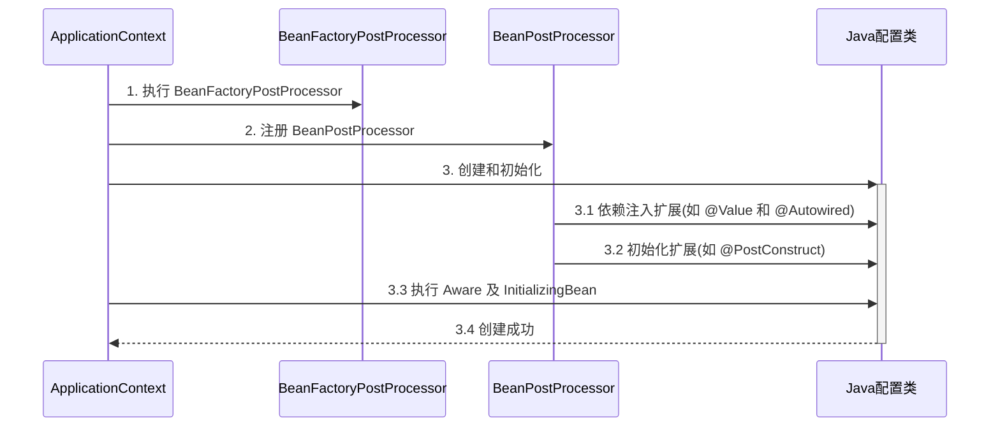

Java 配置类包含 BeanFactoryPostProcessor 的情况，因此要创建其中的 BeanFactoryPostProcessor 必须提前创建 Java 配置类，而此时的 BeanPostProcessor 还未准备好，导致 @Autowired 等注解失效

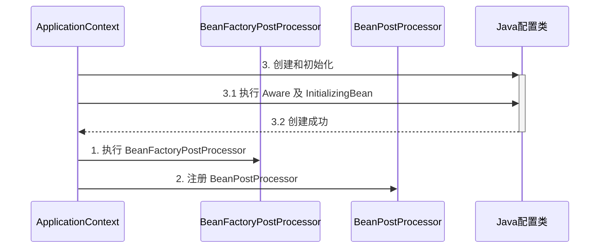

对应代码

```java
@Configuration
public class MyConfig1 {

    private static final Logger log = LoggerFactory.getLogger(MyConfig1.class);

    @Autowired
    public void setApplicationContext(ApplicationContext applicationContext) {
        log.debug("注入 ApplicationContext");
    }

    @PostConstruct
    public void init() {
        log.debug("初始化");
    }

    @Bean //  ⬅️ 注释或添加 beanFactory 后处理器对应上方两种情况
    public BeanFactoryPostProcessor processor1() {
        return beanFactory -> {
            log.debug("执行 processor1");
        };
    }

}
```

> **_注意_**
>
> 解决方法：
>
> - 用内置依赖注入和初始化取代扩展依赖注入和初始化
> - 用静态工厂方法代替实例工厂方法，避免工厂对象提前被创建

### 7) 初始化与销毁

#### 演示 - 初始化销毁顺序

##### 代码参考

**com.itheima.a07** 包

#### 收获 💡

Spring 提供了多种初始化手段，除了课堂上讲的 @PostConstruct，@Bean(initMethod) 之外，还可以实现 InitializingBean 接口来进行初始化，如果同一个 bean 用了以上手段声明了 3 个初始化方法，那么它们的执行顺序是

1. @PostConstruct 标注的初始化方法
2. InitializingBean 接口的初始化方法
3. @Bean(initMethod) 指定的初始化方法

与初始化类似，Spring 也提供了多种销毁手段，执行顺序为

1. @PreDestroy 标注的销毁方法
2. DisposableBean 接口的销毁方法
3. @Bean(destroyMethod) 指定的销毁方法

### 8) Scope

在当前版本的 Spring 和 Spring Boot 程序中，支持五种 Scope

- singleton，容器启动时创建（未设置延迟），容器关闭时销毁
- prototype，每次使用时创建，不会自动销毁，需要调用 DefaultListableBeanFactory.destroyBean(bean) 销毁
- request，每次请求用到此 bean 时创建，请求结束时销毁
- session，每个会话用到此 bean 时创建，会话结束时销毁
- application，web 容器用到此 bean 时创建，容器停止时销毁

有些文章提到有 globalSession 这一 Scope，也是陈旧的说法，目前 Spring 中已废弃

但要注意，如果在 singleton 注入其它 scope 都会有问题，解决方法有

- @Lazy
- @Scope(proxyMode = ScopedProxyMode.TARGET_CLASS)
- ObjectFactory
- ApplicationContext.getBean

#### 演示 1 - request, session, application 作用域

##### 代码参考

**com.itheima.a08** 包

- 打开不同的浏览器, 刷新 http://localhost:8080/test 即可查看效果
- 如果 jdk > 8, 运行时请添加 --add-opens java.base/java.lang=ALL-UNNAMED

#### 收获 💡

1. 有几种 scope
2. 在 singleton 中使用其它几种 scope 的方法
3. 其它 scope 的销毁时机
   - 可以将通过 server.servlet.session.timeout=30s 观察 session bean 的销毁
   - ServletContextScope 销毁机制疑似实现有误

#### 分析 - singleton 注入其它 scope 失效

以单例注入多例为例

有一个单例对象 E

```java
@Component
public class E {
    private static final Logger log = LoggerFactory.getLogger(E.class);

    private F f;

    public E() {
        log.info("E()");
    }

    @Autowired
    public void setF(F f) {
        this.f = f;
        log.info("setF(F f) {}", f.getClass());
    }

    public F getF() {
        return f;
    }
}
```

要注入的对象 F 期望是多例

```java
@Component
@Scope("prototype")
public class F {
    private static final Logger log = LoggerFactory.getLogger(F.class);

    public F() {
        log.info("F()");
    }
}
```

测试

```java
E e = context.getBean(E.class);
F f1 = e.getF();
F f2 = e.getF();
System.out.println(f1);
System.out.println(f2);
```

输出

```
com.itheima.demo.cycle.F@6622fc65
com.itheima.demo.cycle.F@6622fc65
```

发现它们是同一个对象，而不是期望的多例对象

对于单例对象来讲，依赖注入仅发生了一次，后续再没有用到多例的 F，因此 E 用的始终是第一次依赖注入的 F

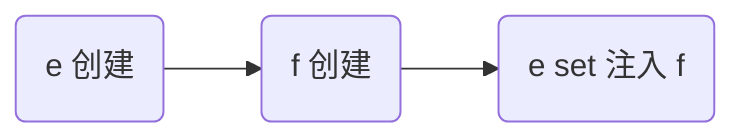

解决

- 仍然使用 @Lazy 生成代理
- 代理对象虽然还是同一个，但当每次**使用代理对象的任意方法**时，由代理创建新的 f 对象

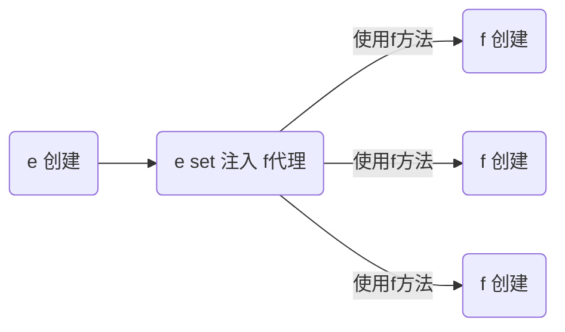

```java
@Component
public class E {

    @Autowired
    @Lazy
    public void setF(F f) {
        this.f = f;
        log.info("setF(F f) {}", f.getClass());
    }

    // ...
}
```

> **_注意_**
>
> - @Lazy 加在也可以加在成员变量上，但加在 set 方法上的目的是可以观察输出，加在成员变量上就不行了
> - @Autowired 加在 set 方法的目的类似

输出

```
E: setF(F f) class com.itheima.demo.cycle.F$$EnhancerBySpringCGLIB$$8b54f2bc
F: F()
com.itheima.demo.cycle.F@3a6f2de3
F: F()
com.itheima.demo.cycle.F@56303b57
```

从输出日志可以看到调用 setF 方法时，f 对象的类型是代理类型

#### 演示 2 - 4 种解决方法

##### 代码参考

**com.itheima.a08.sub** 包

- 如果 jdk > 8, 运行时请添加 --add-opens java.base/java.lang=ALL-UNNAMED

#### 收获 💡

1. 单例注入其它 scope 的四种解决方法
   - @Lazy
   - @Scope(value = "prototype", proxyMode = ScopedProxyMode.TARGET_CLASS)
   - ObjectFactory
   - ApplicationContext
2. 解决方法虽然不同，但理念上殊途同归: 都是推迟其它 scope bean 的获取

## AOP

AOP 底层实现方式之一是代理，由代理结合通知和目标，提供增强功能

除此以外，aspectj 提供了两种另外的 AOP 底层实现：

- 第一种是通过 ajc 编译器在**编译** class 类文件时，就把通知的增强功能，织入到目标类的字节码中

- 第二种是通过 agent 在**加载**目标类时，修改目标类的字节码，织入增强功能
- 作为对比，之前学习的代理是**运行**时生成新的字节码

简单比较的话：

- aspectj 在编译和加载时，修改目标字节码，性能较高
- aspectj 因为不用代理，能突破一些技术上的限制，例如对构造、对静态方法、对 final 也能增强
- 但 aspectj 侵入性较强，且需要学习新的 aspectj 特有语法，因此没有广泛流行

### 9) AOP 实现之 ajc 编译器

代码参考项目 **demo6_advanced_aspectj_01**

#### 收获 💡

1. 编译器也能修改 class 实现增强
2. 编译器增强能突破代理仅能通过方法重写增强的限制：可以对构造方法、静态方法等实现增强

> **_注意_**
>
> - 版本选择了 java 8, 因为目前的 aspectj-maven-plugin 1.14.0 最高只支持到 java 16
> - 一定要用 maven 的 compile 来编译, idea 不会调用 ajc 编译器

### 10) AOP 实现之 agent 类加载

代码参考项目 **demo6_advanced_aspectj_02**

#### 收获 💡

1. 类加载时可以通过 agent 修改 class 实现增强

### 11) AOP 实现之 proxy

#### 演示 1 - jdk 动态代理

```java
public class JdkProxyDemo {

    interface Foo {
        void foo();
    }

    static class Target implements Foo {
        public void foo() {
            System.out.println("target foo");
        }
    }

    public static void main(String[] param) {
        // 目标对象
        Target target = new Target();
        // 代理对象
        Foo proxy = (Foo) Proxy.newProxyInstance(
                Target.class.getClassLoader(), new Class[]{Foo.class},
                (p, method, args) -> {
                    System.out.println("proxy before...");
                    Object result = method.invoke(target, args);
                    System.out.println("proxy after...");
                    return result;
                });
        // 调用代理
        proxy.foo();
    }
}
```

运行结果

```
proxy before...
target foo
proxy after...
```

#### 收获 💡

- jdk 动态代理要求目标**必须**实现接口，生成的代理类实现相同接口，因此代理与目标之间是平级兄弟关系

#### 演示 2 - cglib 代理

```java
public class CglibProxyDemo {

    static class Target {
        public void foo() {
            System.out.println("target foo");
        }
    }

    public static void main(String[] param) {
        // 目标对象
        Target target = new Target();
        // 代理对象
        Target proxy = (Target) Enhancer.create(Target.class,
                (MethodInterceptor) (p, method, args, methodProxy) -> {
            System.out.println("proxy before...");
            Object result = methodProxy.invoke(target, args);
            // 另一种调用方法，不需要目标对象实例
//            Object result = methodProxy.invokeSuper(p, args);
            System.out.println("proxy after...");
            return result;
        });
        // 调用代理
        proxy.foo();
    }
}
```

运行结果与 jdk 动态代理相同

#### 收获 💡

- cglib 不要求目标实现接口，它生成的代理类是目标的子类，因此代理与目标之间是子父关系
- 限制 ⛔：根据上述分析 final 类无法被 cglib 增强

### 12) jdk 动态代理进阶

#### 演示 1 - 模拟 jdk 动态代理

```java
public class A12 {

    interface Foo {
        void foo();
        int bar();
    }

    static class Target implements Foo {
        public void foo() {
            System.out.println("target foo");
        }

        public int bar() {
            System.out.println("target bar");
            return 100;
        }
    }

    public static void main(String[] param) {
        // ⬇️1. 创建代理，这时传入 InvocationHandler
        Foo proxy = new $Proxy0(new InvocationHandler() {
            // ⬇️5. 进入 InvocationHandler
            public Object invoke(Object proxy, Method method, Object[] args) throws Throwable{
                // ⬇️6. 功能增强
                System.out.println("before...");
                // ⬇️7. 反射调用目标方法
                return method.invoke(new Target(), args);
            }
        });
        // ⬇️2. 调用代理方法
        proxy.foo();
        proxy.bar();
    }
}
```

模拟代理实现

```java
import java.lang.reflect.InvocationHandler;
import java.lang.reflect.Method;
import java.lang.reflect.Proxy;
import java.lang.reflect.UndeclaredThrowableException;

// ⬇️这就是 jdk 代理类的源码, 秘密都在里面
public class $Proxy0 extends Proxy implements A12.Foo {

    public $Proxy0(InvocationHandler h) {
        super(h);
    }
    // ⬇️3. 进入代理方法
    public void foo() {
        try {
            // ⬇️4. 回调 InvocationHandler
            h.invoke(this, foo, new Object[0]);
        } catch (RuntimeException | Error e) {
            throw e;
        } catch (Throwable e) {
            throw new UndeclaredThrowableException(e);
        }
    }

    @Override
    public int bar() {
        try {
            Object result = h.invoke(this, bar, new Object[0]);
            return (int) result;
        } catch (RuntimeException | Error e) {
            throw e;
        } catch (Throwable e) {
            throw new UndeclaredThrowableException(e);
        }
    }

    static Method foo;
    static Method bar;
    static {
        try {
            foo = A12.Foo.class.getMethod("foo");
            bar = A12.Foo.class.getMethod("bar");
        } catch (NoSuchMethodException e) {
            throw new NoSuchMethodError(e.getMessage());
        }
    }
}
```

#### 收获 💡

代理一点都不难，无非就是利用了多态、反射的知识

1. 方法重写可以增强逻辑，只不过这【增强逻辑】千变万化，不能写死在代理内部
2. 通过接口回调将【增强逻辑】置于代理类之外
3. 配合接口方法反射（是多态调用），就可以再联动调用目标方法
4. 会用 arthas 的 jad 工具反编译代理类
5. 限制 ⛔：代理增强是借助多态来实现，因此成员变量、静态方法、final 方法均不能通过代理实现

#### 演示 2 - 方法反射优化

##### 代码参考

**com.itheima.a12.TestMethodInvoke**

#### 收获 💡

1. 前 16 次反射性能较低
2. 第 17 次调用会生成代理类，优化为非反射调用
3. 会用 arthas 的 jad 工具反编译第 17 次调用生成的代理类

> **_注意_**
>
> 运行时请添加 --add-opens java.base/java.lang.reflect=ALL-UNNAMED --add-opens java.base/jdk.internal.reflect=ALL-UNNAMED

### 13) cglib 代理进阶

#### 演示 - 模拟 cglib 代理

##### 代码参考

**com.itheima.a13** 包

#### 收获 💡

和 jdk 动态代理原理查不多

1. 回调的接口换了一下，InvocationHandler 改成了 MethodInterceptor
2. 调用目标时有所改进，见下面代码片段
   1. method.invoke 是反射调用，必须调用到足够次数才会进行优化
   2. methodProxy.invoke 是不反射调用，它会正常（间接）调用目标对象的方法（Spring 采用）
   3. methodProxy.invokeSuper 也是不反射调用，它会正常（间接）调用代理对象的方法，可以省略目标对象

```java
public class A14Application {
    public static void main(String[] args) throws InvocationTargetException {

        Target target = new Target();
        Proxy proxy = new Proxy();

        proxy.setCallbacks(new Callback[]{(MethodInterceptor) (p, m, a, mp) -> {
            System.out.println("proxy before..." + mp.getSignature());
            // ⬇️调用目标方法(三种)
//            Object result = m.invoke(target, a);  // ⬅️反射调用
//            Object result = mp.invoke(target, a); // ⬅️非反射调用, 结合目标用
            Object result = mp.invokeSuper(p, a);   // ⬅️非反射调用, 结合代理用
            System.out.println("proxy after..." + mp.getSignature());
            return result;
        }});

        // ⬇️调用代理方法
        proxy.save();
    }
}
```

> **_注意_**
>
> - 调用 Object 的方法, 后两种在 jdk >= 9 时都有问题, 需要 --add-opens java.base/java.lang=ALL-UNNAMED

### 14) cglib 避免反射调用

#### 演示 - cglib 如何避免反射

##### 代码参考

**com.itheima.a13.ProxyFastClass**，**com.itheima.a13.TargetFastClass**

#### 收获 💡

1. 当调用 MethodProxy 的 invoke 或 invokeSuper 方法时, 会动态生成两个类
   - ProxyFastClass 配合代理对象一起使用, 避免反射
   - TargetFastClass 配合目标对象一起使用, 避免反射 (Spring 用的这种)
2. TargetFastClass 记录了 Target 中方法与编号的对应关系
   - save(long) 编号 2
   - save(int) 编号 1
   - save() 编号 0
   - 首先根据方法名和参数个数、类型, 用 switch 和 if 找到这些方法编号
   - 然后再根据编号去调用目标方法, 又用了一大堆 switch 和 if, 但避免了反射
3. ProxyFastClass 记录了 Proxy 中方法与编号的对应关系，不过 Proxy 额外提供了下面几个方法
   - saveSuper(long) 编号 2，不增强，仅是调用 super.save(long)
   - saveSuper(int) 编号 1，不增强, 仅是调用 super.save(int)
   - saveSuper() 编号 0，不增强, 仅是调用 super.save()
   - 查找方式与 TargetFastClass 类似
4. 为什么有这么麻烦的一套东西呢？
   - 避免反射, 提高性能, 代价是一个代理类配两个 FastClass 类, 代理类中还得增加仅调用 super 的一堆方法
   - 用编号处理方法对应关系比较省内存, 另外, 最初获得方法顺序是不确定的, 这个过程没法固定死

### 15) jdk 和 cglib 在 Spring 中的统一

Spring 中对切点、通知、切面的抽象如下

- 切点：接口 Pointcut，典型实现 AspectJExpressionPointcut
- 通知：典型接口为 MethodInterceptor 代表环绕通知
- 切面：Advisor，包含一个 Advice 通知，PointcutAdvisor 包含一个 Advice 通知和一个 Pointcut

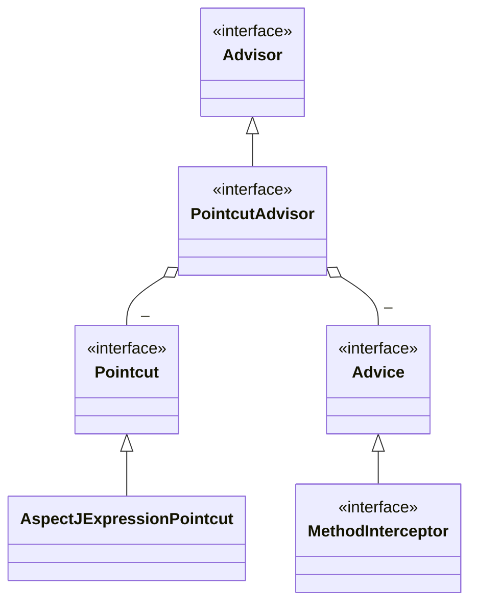

代理相关类图

- AopProxyFactory 根据 proxyTargetClass 等设置选择 AopProxy 实现
- AopProxy 通过 getProxy 创建代理对象
- 图中 Proxy 都实现了 Advised 接口，能够获得关联的切面集合与目标（其实是从 ProxyFactory 取得）
- 调用代理方法时，会借助 ProxyFactory 将通知统一转为环绕通知：MethodInterceptor

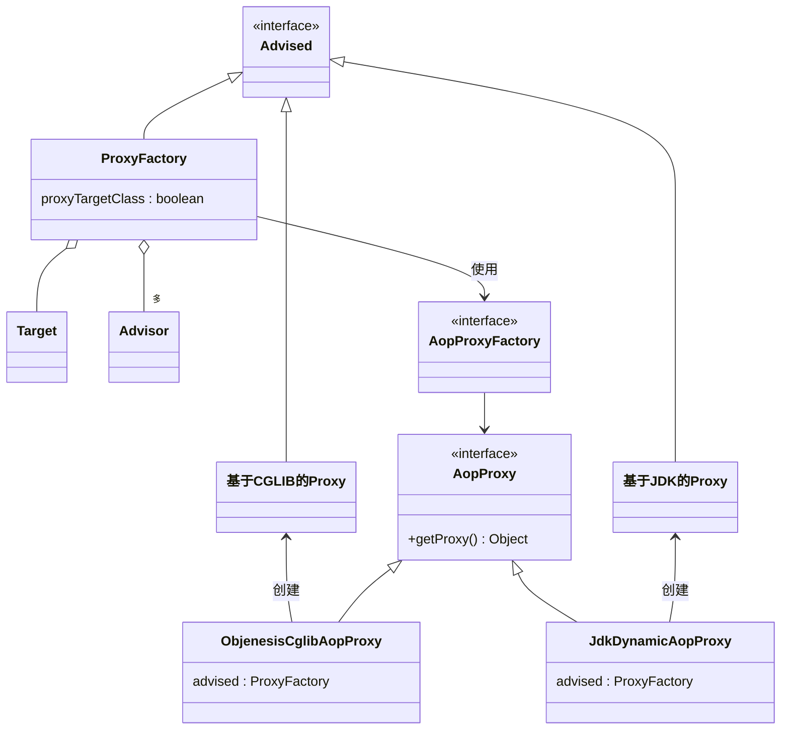

#### 演示 - 底层切点、通知、切面

##### 代码参考

**com.itheima.a15.A15**

#### 收获 💡

1. 底层的切点实现
2. 底层的通知实现
3. 底层的切面实现
4. ProxyFactory 用来创建代理
   - 如果指定了接口，且 proxyTargetClass = false，使用 JdkDynamicAopProxy
   - 如果没有指定接口，或者 proxyTargetClass = true，使用 ObjenesisCglibAopProxy
     - 例外：如果目标是接口类型或已经是 Jdk 代理，使用 JdkDynamicAopProxy

> **_注意_**
>
> - 要区分本章节提到的 MethodInterceptor，它与之前 cglib 中用的的 MethodInterceptor 是不同的接口

### 16) 切点匹配

#### 演示 - 切点匹配

##### 代码参考

**com.itheima.a16.A16**

#### 收获 💡

1. 常见 aspectj 切点用法
2. aspectj 切点的局限性，实际的 @Transactional 切点实现

### 17) 从 @Aspect 到 Advisor

#### 演示 1 - 代理创建器

##### 代码参考

**org.springframework.aop.framework.autoproxy** 包

#### 收获 💡

1. AnnotationAwareAspectJAutoProxyCreator 的作用
   - 将高级 @Aspect 切面统一为低级 Advisor 切面
   - 在合适的时机创建代理
2. findEligibleAdvisors 找到有【资格】的 Advisors
   - 有【资格】的 Advisor 一部分是低级的, 可以由自己编写, 如本例 A17 中的 advisor3
   - 有【资格】的 Advisor 另一部分是高级的, 由解析 @Aspect 后获得
3. wrapIfNecessary
   - 它内部调用 findEligibleAdvisors, 只要返回集合不空, 则表示需要创建代理
   - 它的调用时机通常在原始对象初始化后执行, 但碰到循环依赖会提前至依赖注入之前执行

#### 演示 2 - 代理创建时机

##### 代码参考

**org.springframework.aop.framework.autoproxy.A17_1**

#### 收获 💡

1. 代理的创建时机
   - 初始化之后 (无循环依赖时)
   - 实例创建后, 依赖注入前 (有循环依赖时), 并暂存于二级缓存
2. 依赖注入与初始化不应该被增强, 仍应被施加于原始对象

#### 演示 3 - @Before 对应的低级通知

##### 代码参考

**org.springframework.aop.framework.autoproxy.A17_2**

#### 收获 💡

1. @Before 前置通知会被转换为原始的 AspectJMethodBeforeAdvice 形式, 该对象包含了如下信息
   1. 通知代码从哪儿来
   2. 切点是什么(这里为啥要切点, 后面解释)
   3. 通知对象如何创建, 本例共用同一个 Aspect 对象
2. 类似的还有
   1. AspectJAroundAdvice (环绕通知)
   2. AspectJAfterReturningAdvice
   3. AspectJAfterThrowingAdvice (环绕通知)
   4. AspectJAfterAdvice (环绕通知)

### 18) 静态通知调用

代理对象调用流程如下（以 JDK 动态代理实现为例）

- 从 ProxyFactory 获得 Target 和环绕通知链，根据他俩创建 MethodInvocation，简称 mi
- 首次执行 mi.proceed() 发现有下一个环绕通知，调用它的 invoke(mi)
- 进入环绕通知 1，执行前增强，再次调用 mi.proceed() 发现有下一个环绕通知，调用它的 invoke(mi)
- 进入环绕通知 2，执行前增强，调用 mi.proceed() 发现没有环绕通知，调用 mi.invokeJoinPoint() 执行目标方法
- 目标方法执行结束，将结果返回给环绕通知 2，执行环绕通知 2 的后增强
- 环绕通知 2 继续将结果返回给环绕通知 1，执行环绕通知 1 的后增强
- 环绕通知 1 返回最终的结果

图中不同颜色对应一次环绕通知或目标的调用起始至终结

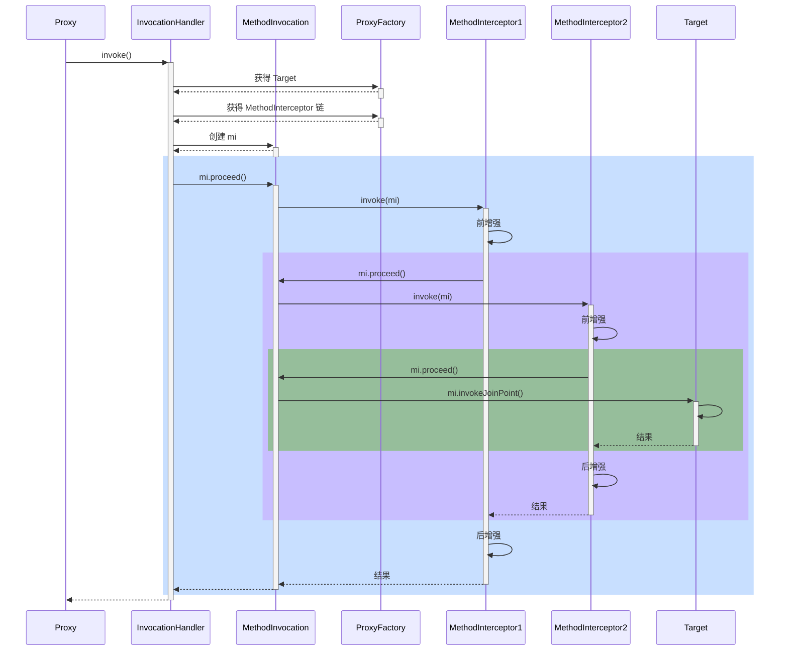

#### 演示 1 - 通知调用过程

##### 代码参考

**org.springframework.aop.framework.A18**

#### 收获 💡

代理方法执行时会做如下工作

1. 通过 proxyFactory 的 getInterceptorsAndDynamicInterceptionAdvice() 将其他通知统一转换为 MethodInterceptor 环绕通知
   - MethodBeforeAdviceAdapter 将 @Before AspectJMethodBeforeAdvice 适配为 MethodBeforeAdviceInterceptor
   - AfterReturningAdviceAdapter 将 @AfterReturning AspectJAfterReturningAdvice 适配为 AfterReturningAdviceInterceptor
   - 这体现的是适配器设计模式
2. 所谓静态通知，体现在上面方法的 Interceptors 部分，这些通知调用时无需再次检查切点，直接调用即可
3. 结合目标与环绕通知链，创建 MethodInvocation 对象，通过它完成整个调用

#### 演示 2 - 模拟 MethodInvocation

##### 代码参考

**org.springframework.aop.framework.A18_1**

#### 收获 💡

1. proceed() 方法调用链中下一个环绕通知
2. 每个环绕通知内部继续调用 proceed()
3. 调用到没有更多通知了, 就调用目标方法

MethodInvocation 的编程技巧在实现拦截器、过滤器时能用上

### 19) 动态通知调用

#### 演示 - 带参数绑定的通知方法调用

##### 代码参考

**org.springframework.aop.framework.autoproxy.A19**

#### 收获 💡

1. 通过 proxyFactory 的 getInterceptorsAndDynamicInterceptionAdvice() 将其他通知统一转换为 MethodInterceptor 环绕通知
2. 所谓动态通知，体现在上面方法的 DynamicInterceptionAdvice 部分，这些通知调用时因为要为通知方法绑定参数，还需再次利用切点表达式
3. 动态通知调用复杂程度高，性能较低

## WEB

### 20) RequestMappingHandlerMapping 与 RequestMappingHandlerAdapter

RequestMappingHandlerMapping 与 RequestMappingHandlerAdapter 俩是一对，分别用来

- 处理 @RequestMapping 映射
- 调用控制器方法、并处理方法参数与方法返回值

#### 演示 1 - DispatcherServlet 初始化

##### 代码参考

**com.itheima.a20** 包

#### 收获 💡

1. DispatcherServlet 是在第一次被访问时执行初始化, 也可以通过配置修改为 Tomcat 启动后就初始化
2. 在初始化时会从 Spring 容器中找一些 Web 需要的组件, 如 HandlerMapping、HandlerAdapter 等，并逐一调用它们的初始化
3. RequestMappingHandlerMapping 初始化时，会收集所有 @RequestMapping 映射信息，封装为 Map，其中
   - key 是 RequestMappingInfo 类型，包括请求路径、请求方法等信息
   - value 是 HandlerMethod 类型，包括控制器方法对象、控制器对象
   - 有了这个 Map，就可以在请求到达时，快速完成映射，找到 HandlerMethod 并与匹配的拦截器一起返回给 DispatcherServlet
4. RequestMappingHandlerAdapter 初始化时，会准备 HandlerMethod 调用时需要的各个组件，如：
   - HandlerMethodArgumentResolver 解析控制器方法参数
   - HandlerMethodReturnValueHandler 处理控制器方法返回值

#### 演示 2 - 自定义参数与返回值处理器

##### 代码参考

**com.itheima.a20.TokenArgumentResolver** ，**com.itheima.a20.YmlReturnValueHandler**

#### 收获 💡

1. 体会参数解析器的作用
2. 体会返回值处理器的作用

### 21) 参数解析器

#### 演示 - 常见参数解析器

##### 代码参考

**com.itheima.a21** 包

#### 收获 💡

1. 初步了解 RequestMappingHandlerAdapter 的调用过程
   1. 控制器方法被封装为 HandlerMethod
   2. 准备对象绑定与类型转换
   3. 准备 ModelAndViewContainer 用来存储中间 Model 结果
   4. 解析每个参数值
2. 解析参数依赖的就是各种参数解析器，它们都有两个重要方法
   - supportsParameter 判断是否支持方法参数
   - resolveArgument 解析方法参数
3. 常见参数的解析
   - @RequestParam
   - 省略 @RequestParam
   - @RequestParam(defaultValue)
   - MultipartFile
   - @PathVariable
   - @RequestHeader
   - @CookieValue
   - @Value
   - HttpServletRequest 等
   - @ModelAttribute
   - 省略 @ModelAttribute
   - @RequestBody
4. 组合模式在 Spring 中的体现
5. @RequestParam, @CookieValue 等注解中的参数名、默认值, 都可以写成活的, 即从 ${ } #{ }中获取

### 22) 参数名解析

#### 演示 - 两种方法获取参数名

##### 代码参考

**com.itheima.a22.A22**

#### 收获 💡

1. 如果编译时添加了 -parameters 可以生成参数表, 反射时就可以拿到参数名
2. 如果编译时添加了 -g 可以生成调试信息, 但分为两种情况
   - 普通类, 会包含局部变量表, 用 asm 可以拿到参数名
   - 接口, 不会包含局部变量表, 无法获得参数名
     - 这也是 MyBatis 在实现 Mapper 接口时为何要提供 @Param 注解来辅助获得参数名

### 23) 对象绑定与类型转换

#### 底层第一套转换接口与实现

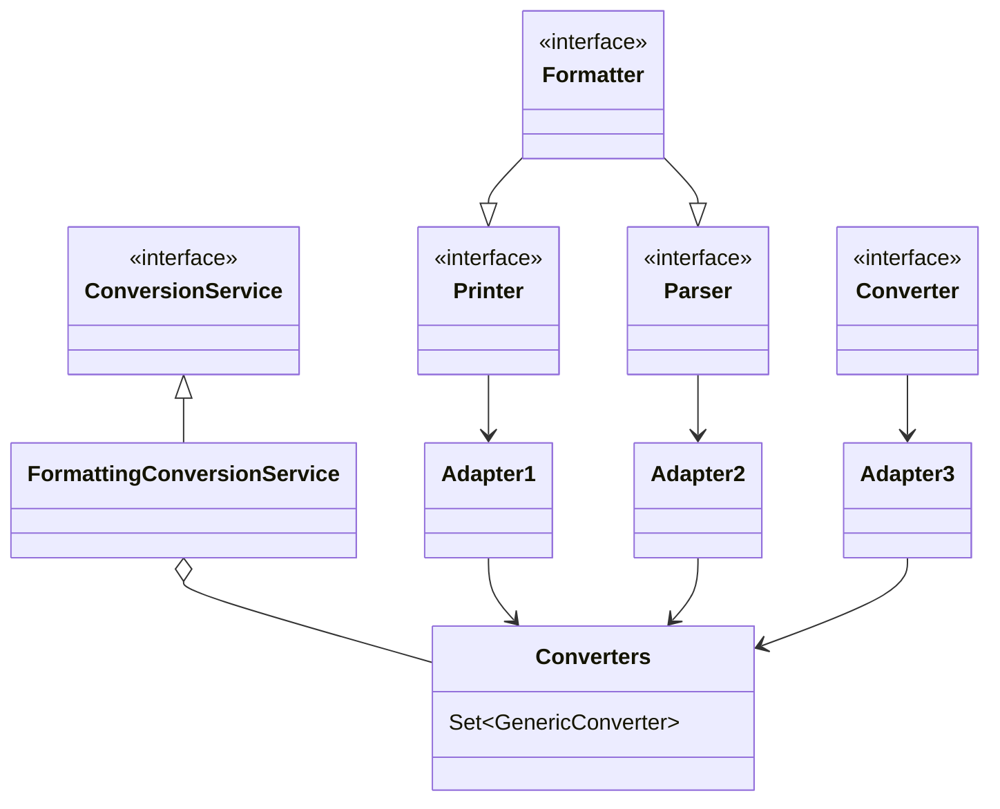

- Printer 把其它类型转为 String
- Parser 把 String 转为其它类型
- Formatter 综合 Printer 与 Parser 功能
- Converter 把类型 S 转为类型 T
- Printer、Parser、Converter 经过适配转换成 GenericConverter 放入 Converters 集合
- FormattingConversionService 利用其它们实现转换

#### 底层第二套转换接口

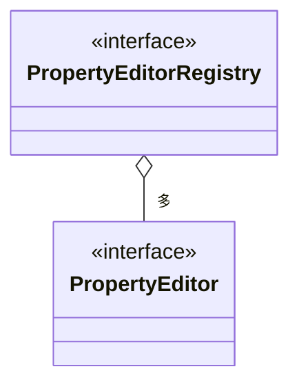

- PropertyEditor 把 String 与其它类型相互转换
- PropertyEditorRegistry 可以注册多个 PropertyEditor 对象
- 与第一套接口直接可以通过 FormatterPropertyEditorAdapter 来进行适配

#### 高层接口与实现

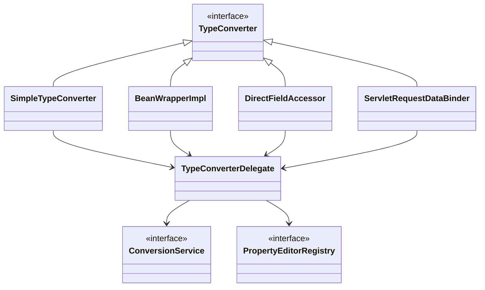

- 它们都实现了 TypeConverter 这个高层转换接口，在转换时，会用到 TypeConverter Delegate 委派 ConversionService 与 PropertyEditorRegistry 真正执行转换（Facade 门面模式）
  - 首先看是否有自定义转换器, @InitBinder 添加的即属于这种 (用了适配器模式把 Formatter 转为需要的 PropertyEditor)
  - 再看有没有 ConversionService 转换
  - 再利用默认的 PropertyEditor 转换
  - 最后有一些特殊处理
- SimpleTypeConverter 仅做类型转换
- BeanWrapperImpl 为 bean 的属性赋值，当需要时做类型转换，走 Property
- DirectFieldAccessor 为 bean 的属性赋值，当需要时做类型转换，走 Field
- ServletRequestDataBinder 为 bean 的属性执行绑定，当需要时做类型转换，根据 directFieldAccess 选择走 Property 还是 Field，具备校验与获取校验结果功能

#### 演示 1 - 类型转换与数据绑定

##### 代码参考

**com.itheima.a23** 包

#### 收获 💡

基本的类型转换与数据绑定用法

- SimpleTypeConverter
- BeanWrapperImpl
- DirectFieldAccessor
- ServletRequestDataBinder

#### 演示 2 - 数据绑定工厂

##### 代码参考

**com.itheima.a23.TestServletDataBinderFactory**

#### 收获 💡

ServletRequestDataBinderFactory 的用法和扩展点

1. 可以解析控制器的 @InitBinder 标注方法作为扩展点，添加自定义转换器
   - 控制器私有范围
2. 可以通过 ConfigurableWebBindingInitializer 配置 ConversionService 作为扩展点，添加自定义转换器
   - 公共范围
3. 同时加了 @InitBinder 和 ConversionService 的转换优先级
   1. 优先采用 @InitBinder 的转换器
   2. 其次使用 ConversionService 的转换器
   3. 使用默认转换器
   4. 特殊处理（例如有参构造）

#### 演示 3 - 获取泛型参数

##### 代码参考

**com.itheima.a23.sub** 包

#### 收获 💡

1. java api 获取泛型参数
2. spring api 获取泛型参数

### 24) @ControllerAdvice 之 @InitBinder

#### 演示 - 准备 @InitBinder

**准备 @InitBinder** 在整个 HandlerAdapter 调用过程中所处的位置

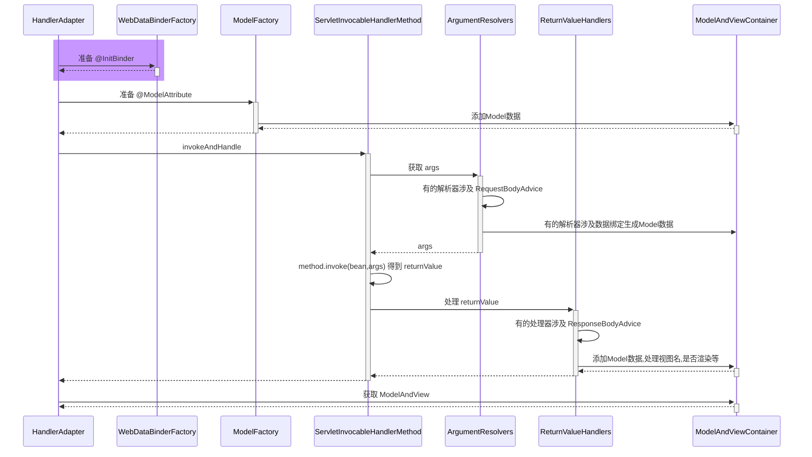

- RequestMappingHandlerAdapter 在图中缩写为 HandlerAdapter
- HandlerMethodArgumentResolverComposite 在图中缩写为 ArgumentResolvers
- HandlerMethodReturnValueHandlerComposite 在图中缩写为 ReturnValueHandlers

#### 收获 💡

1. RequestMappingHandlerAdapter 初始化时会解析 @ControllerAdvice 中的 @InitBinder 方法
2. RequestMappingHandlerAdapter 会以类为单位，在该类首次使用时，解析此类的 @InitBinder 方法
3. 以上两种 @InitBinder 的解析结果都会缓存来避免重复解析
4. 控制器方法调用时，会综合利用本类的 @InitBinder 方法和 @ControllerAdvice 中的 @InitBinder 方法创建绑定工厂

### 25) 控制器方法执行流程

#### 图 1

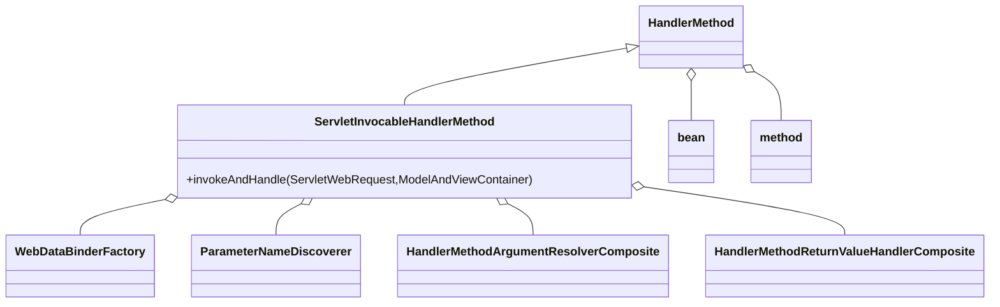

HandlerMethod 需要

- bean 即是哪个 Controller
- method 即是 Controller 中的哪个方法

ServletInvocableHandlerMethod 需要

- WebDataBinderFactory 负责对象绑定、类型转换
- ParameterNameDiscoverer 负责参数名解析
- HandlerMethodArgumentResolverComposite 负责解析参数
- HandlerMethodReturnValueHandlerComposite 负责处理返回值

#### 图 2

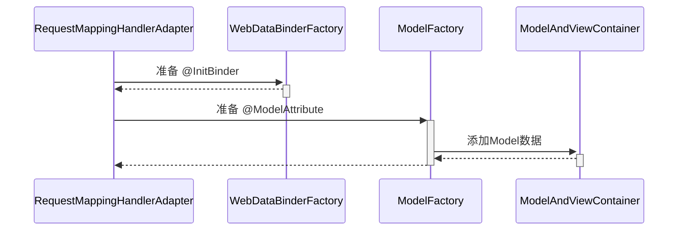

#### 图 3

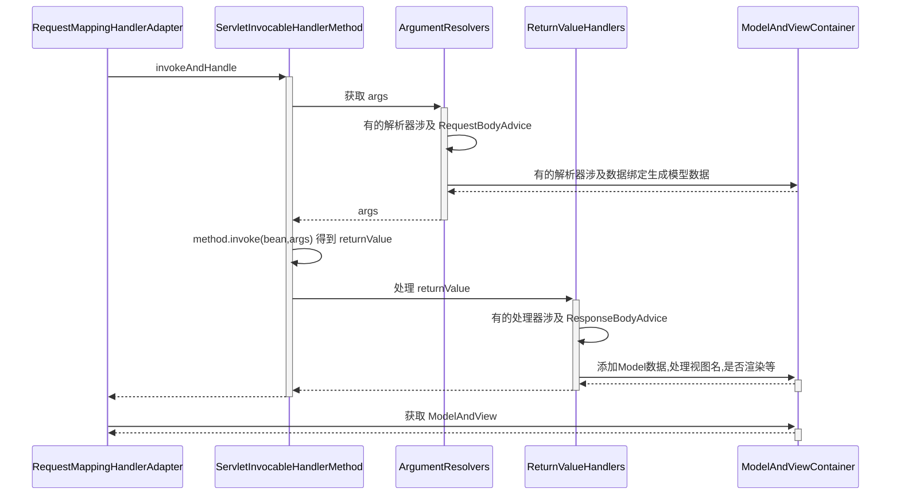

### 26) @ControllerAdvice 之 @ModelAttribute

#### 演示 - 准备 @ModelAttribute

##### 代码参考

**com.itheima.a26** 包

**准备 @ModelAttribute** 在整个 HandlerAdapter 调用过程中所处的位置

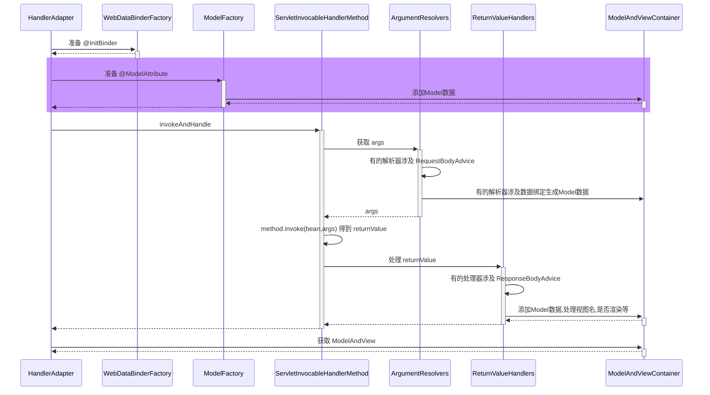

#### 收获 💡

1. RequestMappingHandlerAdapter 初始化时会解析 @ControllerAdvice 中的 @ModelAttribute 方法
2. RequestMappingHandlerAdapter 会以类为单位，在该类首次使用时，解析此类的 @ModelAttribute 方法
3. 以上两种 @ModelAttribute 的解析结果都会缓存来避免重复解析
4. 控制器方法调用时，会综合利用本类的 @ModelAttribute 方法和 @ControllerAdvice 中的 @ModelAttribute 方法创建模型工厂

### 27) 返回值处理器

#### 演示 - 常见返回值处理器

##### 代码参考

**com.itheima.a27** 包

#### 收获 💡

1. 常见的返回值处理器
   - ModelAndView，分别获取其模型和视图名，放入 ModelAndViewContainer
   - 返回值类型为 String 时，把它当做视图名，放入 ModelAndViewContainer
   - 返回值添加了 @ModelAttribute 注解时，将返回值作为模型，放入 ModelAndViewContainer
     - 此时需找到默认视图名
   - 返回值省略 @ModelAttribute 注解且返回非简单类型时，将返回值作为模型，放入 ModelAndViewContainer
     - 此时需找到默认视图名
   - 返回值类型为 ResponseEntity 时
     - 此时走 MessageConverter，并设置 ModelAndViewContainer.requestHandled 为 true
   - 返回值类型为 HttpHeaders 时
     - 会设置 ModelAndViewContainer.requestHandled 为 true
   - 返回值添加了 @ResponseBody 注解时
     - 此时走 MessageConverter，并设置 ModelAndViewContainer.requestHandled 为 true
2. 组合模式在 Spring 中的体现 + 1

### 28) MessageConverter

#### 演示 - MessageConverter 的作用

##### 代码参考

**com.itheima.a28.A28**

#### 收获 💡

1. MessageConverter 的作用
   - @ResponseBody 是返回值处理器解析的
   - 但具体转换工作是 MessageConverter 做的
2. 如何选择 MediaType
   - 首先看 @RequestMapping 上有没有指定
   - 其次看 request 的 Accept 头有没有指定
   - 最后按 MessageConverter 的顺序, 谁能谁先转换

### 29) @ControllerAdvice 之 ResponseBodyAdvice

#### 演示 - ResponseBodyAdvice 增强

##### 代码参考

**com.itheima.a29** 包

**ResponseBodyAdvice 增强** 在整个 HandlerAdapter 调用过程中所处的位置

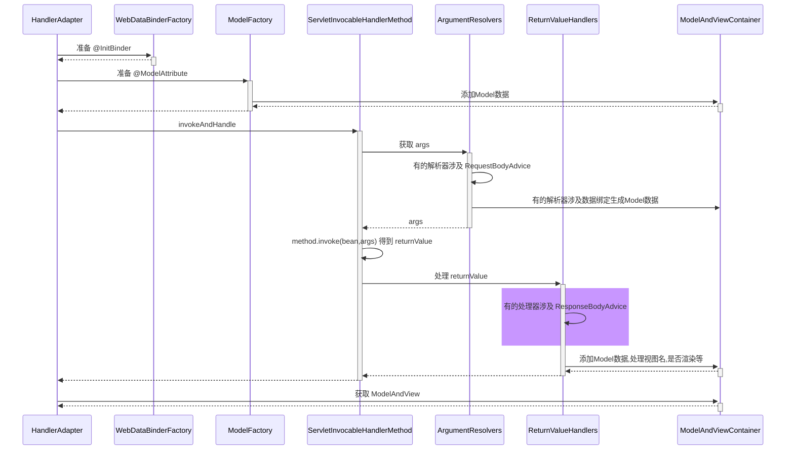

#### 收获 💡

1. ResponseBodyAdvice 返回响应体前包装

### 30) 异常解析器

#### 演示 - ExceptionHandlerExceptionResolver

##### 代码参考

**com.itheima.a30.A30**

#### 收获 💡

1. 它能够重用参数解析器、返回值处理器，实现组件重用
2. 它能够支持嵌套异常

### 31) @ControllerAdvice 之 @ExceptionHandler

#### 演示 - 准备 @ExceptionHandler

##### 代码参考

**com.itheima.a31** 包

#### 收获 💡

1. ExceptionHandlerExceptionResolver 初始化时会解析 @ControllerAdvice 中的 @ExceptionHandler 方法
2. ExceptionHandlerExceptionResolver 会以类为单位，在该类首次处理异常时，解析此类的 @ExceptionHandler 方法
3. 以上两种 @ExceptionHandler 的解析结果都会缓存来避免重复解析

### 32) Tomcat 异常处理

- 我们知道 @ExceptionHandler 只能处理发生在 mvc 流程中的异常，例如控制器内、拦截器内，那么如果是 Filter 出现了异常，如何进行处理呢？

- 在 Spring Boot 中，是这么实现的：
  1. 因为内嵌了 Tomcat 容器，因此可以配置 Tomcat 的错误页面，Filter 与 错误页面之间是通过请求转发跳转的，可以在这里做手脚
  2. 先通过 ErrorPageRegistrarBeanPostProcessor 这个后处理器配置错误页面地址，默认为 `/error` 也可以通过 `${server.error.path}` 进行配置
  3. 当 Filter 发生异常时，不会走 Spring 流程，但会走 Tomcat 的错误处理，于是就希望转发至 `/error` 这个地址
     - 当然，如果没有 @ExceptionHandler，那么最终也会走到 Tomcat 的错误处理
  4. Spring Boot 又提供了一个 BasicErrorController，它就是一个标准 @Controller，@RequestMapping 配置为 `/error`，所以处理异常的职责就又回到了 Spring
  5. 异常信息由于会被 Tomcat 放入 request 作用域，因此 BasicErrorController 里也能获取到
  6. 具体异常信息会由 DefaultErrorAttributes 封装好
  7. BasicErrorController 通过 Accept 头判断需要生成哪种 MediaType 的响应
     - 如果要的不是 text/html，走 MessageConverter 流程
     - 如果需要 text/html，走 mvc 流程，此时又分两种情况
       - 配置了 ErrorViewResolver，根据状态码去找 View
       - 没配置或没找到，用 BeanNameViewResolver 根据一个固定为 error 的名字找到 View，即所谓的 WhitelabelErrorView

> **_评价_**
>
> - 一个错误处理搞得这么复杂，就问恶心不？

#### 演示 1 - 错误页处理

##### 关键代码

```java
@Bean // ⬅️修改了 Tomcat 服务器默认错误地址, 出错时使用请求转发方式跳转
public ErrorPageRegistrar errorPageRegistrar() {
    return webServerFactory -> webServerFactory.addErrorPages(new ErrorPage("/error"));
}

@Bean // ⬅️TomcatServletWebServerFactory 初始化前用它增强, 注册所有 ErrorPageRegistrar
public ErrorPageRegistrarBeanPostProcessor errorPageRegistrarBeanPostProcessor() {
    return new ErrorPageRegistrarBeanPostProcessor();
}
```

#### 收获 💡

1. Tomcat 的错误页处理手段

#### 演示 2 - BasicErrorController

##### 关键代码

```java
@Bean // ⬅️ErrorProperties 封装环境键值, ErrorAttributes 控制有哪些错误信息
public BasicErrorController basicErrorController() {
    ErrorProperties errorProperties = new ErrorProperties();
    errorProperties.setIncludeException(true);
    return new BasicErrorController(new DefaultErrorAttributes(), errorProperties);
}

@Bean // ⬅️名称为 error 的视图, 作为 BasicErrorController 的 text/html 响应结果
public View error() {
    return new View() {
        @Override
        public void render(
            Map<String, ?> model,
            HttpServletRequest request,
            HttpServletResponse response
        ) throws Exception {
            System.out.println(model);
            response.setContentType("text/html;charset=utf-8");
            response.getWriter().print("""
                    <h3>服务器内部错误</h3>
                    """);
        }
    };
}

@Bean // ⬅️收集容器中所有 View 对象, bean 的名字作为视图名
public ViewResolver viewResolver() {
    return new BeanNameViewResolver();
}
```

#### 收获 💡

1. Spring Boot 中 BasicErrorController 如何工作

### 33) BeanNameUrlHandlerMapping 与 SimpleControllerHandlerAdapter

#### 演示 - 本组映射器和适配器

##### 关键代码

```java
@Bean
public BeanNameUrlHandlerMapping beanNameUrlHandlerMapping() {
    return new BeanNameUrlHandlerMapping();
}

@Bean
public SimpleControllerHandlerAdapter simpleControllerHandlerAdapter() {
    return new SimpleControllerHandlerAdapter();
}

@Bean("/c3")
public Controller controller3() {
    return (request, response) -> {
        response.getWriter().print("this is c3");
        return null;
    };
}
```

#### 收获 💡

1. BeanNameUrlHandlerMapping，以 / 开头的 bean 的名字会被当作映射路径
2. 这些 bean 本身当作 handler，要求实现 Controller 接口
3. SimpleControllerHandlerAdapter，调用 handler
4. 模拟实现这组映射器和适配器

### 34) RouterFunctionMapping 与 HandlerFunctionAdapter

#### 演示 - 本组映射器和适配器

##### 关键代码

```java
@Bean
public RouterFunctionMapping routerFunctionMapping() {
    return new RouterFunctionMapping();
}

@Bean
public HandlerFunctionAdapter handlerFunctionAdapter() {
    return new HandlerFunctionAdapter();
}

@Bean
public RouterFunction<ServerResponse> r1() {
    //           ⬇️映射条件   ⬇️handler
    return route(GET("/r1"), request -> ok().body("this is r1"));
}
```

#### 收获 💡

1. RouterFunctionMapping, 通过 RequestPredicate 条件映射
2. handler 要实现 HandlerFunction 接口
3. HandlerFunctionAdapter, 调用 handler

### 35) SimpleUrlHandlerMapping 与 HttpRequestHandlerAdapter

#### 演示 1 - 本组映射器和适配器

##### 代码参考

**org.springframework.boot.autoconfigure.web.servlet.A35**

##### 关键代码

```java
@Bean
public SimpleUrlHandlerMapping simpleUrlHandlerMapping(ApplicationContext context) {
    SimpleUrlHandlerMapping handlerMapping = new SimpleUrlHandlerMapping();
    Map<String, ResourceHttpRequestHandler> map
        = context.getBeansOfType(ResourceHttpRequestHandler.class);
    handlerMapping.setUrlMap(map);
    return handlerMapping;
}

@Bean
public HttpRequestHandlerAdapter httpRequestHandlerAdapter() {
    return new HttpRequestHandlerAdapter();
}

@Bean("/**")
public ResourceHttpRequestHandler handler1() {
    ResourceHttpRequestHandler handler = new ResourceHttpRequestHandler();
    handler.setLocations(List.of(new ClassPathResource("static/")));
    return handler;
}

@Bean("/img/**")
public ResourceHttpRequestHandler handler2() {
    ResourceHttpRequestHandler handler = new ResourceHttpRequestHandler();
    handler.setLocations(List.of(new ClassPathResource("images/")));
    return handler;
}
```

#### 收获 💡

1. SimpleUrlHandlerMapping 不会在初始化时收集映射信息，需要手动收集
2. SimpleUrlHandlerMapping 映射路径
3. ResourceHttpRequestHandler 作为静态资源 handler
4. HttpRequestHandlerAdapter, 调用此 handler

#### 演示 2 - 静态资源解析优化

##### 关键代码

```java
@Bean("/**")
public ResourceHttpRequestHandler handler1() {
    ResourceHttpRequestHandler handler = new ResourceHttpRequestHandler();
    handler.setLocations(List.of(new ClassPathResource("static/")));
    handler.setResourceResolvers(List.of(
        	// ⬇️缓存优化
            new CachingResourceResolver(new ConcurrentMapCache("cache1")),
        	// ⬇️压缩优化
            new EncodedResourceResolver(),
        	// ⬇️原始资源解析
            new PathResourceResolver()
    ));
    return handler;
}
```

#### 收获 💡

1. 责任链模式体现
2. 压缩文件需要手动生成

#### 演示 3 - 欢迎页

##### 关键代码

```java
@Bean
public WelcomePageHandlerMapping welcomePageHandlerMapping(ApplicationContext context) {
    Resource resource = context.getResource("classpath:static/index.html");
    return new WelcomePageHandlerMapping(null, context, resource, "/**");
}

@Bean
public SimpleControllerHandlerAdapter simpleControllerHandlerAdapter() {
    return new SimpleControllerHandlerAdapter();
}
```

#### 收获 💡

1. 欢迎页支持静态欢迎页与动态欢迎页
2. WelcomePageHandlerMapping 映射欢迎页（即只映射 '/'）
   - 它内置的 handler ParameterizableViewController 作用是不执行逻辑，仅根据视图名找视图
   - 视图名固定为 forward:index.html
3. SimpleControllerHandlerAdapter, 调用 handler
   - 转发至 /index.html
   - 处理 /index.html 又会走上面的静态资源处理流程

#### 映射器与适配器小结

1. HandlerMapping 负责建立请求与控制器之间的映射关系
   - RequestMappingHandlerMapping (与 @RequestMapping 匹配)
   - WelcomePageHandlerMapping (/)
   - BeanNameUrlHandlerMapping (与 bean 的名字匹配 以 / 开头)
   - RouterFunctionMapping (函数式 RequestPredicate, HandlerFunction)
   - SimpleUrlHandlerMapping (静态资源 通配符 /** /img/**)
   - 之间也会有顺序问题, boot 中默认顺序如上
2. HandlerAdapter 负责实现对各种各样的 handler 的适配调用
   - RequestMappingHandlerAdapter 处理：@RequestMapping 方法
     - 参数解析器、返回值处理器体现了组合模式
   - SimpleControllerHandlerAdapter 处理：Controller 接口
   - HandlerFunctionAdapter 处理：HandlerFunction 函数式接口
   - HttpRequestHandlerAdapter 处理：HttpRequestHandler 接口 (静态资源处理)
   - 这也是典型适配器模式体现

### 36) mvc 处理流程

当浏览器发送一个请求 `http://localhost:8080/hello` 后，请求到达服务器，其处理流程是：

1. 服务器提供了 DispatcherServlet，它使用的是标准 Servlet 技术

   - 路径：默认映射路径为 `/`，即会匹配到所有请求 URL，可作为请求的统一入口，也被称之为**前控制器**
     - jsp 不会匹配到 DispatcherServlet
     - 其它有路径的 Servlet 匹配优先级也高于 DispatcherServlet
   - 创建：在 Boot 中，由 DispatcherServletAutoConfiguration 这个自动配置类提供 DispatcherServlet 的 bean
   - 初始化：DispatcherServlet 初始化时会优先到容器里寻找各种组件，作为它的成员变量
     - HandlerMapping，初始化时记录映射关系
     - HandlerAdapter，初始化时准备参数解析器、返回值处理器、消息转换器
     - HandlerExceptionResolver，初始化时准备参数解析器、返回值处理器、消息转换器
     - ViewResolver

2. DispatcherServlet 会利用 RequestMappingHandlerMapping 查找控制器方法

   - 例如根据 /hello 路径找到 @RequestMapping("/hello") 对应的控制器方法

   - 控制器方法会被封装为 HandlerMethod 对象，并结合匹配到的拦截器一起返回给 DispatcherServlet

   - HandlerMethod 和拦截器合在一起称为 HandlerExecutionChain（调用链）对象

3. DispatcherServlet 接下来会：

   1. 调用拦截器的 preHandle 方法
   2. RequestMappingHandlerAdapter 调用 handle 方法，准备数据绑定工厂、模型工厂、ModelAndViewContainer、将 HandlerMethod 完善为 ServletInvocableHandlerMethod
      - @ControllerAdvice 全局增强点 1️⃣：补充模型数据
      - @ControllerAdvice 全局增强点 2️⃣：补充自定义类型转换器
      - 使用 HandlerMethodArgumentResolver 准备参数
        - @ControllerAdvice 全局增强点 3️⃣：RequestBody 增强
      - 调用 ServletInvocableHandlerMethod
      - 使用 HandlerMethodReturnValueHandler 处理返回值
        - @ControllerAdvice 全局增强点 4️⃣：ResponseBody 增强
      - 根据 ModelAndViewContainer 获取 ModelAndView
        - 如果返回的 ModelAndView 为 null，不走第 4 步视图解析及渲染流程
          - 例如，有的返回值处理器调用了 HttpMessageConverter 来将结果转换为 JSON，这时 ModelAndView 就为 null
        - 如果返回的 ModelAndView 不为 null，会在第 4 步走视图解析及渲染流程
   3. 调用拦截器的 postHandle 方法
   4. 处理异常或视图渲染
      - 如果 1~3 出现异常，走 ExceptionHandlerExceptionResolver 处理异常流程
        - @ControllerAdvice 全局增强点 5️⃣：@ExceptionHandler 异常处理
      - 正常，走视图解析及渲染流程
   5. 调用拦截器的 afterCompletion 方法

## Boot

### 37) Boot 骨架项目

如果是 linux 环境，用以下命令即可获取 spring boot 的骨架 pom.xml

```shell
curl -G https://start.spring.io/pom.xml -d dependencies=web,mysql,mybatis -o pom.xml
```

也可以使用 Postman 等工具实现

若想获取更多用法，请参考

```shell
curl https://start.spring.io
```

### 38) Boot War 项目

步骤 1：创建模块，区别在于打包方式选择 war


接下来勾选 Spring Web 支持


步骤 2：编写控制器

```java
@Controller
public class MyController {

    @RequestMapping("/hello")
    public String abc() {
        System.out.println("进入了控制器");
        return "hello";
    }
}
```

步骤 3：编写 jsp 视图，新建 webapp 目录和一个 hello.jsp 文件，注意文件名与控制器方法返回的视图逻辑名一致

```
src
	|- main
		|- java
		|- resources
		|- webapp
			|- hello.jsp
```

步骤 4：配置视图路径，打开 application.properties 文件

```properties
spring.mvc.view.prefix=/
spring.mvc.view.suffix=.jsp
```

> 将来 prefix + 控制器方法返回值 + suffix 即为视图完整路径

#### 测试

如果用 mvn 插件 `mvn spring-boot:run` 或 main 方法测试

- 必须添加如下依赖，因为此时用的还是内嵌 tomcat，而内嵌 tomcat 默认不带 jasper（用来解析 jsp）

```xml
<dependency>
    <groupId>org.apache.tomcat.embed</groupId>
    <artifactId>tomcat-embed-jasper</artifactId>
    <scope>provided</scope>
</dependency>
```

也可以使用 Idea 配置 tomcat 来测试，此时用的是外置 tomcat

- 骨架生成的代码中，多了一个 ServletInitializer，它的作用就是配置外置 Tomcat 使用的，在外置 Tomcat 启动后，去调用它创建和运行 SpringApplication

#### 启示

对于 jar 项目，若要支持 jsp，也可以在加入 jasper 依赖的前提下，把 jsp 文件置入 `META-INF/resources`

### 39) Boot 启动过程

阶段一：SpringApplication 构造

1. 记录 BeanDefinition 源
2. 推断应用类型
3. 记录 ApplicationContext 初始化器
4. 记录监听器
5. 推断主启动类

阶段二：执行 run 方法

1. 得到 SpringApplicationRunListeners，名字取得不好，实际是事件发布器

   - 发布 application starting 事件 1️⃣

2. 封装启动 args

3. 准备 Environment 添加命令行参数（\*）

4. ConfigurationPropertySources 处理（\*）

   - 发布 application environment 已准备事件 2️⃣

5. 通过 EnvironmentPostProcessorApplicationListener 进行 env 后处理（\*）

   - application.properties，由 StandardConfigDataLocationResolver 解析
   - spring.application.json

6. 绑定 spring.main 到 SpringApplication 对象（\*）

7. 打印 banner（\*）

8. 创建容器

9. 准备容器

   - 发布 application context 已初始化事件 3️⃣

10. 加载 bean 定义

    - 发布 application prepared 事件 4️⃣

11. refresh 容器

    - 发布 application started 事件 5️⃣

12. 执行 runner

    - 发布 application ready 事件 6️⃣

    - 这其中有异常，发布 application failed 事件 7️⃣

> 带 \* 的有独立的示例

#### 演示 - 启动过程

**com.itheima.a39.A39_1** 对应 SpringApplication 构造

**com.itheima.a39.A39_2** 对应第 1 步，并演示 7 个事件

**com.itheima.a39.A39_3** 对应第 2、8 到 12 步

**org.springframework.boot.Step3**

**org.springframework.boot.Step4**

**org.springframework.boot.Step5**

**org.springframework.boot.Step6**

**org.springframework.boot.Step7**

#### 收获 💡

1. SpringApplication 构造方法中所做的操作
   - 可以有多种源用来加载 bean 定义
   - 应用类型推断
   - 添加容器初始化器
   - 添加监听器
   - 演示主类推断
2. 如何读取 spring.factories 中的配置
3. 从配置中获取重要的事件发布器：SpringApplicationRunListeners
4. 容器的创建、初始化器增强、加载 bean 定义等
5. CommandLineRunner、ApplicationRunner 的作用
6. 环境对象
   1. 命令行 PropertySource
   2. ConfigurationPropertySources 规范环境键名称
   3. EnvironmentPostProcessor 后处理增强
      - 由 EventPublishingRunListener 通过监听事件 2️⃣ 来调用
   4. 绑定 spring.main 前缀的 key value 至 SpringApplication
7. Banner

### 40) Tomcat 内嵌容器

Tomcat 基本结构

```
Server
└───Service
    ├───Connector (协议, 端口)
    └───Engine
        └───Host(虚拟主机 localhost)
            ├───Context1 (应用1, 可以设置虚拟路径, / 即 url 起始路径; 项目磁盘路径, 即 docBase )
            │   │   index.html
            │   └───WEB-INF
            │       │   web.xml (servlet, filter, listener) 3.0
            │       ├───classes (servlet, controller, service ...)
            │       ├───jsp
            │       └───lib (第三方 jar 包)
            └───Context2 (应用2)
                │   index.html
                └───WEB-INF
                        web.xml
```

#### 演示 1 - Tomcat 内嵌容器

##### 关键代码

```java
public static void main(String[] args) throws LifecycleException, IOException {
    // 1.创建 Tomcat 对象
    Tomcat tomcat = new Tomcat();
    tomcat.setBaseDir("tomcat");

    // 2.创建项目文件夹, 即 docBase 文件夹
    File docBase = Files.createTempDirectory("boot.").toFile();
    docBase.deleteOnExit();

    // 3.创建 Tomcat 项目, 在 Tomcat 中称为 Context
    Context context = tomcat.addContext("", docBase.getAbsolutePath());

    // 4.编程添加 Servlet
    context.addServletContainerInitializer(new ServletContainerInitializer() {
        @Override
        public void onStartup(Set<Class<?>> c, ServletContext ctx) throws ServletException {
            HelloServlet helloServlet = new HelloServlet();
            ctx.addServlet("aaa", helloServlet).addMapping("/hello");
        }
    }, Collections.emptySet());

    // 5.启动 Tomcat
    tomcat.start();

    // 6.创建连接器, 设置监听端口
    Connector connector = new Connector(new Http11Nio2Protocol());
    connector.setPort(8080);
    tomcat.setConnector(connector);
}
```

#### 演示 2 - 集成 Spring 容器

##### 关键代码

```java
WebApplicationContext springContext = getApplicationContext();

// 4.编程添加 Servlet
context.addServletContainerInitializer(new ServletContainerInitializer() {
    @Override
    public void onStartup(Set<Class<?>> c, ServletContext ctx) throws ServletException {
        // ⬇️通过 ServletRegistrationBean 添加 DispatcherServlet 等
        for (ServletRegistrationBean registrationBean :
             springContext.getBeansOfType(ServletRegistrationBean.class).values()) {
            registrationBean.onStartup(ctx);
        }
    }
}, Collections.emptySet());
```

### 41) Boot 自动配置

#### AopAutoConfiguration

Spring Boot 是利用了自动配置类来简化了 aop 相关配置

- AOP 自动配置类为 `org.springframework.boot.autoconfigure.aop.AopAutoConfiguration`
- 可以通过 `spring.aop.auto=false` 禁用 aop 自动配置
- AOP 自动配置的本质是通过 `@EnableAspectJAutoProxy` 来开启了自动代理，如果在引导类上自己添加了 `@EnableAspectJAutoProxy` 那么以自己添加的为准
- `@EnableAspectJAutoProxy` 的本质是向容器中添加了 `AnnotationAwareAspectJAutoProxyCreator` 这个 bean 后处理器，它能够找到容器中所有切面，并为匹配切点的目标类创建代理，创建代理的工作一般是在 bean 的初始化阶段完成的

#### DataSourceAutoConfiguration

- 对应的自动配置类为：org.springframework.boot.autoconfigure.jdbc.DataSourceAutoConfiguration
- 它内部采用了条件装配，通过检查容器的 bean，以及类路径下的 class，来决定该 @Bean 是否生效

简单说明一下，Spring Boot 支持两大类数据源：

- EmbeddedDatabase - 内嵌数据库连接池
- PooledDataSource - 非内嵌数据库连接池

PooledDataSource 又支持如下数据源

- hikari 提供的 HikariDataSource
- tomcat-jdbc 提供的 DataSource
- dbcp2 提供的 BasicDataSource
- oracle 提供的 PoolDataSourceImpl

如果知道数据源的实现类类型，即指定了 `spring.datasource.type`，理论上可以支持所有数据源，但这样做的一个最大问题是无法订制每种数据源的详细配置（如最大、最小连接数等）

#### MybatisAutoConfiguration

- MyBatis 自动配置类为 `org.mybatis.spring.boot.autoconfigure.MybatisAutoConfiguration`
- 它主要配置了两个 bean
  - SqlSessionFactory - MyBatis 核心对象，用来创建 SqlSession
  - SqlSessionTemplate - SqlSession 的实现，此实现会与当前线程绑定
  - 用 ImportBeanDefinitionRegistrar 的方式扫描所有标注了 @Mapper 注解的接口
  - 用 AutoConfigurationPackages 来确定扫描的包
- 还有一个相关的 bean：MybatisProperties，它会读取配置文件中带 `mybatis.` 前缀的配置项进行定制配置

@MapperScan 注解的作用与 MybatisAutoConfiguration 类似，会注册 MapperScannerConfigurer 有如下区别

- @MapperScan 扫描具体包（当然也可以配置关注哪个注解）
- @MapperScan 如果不指定扫描具体包，则会把引导类范围内，所有接口当做 Mapper 接口
- MybatisAutoConfiguration 关注的是所有标注 @Mapper 注解的接口，会忽略掉非 @Mapper 标注的接口

这里有同学有疑问，之前介绍的都是将具体类交给 Spring 管理，怎么到了 MyBatis 这儿，接口就可以被管理呢？

- 其实并非将接口交给 Spring 管理，而是每个接口会对应一个 MapperFactoryBean，是后者被 Spring 所管理，接口只是作为 MapperFactoryBean 的一个属性来配置

#### TransactionAutoConfiguration

- 事务自动配置类有两个：

  - `org.springframework.boot.autoconfigure.jdbc.DataSourceTransactionManagerAutoConfiguration`
  - `org.springframework.boot.autoconfigure.transaction.TransactionAutoConfiguration`

- 前者配置了 DataSourceTransactionManager 用来执行事务的提交、回滚操作
- 后者功能上对标 @EnableTransactionManagement，包含以下三个 bean
  - BeanFactoryTransactionAttributeSourceAdvisor 事务切面类，包含通知和切点
  - TransactionInterceptor 事务通知类，由它在目标方法调用前后加入事务操作
  - AnnotationTransactionAttributeSource 会解析 @Transactional 及事务属性，也包含了切点功能
- 如果自己配置了 DataSourceTransactionManager 或是在引导类加了 @EnableTransactionManagement，则以自己配置的为准

#### ServletWebServerFactoryAutoConfiguration

- 提供 ServletWebServerFactory

#### DispatcherServletAutoConfiguration

- 提供 DispatcherServlet
- 提供 DispatcherServletRegistrationBean

#### WebMvcAutoConfiguration

- 配置 DispatcherServlet 的各项组件，提供的 bean 见过的有
  - 多项 HandlerMapping
  - 多项 HandlerAdapter
  - HandlerExceptionResolver

#### ErrorMvcAutoConfiguration

- 提供的 bean 有 BasicErrorController

#### MultipartAutoConfiguration

- 它提供了 org.springframework.web.multipart.support.StandardServletMultipartResolver
- 该 bean 用来解析 multipart/form-data 格式的数据

#### HttpEncodingAutoConfiguration

- POST 请求参数如果有中文，无需特殊设置，这是因为 Spring Boot 已经配置了 org.springframework.boot.web.servlet.filter.OrderedCharacterEncodingFilter
- 对应配置 server.servlet.encoding.charset=UTF-8，默认就是 UTF-8
- 当然，它只影响非 json 格式的数据

#### 演示 - 自动配置类原理

##### 关键代码

假设已有第三方的两个自动配置类

```java
@Configuration // ⬅️第三方的配置类
static class AutoConfiguration1 {
    @Bean
    public Bean1 bean1() {
        return new Bean1();
    }
}

@Configuration // ⬅️第三方的配置类
static class AutoConfiguration2 {
    @Bean
    public Bean2 bean2() {
        return new Bean2();
    }
}
```

提供一个配置文件 META-INF/spring.factories，key 为导入器类名，值为多个自动配置类名，用逗号分隔

```properties
MyImportSelector=\
AutoConfiguration1,\
AutoConfiguration2
```

> **_注意_**
>
> - 上述配置文件中 MyImportSelector 与 AutoConfiguration1，AutoConfiguration2 为简洁均省略了包名，自己测试时请将包名根据情况补全

引入自动配置

```java
@Configuration // ⬅️本项目的配置类
@Import(MyImportSelector.class)
static class Config { }

static class MyImportSelector implements DeferredImportSelector {
    // ⬇️该方法从 META-INF/spring.factories 读取自动配置类名，返回的 String[] 即为要导入的配置类
    public String[] selectImports(AnnotationMetadata importingClassMetadata) {
        return SpringFactoriesLoader
            .loadFactoryNames(MyImportSelector.class, null).toArray(new String[0]);
    }
}
```

#### 收获 💡

1. 自动配置类本质上就是一个配置类而已，只是用 META-INF/spring.factories 管理，与应用配置类解耦
2. @Enable 打头的注解本质是利用了 @Import
3. @Import 配合 DeferredImportSelector 即可实现导入，selectImports 方法的返回值即为要导入的配置类名
4. DeferredImportSelector 的导入会在最后执行，为的是让其它配置优先解析

### 42) 条件装配底层

条件装配的底层是本质上是 @Conditional 与 Condition，这两个注解。引入自动配置类时，期望满足一定条件才能被 Spring 管理，不满足则不管理，怎么做呢？

比如条件是【类路径下必须有 dataSource】这个 bean ，怎么做呢？

首先编写条件判断类，它实现 Condition 接口，编写条件判断逻辑

```java
static class MyCondition1 implements Condition {
    // ⬇️如果存在 Druid 依赖，条件成立
    public boolean matches(ConditionContext context, AnnotatedTypeMetadata metadata) {
        return ClassUtils.isPresent("com.alibaba.druid.pool.DruidDataSource", null);
    }
}
```

其次，在要导入的自动配置类上添加 `@Conditional(MyCondition1.class)`，将来此类被导入时就会做条件检查

```java
@Configuration // 第三方的配置类
@Conditional(MyCondition1.class) // ⬅️加入条件
static class AutoConfiguration1 {
    @Bean
    public Bean1 bean1() {
        return new Bean1();
    }
}
```

分别测试加入和去除 druid 依赖，观察 bean1 是否存在于容器

```xml
<dependency>
    <groupId>com.alibaba</groupId>
    <artifactId>druid</artifactId>
    <version>1.1.17</version>
</dependency>
```

#### 收获 💡

1. 学习一种特殊的 if - else

## 其它

### 43) FactoryBean

#### 演示 - FactoryBean

##### 代码参考

**com.itheima.a43** 包

#### 收获 💡

1. 它的作用是用制造创建过程较为复杂的产品, 如 SqlSessionFactory, 但 @Bean 已具备等价功能
2. 使用上较为古怪, 一不留神就会用错
   1. 被 FactoryBean 创建的产品
      - 会认为创建、依赖注入、Aware 接口回调、前初始化这些都是 FactoryBean 的职责, 这些流程都不会走
      - 唯有后初始化的流程会走, 也就是产品可以被代理增强
      - 单例的产品不会存储于 BeanFactory 的 singletonObjects 成员中, 而是另一个 factoryBeanObjectCache 成员中
   2. 按名字去获取时, 拿到的是产品对象, 名字前面加 & 获取的是工厂对象

### 44) @Indexed 原理

真实项目中，只需要加入以下依赖即可

```xml
<dependency>
    <groupId>org.springframework</groupId>
    <artifactId>spring-context-indexer</artifactId>
    <optional>true</optional>
</dependency>
```

#### 演示 - @Indexed

##### 代码参考

**com.itheima.a44** 包

#### 收获 💡

1. 在编译时就根据 @Indexed 生成 META-INF/spring.components 文件
2. 扫描时
   - 如果发现 META-INF/spring.components 存在, 以它为准加载 bean definition
   - 否则, 会遍历包下所有 class 资源 (包括 jar 内的)
3. 解决的问题，在编译期就找到 @Component 组件，节省运行期间扫描 @Component 的时间

### 45) 代理进一步理解

#### 演示 - 代理

##### 代码参考

**com.itheima.a45** 包

#### 收获 💡

1. spring 代理的设计特点

   - 依赖注入和初始化影响的是原始对象

     - 因此 cglib 不能用 MethodProxy.invokeSuper()

   - 代理与目标是两个对象，二者成员变量并不共用数据

2. static 方法、final 方法、private 方法均无法增强

   - 进一步理解代理增强基于方法重写

### 46) @Value 装配底层

#### 按类型装配的步骤

1. 查看需要的类型是否为 Optional，是，则进行封装（非延迟），否则向下走
2. 查看需要的类型是否为 ObjectFactory 或 ObjectProvider，是，则进行封装（延迟），否则向下走
3. 查看需要的类型（成员或参数）上是否用 @Lazy 修饰，是，则返回代理，否则向下走
4. 解析 @Value 的值
   1. 如果需要的值是字符串，先解析 ${ }，再解析 #{ }
   2. 不是字符串，需要用 TypeConverter 转换
5. 看需要的类型是否为 Stream、Array、Collection、Map，是，则按集合处理，否则向下走
6. 在 BeanFactory 的 resolvableDependencies 中找有没有类型合适的对象注入，没有向下走
7. 在 BeanFactory 及父工厂中找类型匹配的 bean 进行筛选，筛选时会考虑 @Qualifier 及泛型
8. 结果个数为 0 抛出 NoSuchBeanDefinitionException 异常
9. 如果结果 > 1，再根据 @Primary 进行筛选
10. 如果结果仍 > 1，再根据成员名或变量名进行筛选
11. 结果仍 > 1，抛出 NoUniqueBeanDefinitionException 异常

#### 演示 - @Value 装配过程

##### 代码参考

**com.itheima.a46** 包

#### 收获 💡

1. ContextAnnotationAutowireCandidateResolver 作用之一，获取 @Value 的值
2. 了解 ${ } 对应的解析器
3. 了解 #{ } 对应的解析器
4. TypeConvert 的一项体现

### 47) @Autowired 装配底层

#### 演示 - @Autowired 装配过程

##### 代码参考

**com.itheima.a47** 包

#### 收获 💡

1. @Autowired 本质上是根据成员变量或方法参数的类型进行装配
2. 如果待装配类型是 Optional，需要根据 Optional 泛型找到 bean，再封装为 Optional 对象装配
3. 如果待装配的类型是 ObjectFactory，需要根据 ObjectFactory 泛型创建 ObjectFactory 对象装配
   - 此方法可以延迟 bean 的获取
4. 如果待装配的成员变量或方法参数上用 @Lazy 标注，会创建代理对象装配
   - 此方法可以延迟真实 bean 的获取
   - 被装配的代理不作为 bean
5. 如果待装配类型是数组，需要获取数组元素类型，根据此类型找到多个 bean 进行装配
6. 如果待装配类型是 Collection 或其子接口，需要获取 Collection 泛型，根据此类型找到多个 bean
7. 如果待装配类型是 ApplicationContext 等特殊类型
   - 会在 BeanFactory 的 resolvableDependencies 成员按类型查找装配
   - resolvableDependencies 是 map 集合，key 是特殊类型，value 是其对应对象
   - 不能直接根据 key 进行查找，而是用 isAssignableFrom 逐一尝试右边类型是否可以被赋值给左边的 key 类型
8. 如果待装配类型有泛型参数
   - 需要利用 ContextAnnotationAutowireCandidateResolver 按泛型参数类型筛选
9. 如果待装配类型有 @Qualifier
   - 需要利用 ContextAnnotationAutowireCandidateResolver 按注解提供的 bean 名称筛选
10. 有 @Primary 标注的 @Component 或 @Bean 的处理
11. 与成员变量名或方法参数名同名 bean 的处理

### 48) 事件监听器

#### 演示 - 事件监听器

##### 代码参考

**com.itheima.a48** 包

#### 收获 💡

事件监听器的两种方式

1. 实现 ApplicationListener 接口
   - 根据接口泛型确定事件类型
2. @EventListener 标注监听方法
   - 根据监听器方法参数确定事件类型
   - 解析时机：在 SmartInitializingSingleton（所有单例初始化完成后），解析每个单例 bean

### 49) 事件发布器

#### 演示 - 事件发布器

##### 代码参考

**com.itheima.a49** 包

#### 收获 💡

事件发布器模拟实现

1. addApplicationListenerBean 负责收集容器中的监听器
   - 监听器会统一转换为 GenericApplicationListener 对象，以支持判断事件类型
2. multicastEvent 遍历监听器集合，发布事件
   - 发布前先通过 GenericApplicationListener.supportsEventType 判断支持该事件类型才发事件
   - 可以利用线程池进行异步发事件优化
3. 如果发送的事件对象不是 ApplicationEvent 类型，Spring 会把它包装为 PayloadApplicationEvent 并用泛型技术解析事件对象的原始类型
   - 视频中未讲解
