# Nginx简介

### Nginx简介

#### 什么是nginx
 Nginx是一个http服务器（web服务器）。是一个使用c语言开发的高性能的http服务器及反向代理服务器。Nginx是一款高性能的http服务器/反向代理服务器及电子邮件（IMAP/POP3）代理服务器。cpu、内存等资源消耗却非常低，运行非常稳定。nginx常用做静态内容服务和反向代理服务器，直面外来请求转发给后面的应用服务（tomcat，django什么的），tomcat更多用来做做一个应用容器，让java web app跑在里面的东西，对应同级别的有jboss,jetty等东西。

### Nginx的特性
- 模块化设计，较好的扩展性
- 高可靠性
- 基于master/worker架构设计
- 支持热部署；可在线升级
- 不停机更新配置文件、更好日志文件、更新服务器查询版本
- 较低的内存消耗
- 1万个keep-alive连接模式下的非活动连接仅消耗2.5M内存
- event-driven机制：支持aio，mmap（内存映射)
### Nginx基本功能
- 静态资源的web服务器
- 网关：面向客户的总入口
- 虚拟主机：一台机器为不同的域名/ip/端口提供服务
- 可作为http协议的反向代理服务器
- pop3/imap4协议反向代理服务器
- 路由：使用反向代理，整合后续服务为一个完整业务
- 负载集群：使用upstream，负载多个tomcat
- 支持FastCGI（lnmp）、uWSGI等协议
- 模块化（非DSO机制）机制，著名模块zip，SSL，… 

### Nginx 特点

> Nginx 可以部署在网络上使用 FastCGI 脚本、SCGI 处理程序、WSGI 应用服务器或 Phusion Passenger 模块的动态 HTTP 内容，并可作为软件负载均衡器。

Nginx 使用异步事件驱动的方法来处理请求。Nginx 的模块化事件驱动架构可以在高负载下提供更可预测的性能。

​ Nginx 是一款面向性能设计的 HTTP 服务器，相较于 Apache、lighttpd 具有占有内存少，稳定性高等优势。与旧版本（<=2.2）的 Apache 不同，Nginx 不采用每客户机一线程的设计模型，而是充分使用异步逻辑从而削减了上下文调度开销，所以并发服务能力更强。整体采用模块化设计，有丰富的模块库和第三方模块库，配置灵活。 在 Linux 操作系统下，Nginx 使用 epoll 事件模型，得益于此，Nginx 在 Linux 操作系统下效率相当高。同时 Nginx 在 OpenBSD 或 FreeBSD 操作系统上采用类似于 epoll 的高效事件模型 kqueue。

​ 根据 Netcraft 在 2016 年 11 月网络服务器调查， Nginx 被发现是所有“活跃”站点（被调查站点的 18.22%）和百万最繁忙站点（被调查站点的 27.83%）中使用次数最多的 Web 服务器。根据 W3Techs 的数据，前 100 万个网站中的 37.7%，前 10 万个网站中的 49.7%，以及前 10000 个网站中的 57.0%被使用。 据 BuiltWith 统计，在全球前 10000 个网站中，有 38.2%的网站使用 Nginx。 维基百科使用 Nginx 作为其 SSL 终端代理。 从 OpenBSD 5.2 版本（2012 年 11 月 1 日）开始，Nginx 成为了 OpenBSD 基础系统的一部分，提供了替代 Apache 1.3 系统的替代方案， 但是后来被替换为 OpenBSD 自己的 httpd(8)。
可大量并行处理
​ Nginx 在官方测试的结果中，能够支持五万个并行连接，而在实际的运作中，可以支持二万至四万个并行连接。

#### 为什么高并发重要
​ 和十年前相比，目前的互联网已经难以想象的广泛应用和普及。从NCSA用Apache搭的web服务器提供的可点击的文本HTML，已然进化成超过20亿人在线的通信媒介。随着永久在线的个人电脑，移动终端以及平板电脑的增多，互联网在快速变化，经济系统也完全数字有线化。提供实时可用信息和娱乐的在线服务变得更加复杂精巧。在线业务的安全需求也急剧变化。网站比从前更加复杂，需要在工程上做的更具有健壮性和可伸缩性。

​ 并发总是网站架构最大的挑战之一。由于web服务的兴起，并发的数量级在不断增长。热门网站为几十万甚至几百万的同时在线用户提供服务并不寻常。十年前，并发的主要原因是由于客户端接入速度慢–用户使用ADSL或者拨号商务。现在，并发是由移动终端和新应用架构所带来，这些应用通常基于持久连接来为客户端提供新闻，微博，通知等服务。另一个重要的因素就是现代浏览器行为变了，他们浏览网站的时候会同时打开4到6个连接来加快页面加载速度。

​ 举例说明一下慢客户端的问题，假设一个Apache网站产生小于100KB的响应–包含文本或图片的网页。生成这个页面可能需要1秒钟，但是如果网速只有80kbps（10KB/s），需要花10秒才能把这个页面发送到客户端。基本上，web服务器相对快速的推送100KB数据，然后需要等待10秒发送数据之后才能关闭连接。那么现在如果有1000个同时连接的客户端请求相同的页面，那么如果为每个客户端分配1MB内存，就需要1000MB内存来为这1000个客户端提供这个页面。实际上，一个典型的基于Apache的web服务器通常为每个连接分配1MB内存，而移动通信的有效速度也通常是几十kbps。虽然借助于增加操作系统内核socket缓冲区大小，可以优化发送数据给慢客户端的场景，但是这并不是一个常规的解决方案，并且会带来无法预料的副作用。

​ 随着持久连接的使用，并发处理的问题更加明显。为了避免新建HTTP连接所带来的延时，客户端需要保持连接，这样web服务器就需要为每个连接上的客户端分配一定数量的内存。

​ 因此，为了处理持续增长的用户带来的负载和更高量级的并发，网站需要大量高效的组件。而另一方面，web服务器软件运行在诸如硬件（CPU，内存，磁盘），网络带宽，应用和数据存储架构等之上，这些基础设施显然也很重要。因而，随着同时在线数和每秒请求数的增长，web服务器性能也应该能够非线性扩展。

#### 与 Apache 相比
​ Nginx 的编写有一个明确目标就是超越 Apache Web 服务器的性能。 Nginx 提供开箱即用的静态文件，使用的内存比 Apache 少得多，每秒可以处理大约四倍于 Apache 的请求。 低并发下性能与 Apache 相当，有时候还低于，但是在高并发下 Nginx 能保持低资源低消耗高性能。还有高度模块化的设计，模块编写简单。配置文件简洁。

​ 这种性能提升的代价是降低了灵活性，例如能够以每个文件为基础覆盖系统范围的访问设置（ Apache 使用.htaccess 文件来完成这个工作，而 Nginx 并没有内置这样的功能）。 以前，向 Nginx 添加第三方模块需要使用静态链接的模块从源代码重新编译应用程序。在版本 1.9.11 中部分地克服了这一点，增加了动态模块加载。但是，模块仍然必须与 Nginx 同时编译，而不是所有的模块都与这个系统兼容——有些需要更老的静态链接过程。

##### Apache VS Nginx
> 横坐标代表并发连接数
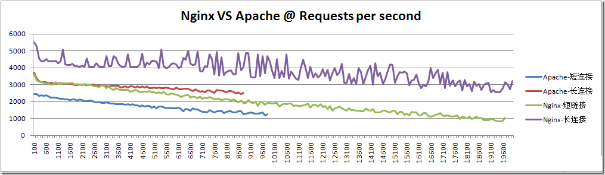
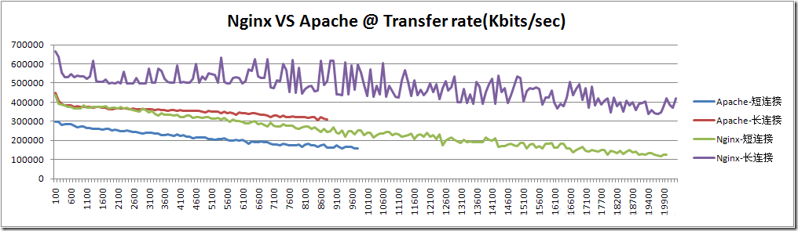
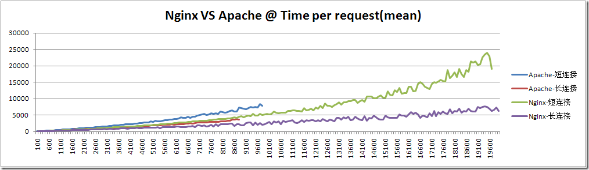
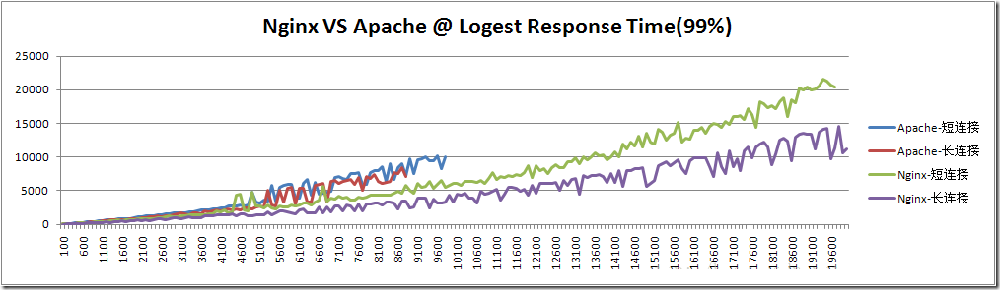
#### 常用web服务器对比
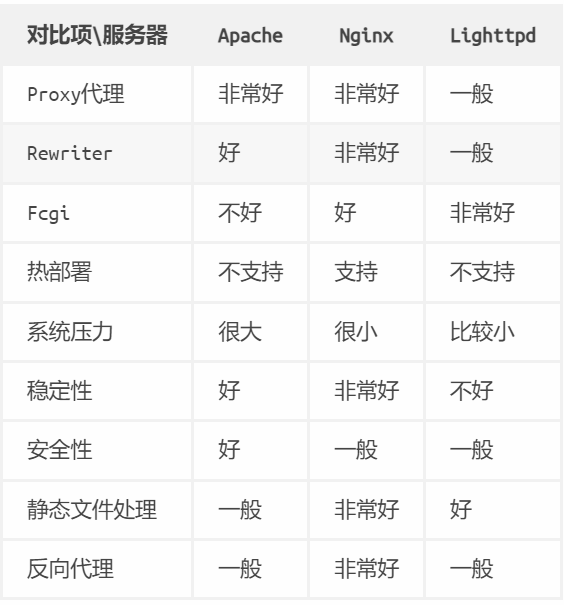
#### Nginx 模块
整体采用模块化设计是 Nginx 的一个重大特点，甚至 http 服务器核心功能也是一个模块。旧版本的 Nginx 的模块是静态的，添加和删除模块都要对 Nginx 进行重新编译，1.9.11 以及更新的版本已经支持动态模块加载。

​ 高度模块化的设计是 Nginx 的架构基础。Nginx 服务器被分解为多个模块，每个模块就是一个功能模块，只负责自身的功能，模块之间严格遵循“高内聚，低耦合”的原则。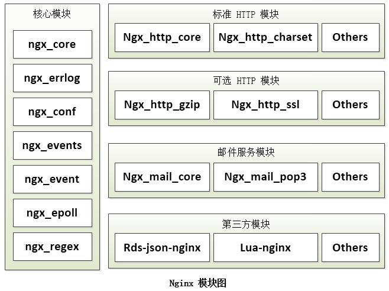
##### 核心模块
​ 核心模块是 Nginx 服务器正常运行必不可少的模块，提供错误日志记录、配置文件解析、事件驱动机制、进程管理等核心功能。

##### 标准 HTTP 模块
​ 标准 HTTP 模块提供 HTTP 协议解析相关的功能，如：端口配置、网页编码设置、HTTP 响应头设置等。

##### 可选 HTTP 模块
​ 可选 HTTP 模块主要用于扩展标准的 HTTP 功能，让 Nginx 能处理一些特殊的服务，如：Flash 多媒体传输、解析 GeoIP 请求、SSL 支持等。

##### 邮件服务模块
​ 邮件服务模块主要用于支持 Nginx 的邮件服务，包括对 POP3 协议、IMAP 协议和 SMTP 协议的支持。

##### 第三方模块
​ 第三方模块是为了扩展 Nginx 服务器应用，完成开发者自定义功能，如：Json 支持、Lua 支持等。

### nginx应用场景
> Nginx是一款自由的、开源的、高性能的HTTP服务器和反向代理服务器；同时也是一个IMAP、POP3、SMTP代理服务器；Nginx可以作为一个HTTP服务器进行网站的发布处理，另外Nginx可以作为反向代理进行负载均衡的实现。

#### 关于代理
> 说到代理，首先我们要明确一个概念，所谓代理就是一个代表、一个渠道；

此时就涉及到两个角色，一个是被代理角色，一个是目标角色，被代理角色通过这个代理访问目标角色完成一些任务的过程称为代理操作过程；如同生活中的专卖店~客人到adidas专卖店买了一双鞋，这个专卖店就是代理，被代理角色就是adidas厂家，目标角色就是用户。

##### 正向代理
​ 说反向代理之前，我们先看看正向代理，正向代理也是大家最常接触的到的代理模式，我们会从两个方面来说关于正向代理的处理模式，分别从软件方面和生活方面来解释一下什么叫正向代理。

​ 在如今的网络环境下，我们如果由于技术需要要去访问国外的某些网站，此时你会发现位于国外的某网站我们通过浏览器是没有办法访问的，此时大家可能都会用一个操作FQ进行访问，FQ的方式主要是找到一个可以访问国外网站的代理服务器，我们将请求发送给代理服务器，代理服务器去访问国外的网站，然后将访问到的数据传递给我们！

　　上述这样的代理模式称为正向代理，正向代理最大的特点是客户端非常明确要访问的服务器地址；服务器只清楚请求来自哪个代理服务器，而不清楚来自哪个具体的客户端；正向代理模式屏蔽或者隐藏了真实客户端信息。来看个示意图（我把客户端和正向代理框在一块，同属于一个环境，后面我有介绍）：

　客户端必须设置正向代理服务器，当然前提是要知道正向代理服务器的IP地址，还有代理程序的端口。如图。

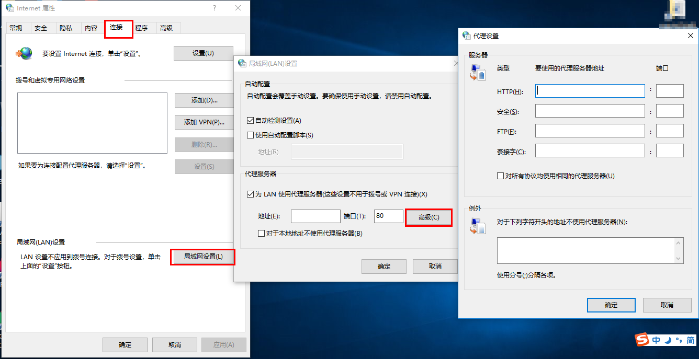

总结来说：**正向代理，”它代理的是客户端，代客户端发出请求”**，是一个位于客户端和原始服务器(origin server)之间的服务器，为了从原始服务器取得内容，客户端向代理发送一个请求并指定目标(原始服务器)，然后代理向原始服务器转交请求并将获得的内容返回给客户端。客户端必须要进行一些特别的设置才能使用正向代理。
> 正向代理的用途:
> - 访问原来无法访问的资源，如Google
> - 可以做缓存，加速访问资源
> - 对客户端访问授权，上网进行认证
> - 代理可以记录用户访问记录（上网行为管理），对外隐藏用户信息

##### 反向代理
　　明白了什么是正向代理，我们继续看关于反向代理的处理方式，举例如我大天朝的某宝网站，每天同时连接到网站的访问人数已经爆表，单个服务器远远不能满足人民日益增长的购买欲望了，此时就出现了一个大家耳熟能详的名词：分布式部署；也就是通过部署多台服务器来解决访问人数限制的问题；某宝网站中大部分功能也是直接使用Nginx进行反向代理实现的，并且通过封装Nginx和其他的组件之后起了个高大上的名字：Tengine，有兴趣的童鞋可以访问Tengine的官网查看具体的信息：http://tengine.taobao.org/。那么反向代理具体是通过什么样的方式实现的分布式的集群操作呢，我们先看一个示意图（我把服务器和反向代理框在一块，同属于一个环境，后面我有介绍）：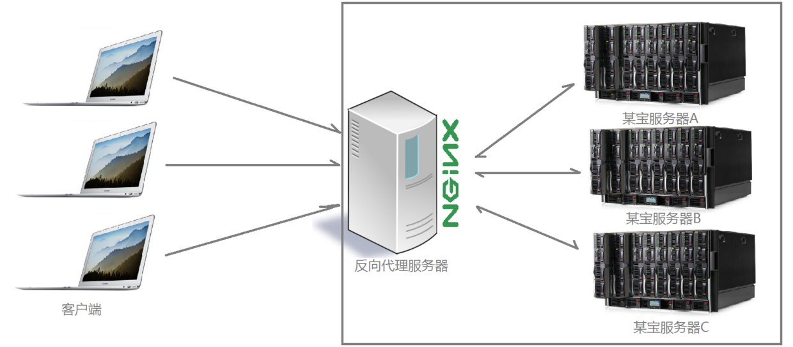
　　通过上述的图解大家就可以看清楚了，多个客户端给服务器发送的请求，Nginx服务器接收到之后，按照一定的规则分发给了后端的业务处理服务器进行处理了。此时~请求的来源也就是客户端是明确的，但是请求具体由哪台服务器处理的并不明确了，Nginx扮演的就是一个反向代理角色。

　　客户端是无感知代理的存在的，反向代理对外都是透明的，访问者并不知道自己访问的是一个代理。因为客户端不需要任何配置就可以访问。

　　反向代理，”它代理的是服务端，代服务端接收请求”，主要用于服务器集群分布式部署的情况下，反向代理隐藏了服务器的信息。
> 反向代理的作用：
> - 保证内网的安全，通常将反向代理作为公网访问地址，Web服务器是内网
> - 负载均衡，通过反向代理服务器来优化网站的负载

##### 项目场景
　　通常情况下，我们在实际项目操作时，正向代理和反向代理很有可能会存在在一个应用场景中，正向代理代理客户端的请求去访问目标服务器，目标服务器是一个反向单利服务器，反向代理了多台真实的业务处理服务器。具体的拓扑图如下：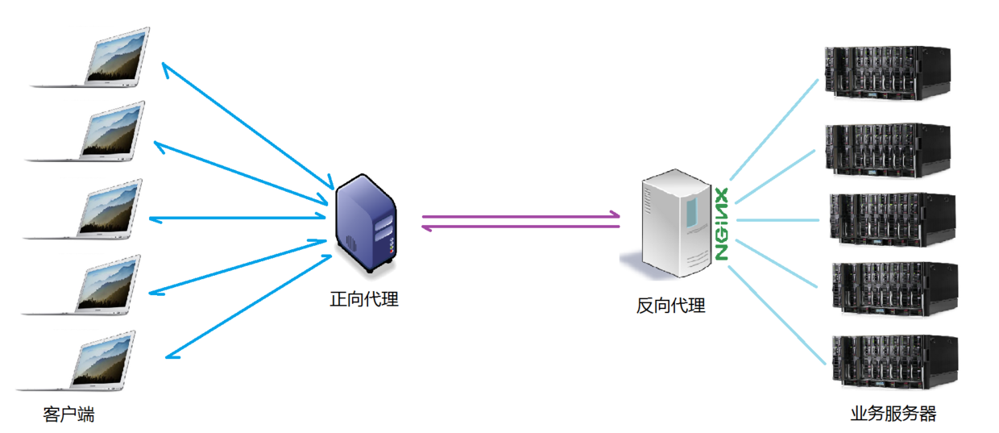
##### 二者区别
    截了一张图来说明正向代理和反向代理二者之间的区别，如图。
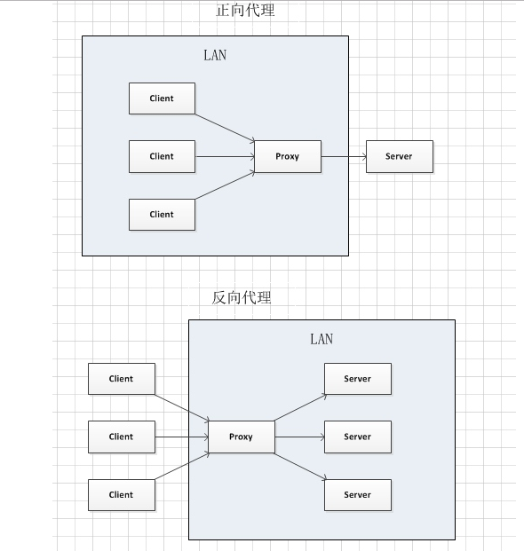

- 在正向代理中，Proxy和Client同属于一个LAN（图中方框内），隐藏了客户端信息；
- 在反向代理中，Proxy和Server同属于一个LAN（图中方框内），隐藏了服务端信息；

​ 实际上，Proxy在两种代理中做的事情都是替服务器代为收发请求和响应，不过从结构上看正好左右互换了一下，所以把后出现的那种代理方式称为反向代理了。
#### 负载均衡
　　我们已经明确了所谓代理服务器的概念，那么接下来，Nginx扮演了反向代理服务器的角色，它是以依据什么样的规则进行请求分发的呢？不用的项目应用场景，分发的规则是否可以控制呢？

这里提到的客户端发送的、Nginx反向代理服务器接收到的请求数量，就是我们说的负载量。

　　请求数量按照一定的规则进行分发到不同的服务器处理的规则，就是一种均衡规则。

　　所以，将服务器接收到的请求按照规则分发的过程，称为负载均衡。

　　负载均衡在实际项目操作过程中，有硬件负载均衡和软件负载均衡两种，硬件负载均衡也称为硬负载，如F5负载均衡，相对造价昂贵成本较高，但是数据的稳定性安全性等等有非常好的保障，如中国移动中国联通这样的公司才会选择硬负载进行操作；更多的公司考虑到成本原因，会选择使用软件负载均衡，软件负载均衡是利用现有的技术结合主机硬件实现的一种消息队列分发机制。
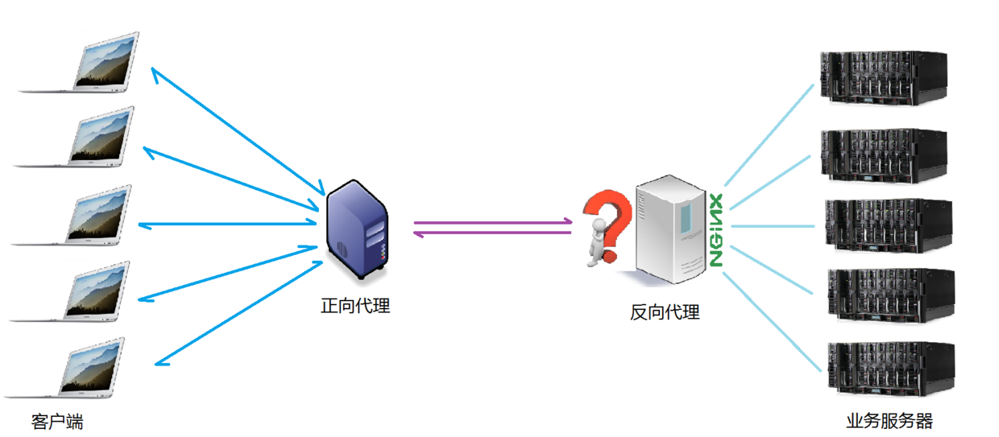
##### 负载均衡算法
Nginx支持的负载均衡调度算法方式如下：
###### 轮询
​ weight轮询（默认，常用，具有HA功效！）：接收到的请求按照权重分配到不同的后端服务器，即使在使用过程中，某一台后端服务器宕机，Nginx会自动将该服务器剔除出队列，请求受理情况不会受到任何影响。 这种方式下，可以给不同的后端服务器设置一个权重值(weight)，用于调整不同的服务器上请求的分配率；权重数据越大，被分配到请求的几率越大；该权重值，主要是针对实际工作环境中不同的后端服务器硬件配置进行调整的。

###### ip_hash
​ ip_hash（常用）：每个请求按访问ip的hash结果分配，这样每个访客固定访问一个后端服务器，这也在一定程度上解决了集群部署环境下session共享的问题。

###### fair
​ fair：智能调整调度算法，动态的根据后端服务器的请求处理到响应的时间进行均衡分配，响应时间短处理效率高的服务器分配到请求的概率高，响应时间长处理效率低的服务器分配到的请求少；结合了前两者的优点的一种调度算法。但是需要注意的是Nginx默认不支持fair算法，如果要使用这种调度算法，请安装upstream_fair模块。

###### url_hash
​ url_hash：按照访问的url的hash结果分配请求，每个请求的url会指向后端固定的某个服务器，可以在Nginx作为静态服务器的情况下提高缓存效率。同样要注意Nginx默认不支持这种调度算法，要使用的话需要安装Nginx的hash软件包。
