# Maven基础与应用

## 1. Maven基础

### 1.1 Maven简介    [01-Maven简介-Maven的概念与作用]

> Maven基础
> ● 配置文件草绿色
> 	<groupId>com.itheima</groupId> 
> ● Java代码蓝色
> 	Statement stat = con.createStatement();
> ● 示例粉色
> 	<groupId>com.itheima</groupId> 
> ● 命令行灰色
> 	mvn test

#### 1.1.1 Maven是什么 

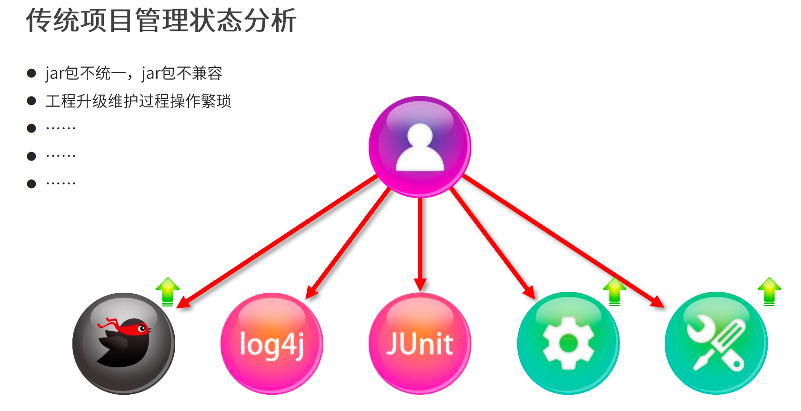

- Maven的本质是一个项目管理工具，将项目开发和管理过程抽象成一个项目对象模型POM
- POM (Project Object Model) 项目对象模型

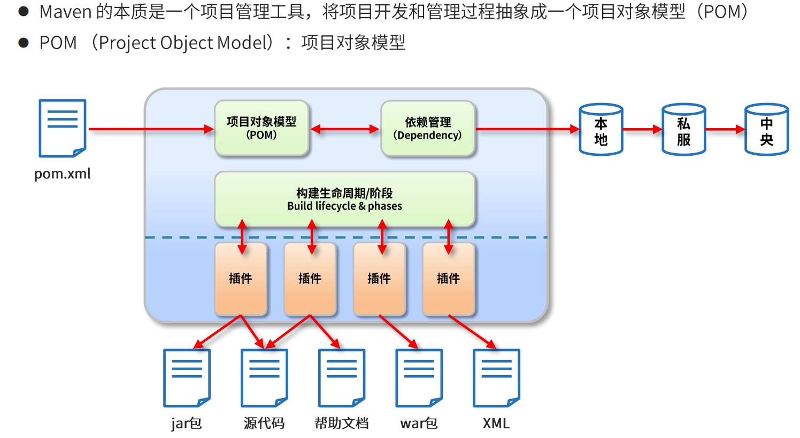

#### 1.1.2 Maven的作用

- 项目构建：提供标准的、跨平台的自动化项目构建方式。
- 依赖管理：方便快捷的管理 项目依赖的资源(jar包)，避免资源间版本冲突问题。
- 统一开发结构：提供标准的、统一的项目结构。

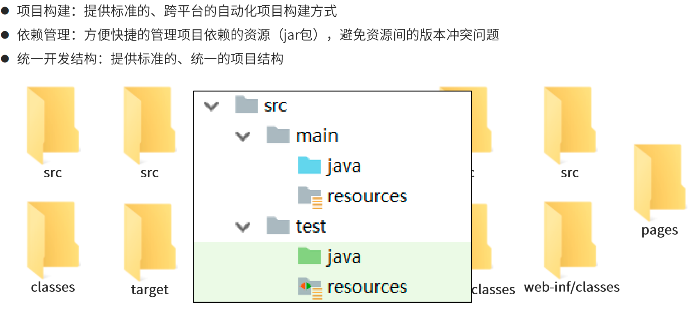

### 1.2 下载与安装  【02-Maven下载与安装-下载安装与环境变量配置】

> Maven下载
> 官网：http://maven.apache.org/
> 下载地址：http://maven.apache.org/download.cgi

#### 1.2.1 Maven安装

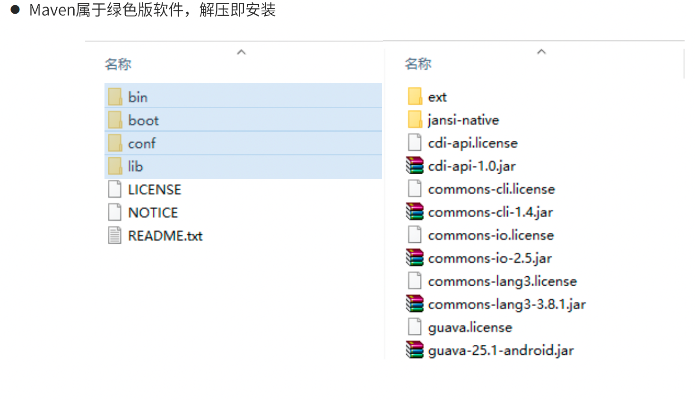

#### 1.2.2 Maven环境变量配置

- 依赖Java需要配置 JAVA_HOME

- 设置Maven自身的运行环境，需要配置 MAVEN_HOME

- 测试环境配置结果

  ~~~sh
  #配置环境变量
  变量名：MAVEN_HOME
  变量值：D:\apache-maven-3.6.3
  
  变量名：path
  变量值：%MAVEN_HOME%\bin
  #注意：一定要放在 JAVA_HOME 后，否则可能配置了不生效。
  mvn -v # 查看结果
  ~~~

### 1.3 Maven基础概念 【03-Maven基本概念-仓库】

#### 1.3.1 仓库

- 仓库：用于存储资源包含各种jar包
- 仓库分类：
  - 本地仓库：自己电脑上存储资源的仓库，连接远程仓库获取资源。
  - 远程仓库：非本机电脑上的仓库，为本地仓库提供资源。
    - 中央仓库：Maven团队维护，存储所有资源的仓库。
    - 私服：部门/公司范围内存储资源的仓库，从中央仓库获取资源。
- 私服作用：
  - 保存具有版权的资源，包含购买或自主研发的jar
    - 中央仓库中的jar都是开源的，不能存储具有版权的资源。
  - 一定范围内共享资源，仅对内部开放，不对外共享。

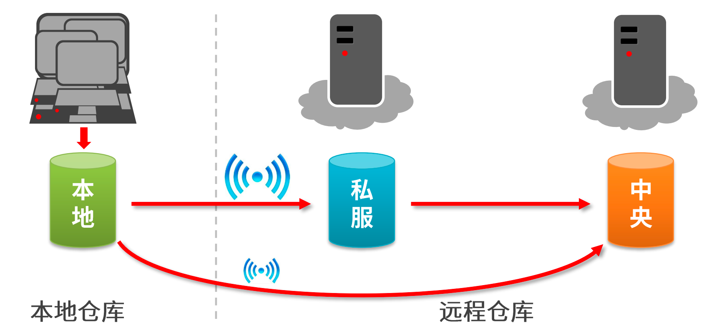

#### 1.3.2 坐标 【04-Maven基本概念-坐标】

- 什么是坐标？
  - Maven中的坐标用于描述仓库中资源的位置 
  - https://repo1.maven.org/maven2/
- Maven坐标主要组成
  - groupId：定义当前Maven项目隶属组织名称(通常是域名反写，例如：org.mybatis)
  - artifactId：定义当前Maven项目名称(通常是模块名称，例如：CRM、SMS)
  - version：定义当前项目版本号
  - packaging：定义该项目的打包方式：pom、war、jar
- Maven坐标作用
  - 使用唯一标识，唯一性定位资源位置，通过该标识可以将资源的识别与下载工作交由机器完成

#### 1.3.3 本地仓库配置 【05-Maven基本概念-仓库配置】

- Maven启动后会自动保存下载的资源到本地仓库

  - 默认位置

    ~~~xml
    <!--当前目录位置为登录用户名所在目录下的.m2文件夹中-->
    <localRepository>${user.home}/.m2/repository</localRepository> 
    ~~~

  - 自定义位置D:\soft\apache-maven-3.6.3\conf\settings.xml

    ~~~xml
    <!--当前目录位置为D:\maven\repository文件夹中-->
    <localRepository>D:\maven\repository</localRepository> 
    ~~~

#### 1.3.4 远程仓库配置

- Maven默认连接的中央仓库位置（**maven的超级pom文件**）

#### 1.3.5 镜像仓库配置

- 在settings.xml文件中配置阿里云镜像仓库(**可替换中央仓库配置**)

  ~~~xml
  <mirrors>
    <!--配置具体的仓库的下载镜像-->
    <mirror>
      <!--此镜像唯一标识符，用来区分不同的mirror元素-->
      <id>nexus-aliyun</id>
      <!--对哪种仓库进行镜像，简单说就是替代哪个仓库(即替换中央仓库id)-->
      <mirrorOf>central</mirrorOf>
      <!--镜像名称，不重要可不要此节点-->
      <name>Nexus aliyun</name>
      <!--镜像URL(即替换中央仓库URL)-->
      <url>http://maven.aliyun.com/nexus/content/groups/public</url>
    </mirror>
  </mirrors>
  ~~~

- 全局setting与用户setting区别

  - 全局setting定义了当前计算器中Maven的公共配置

    > D:\soft\apache-maven-3.6.3\conf\settings.xml

  - 用户setting定义了当前用户的配置

    > D:\maven\settings.xml
    >
    > 注意：必须保证这两个settings.xml一致，否则局部的会覆盖全局的。		

### 1.4 第一个Maven项目（手工制作）【06-第一个Maven程序-Maven项目结构】

#### 1.4.1 Maven工程目录结构

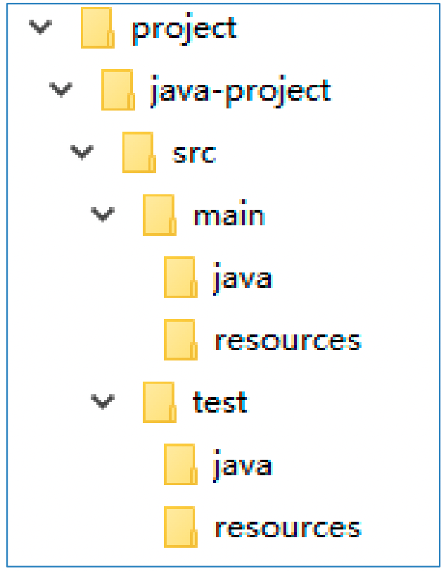

- 在src同层目录下创建pom.xml

  ~~~xml
  <?xml version="1.0" encoding="UTF-8"?>
  <project 
    xmlns="http://maven.apache.org/POM/4.0.0" 
    xmlns:xsi="http://www.w3.org/2001/XMLSchema-instance" 
    xsi:schemaLocation="http://maven.apache.org/POM/4.0.0 
    http://maven.apache.org/maven-v4_0_0.xsd">
  
    <modelVersion>4.0.0</modelVersion>
    
    <groupId>com.itheima</groupId>
    <artifactId>project-java</artifactId>
    <version>1.0</version>
    <packaging>jar</packaging>
    
    <dependencies>
      <dependency>
        <groupId>junit</groupId>
        <artifactId>junit</artifactId>
        <version>4.12</version>
      </dependency>
    </dependencies>
  </project>
  ~~~

#### 1.4.2 构建命令  【07-第一个Maven程序-Maven项目构建】

- Maven构建命令使用mvn开头，后面添加功能参数，可以一次执行多个命令，使用空格分隔

  ~~~sh
  mvn compile 	# 编译
  mvn clean 		# 清理
  mvn test 		  # 测试
  mvn package 	# 打包 经历过程：compile → test-complie → test → package
  mvn install 	# 安装到本地仓库 经历过程：compile → test-complie → test → package → install
  ~~~

- D:\project\project-java>mvn compile

  - 编译用到的插件(没有直接网上下载插件)

  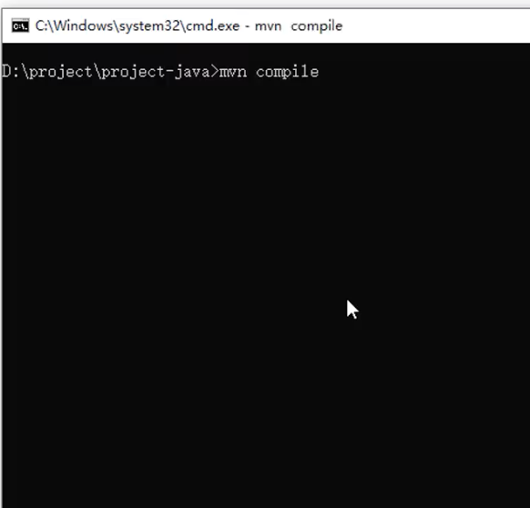

  - 输出

    

    

    

- D:\project\project-java>mvn test

  

#### 1.4.3 插件创建工程 【08-第一个Maven程序-插件创建Maven工程】

- 创建工程

  ~~~sh
  mvn archetype:generate
      -DgroupId={project-packaging}
      -DartifactId={project-name}
      -DarchetypeArtifactId=maven-archetype-quickstart
      -DinteractiveMode=false
  ~~~

- 示例：

   创建java工程

  ~~~sh
  #-D参数 groupId artifactId version archetypeArtifactId 使用哪个模板maven-archetype-quickstart 创建项目
  mvn archetype:generate 
      -DgroupId=com.itheima 
      -DartifactId=java-project 
      -DarchetypeArtifactId=maven-archetype-quickstart 
      -Dversion=0.0.1-snapshot 
      -DinteractiveMode=false
  ~~~

- 创建web工程

  ~~~sh
  mvn archetype:generate 
      -DgroupId=com.itheima 
      -DartifactId=web-project 
      -DarchetypeArtifactId=maven-archetype-webapp 
      -Dversion=0.0.1-snapshot 
      -DinteractiveMode=false
  ~~~

  > 一句话：了解，实际工作都是IDEA创建项目，不会让你手动自己用mvn命令行创建项目的。

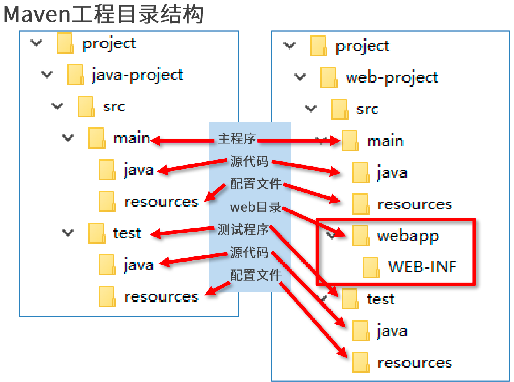

### 1.5 第一个Maven项目（IDEA生成）【09-第一个Maven程序-Idea版创建Maven工程（3.6.1版）】

> ldea对3.6.2及以上版本存在兼容性问题，为避免冲突，IDEA中安装使用3.61版本

#### 1.5.1 配置Maven

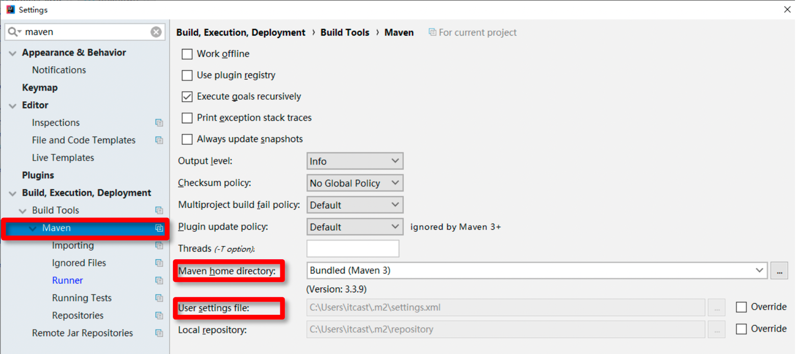

#### 1.5.2 手动创建Java项目 【10-第一个Maven程序-Idea版使用模板（骨架）创建Maven工程（3.6.1版）】

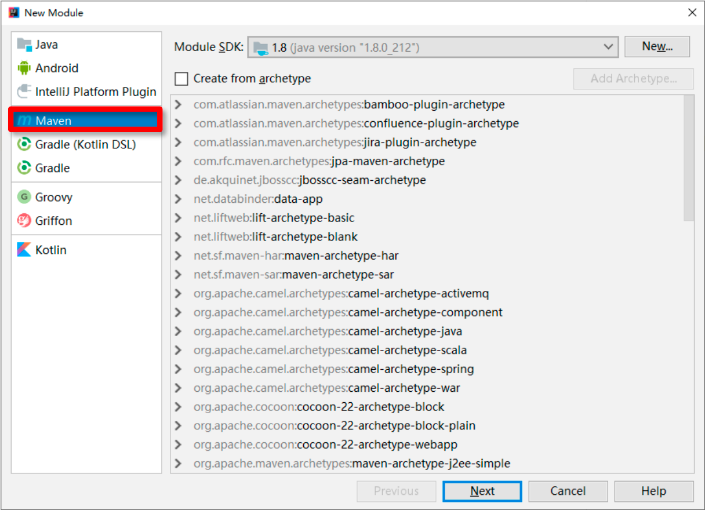

#### 1.5.3 原型创建Java项目

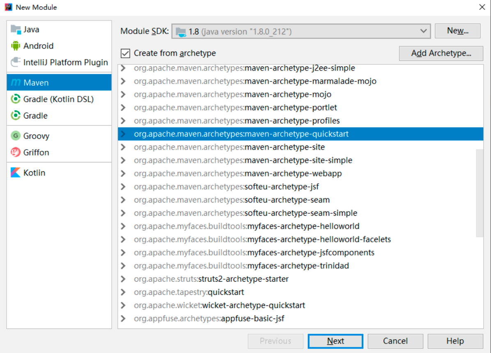

#### 1.5.4 原型创建Web项目 【11-第一个Maven程序-tomcat插件安装与web工程启动】

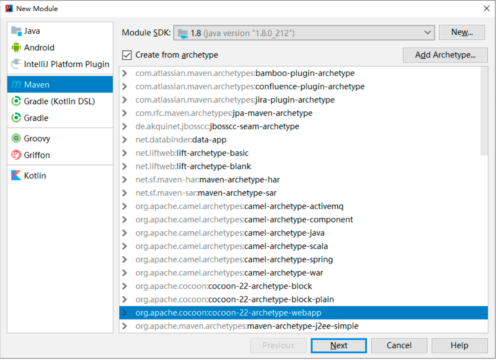

#### 1.5.5 插件

~~~xml
<?xml version="1.0" encoding="UTF-8"?>
<project xmlns="http://maven.apache.org/POM/4.0.0" xmlns:xsi="http://www.w3.org/2001/XMLSchema-instance" xsi:schemaLocation="http://maven.apache.org/POM/4.0.0 http://maven.apache.org/maven-v4_0_0.xsd">
  <!--指定pom的模型版本-->
  <modelVersion>4.0.0</modelVersion>
  <!--打包方式，web工程打包为war，java工程打包为jar-->
  <packaging>war</packaging>
  <!--组织id-->
  <groupId>com.itheima</groupId>
  <!--项目id-->
  <artifactId>web01</artifactId>
  <!--版本号:release,snapshot-->
  <version>1.0-SNAPSHOT</version>
  <!--构建-->
  <build>
    <!--设置插件-->
    <plugins>
      <!--具体的插件配置-->
      <plugin>
        <groupId>org.apache.tomcat.maven</groupId>
        <artifactId>tomcat7-maven-plugin</artifactId>
        <version>2.1</version>
        <configuration>
		  <!--配置端口号-->
          <port>80</port>
		  <!--配置根访问路径-->
          <path>/</path>
        </configuration>
      </plugin>
    </plugins>
  </build>
</project>
~~~

### 1.6 依赖管理  【12-依赖管理-依赖配置与依赖传递】

#### 1.6.1 依赖配置

- 依赖指当前项目运行所需要的jar，一个项目可以设置多个依赖

- 格式

  ~~~xml
  <!--设置当前项目所依赖的所有jar-->
  <dependencies>
      <!—-设置具体的依赖-->
      <dependency>
          <!—-依赖所属群组id-->
          <groupId>junit</groupId>
          <!—-依赖所属项目id-->
          <artifactId>junit</artifactId>
          <!—-依赖版本号-->
          <version>4.12</version>
      </dependency>
  </dependencies>
  ~~~

#### 1.6.2 依赖传递

- 依赖具有传递性

  - 直接依赖：在当前项目中通过依赖配置建立的依赖关系
  - 间接依赖：被资源的如果依赖其他资源，当前项目间接依赖其他资源。

- 依赖传递冲突问题

  - 路径优先：当依赖中出现相同的资源时，层级越深，优先级越低，层级越浅，优先级越高。	

  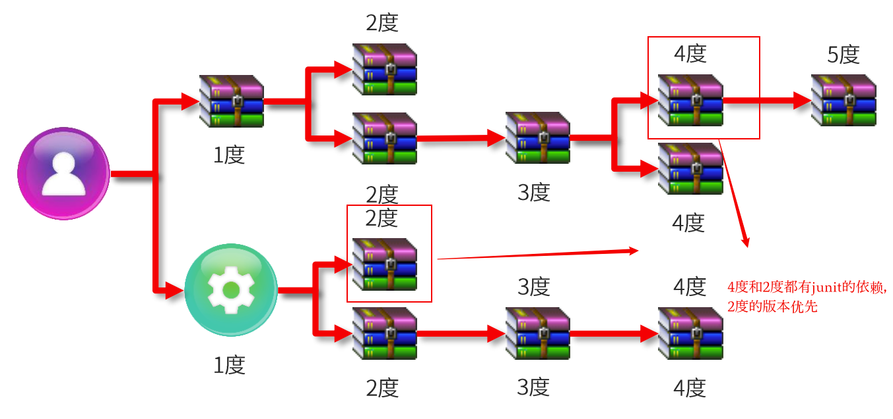

  > 一句话：路径深度越小越优先

  - 声明优先：当资源在相同层级被依赖时，配置顺序靠前的覆盖配置顺序靠后。	

    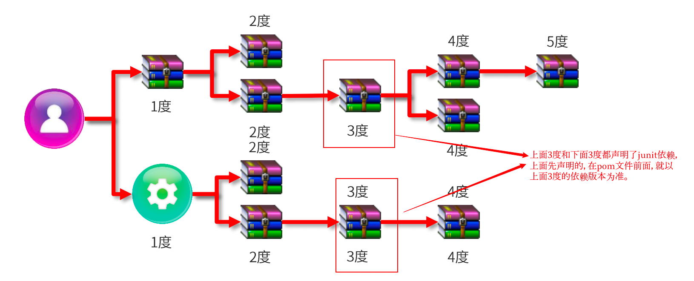		

    > ​	一句话：路径深度看先后顺序，谁靠前谁优先

  - 特殊优先：当同级配置了相同资源的不同版本，后配置的覆盖先配置。 	

    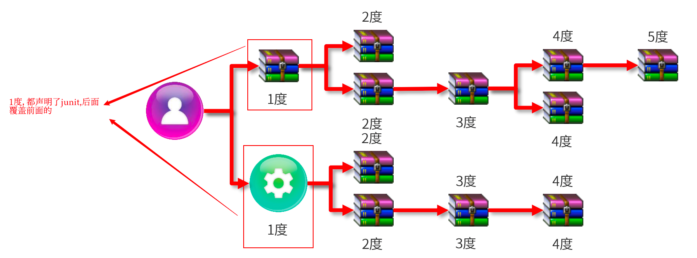				

    > 一句话：pom.xml文件里配置两个同名节点，后面节点覆盖前面节点。

#### 1.6.3 可选依赖

- 可选依赖指对外隐藏当前所依赖的资源--不透明

  ~~~xml
  <!--一句话：不想让人知道我依赖了哪些资源(禁用)-->
  <dependency>
    <groupId>junit</groupId>
    <artifactId>junit</artifactId>
    <version>4.12</version>
    <optional>true</optional> <!--不透明-->
  </dependency>
  ~~~

#### 1.6.4 排除依赖

- 排除依赖指主动断开依赖的资源，被排除的资源无需指定版本--不需要

  ~~~xml
  <dependency>
    <groupId>junit</groupId>
    <artifactId>junit</artifactId>
    <version>4.12</version>
    <exclusions>
      <exclusion> <!--排除标签-->
        <groupId>org.hamcrest</groupId>
        <artifactId>hamcrest-core</artifactId>
      </exclusion>
    </exclusions>
  </dependency>
  ~~~

  > 可选依赖与排除依赖区别？
  > 可选是隐藏了，不让别人看见，实际还存在。
  > 排除是彻底不要了，排除，实际不存在了。

#### 1.6.5 依赖范围  【13-依赖管理-依赖范围】

- 依赖的jar默认情况可以在任何地方使用，可以通过scope标签设定其作用范围
- 作用范围
  - 主程序范围有效(main文件夹范围内)
  - 测试程序范围有效(test文件夹范围内)
  - 是否参与打包(package指令范围内)

- 依赖范围传递性

  - 带有依赖范围的资源在进行传递时，作用范围将受到影响

  

~~~xml
project01 引用 project02
\代码\project-dependency\project01\pom.xml
<?xml version="1.0" encoding="UTF-8"?>
<project>
    <groupId>com.itheima</groupId>
    <artifactId>project01</artifactId>
    <version>1.0-SNAPSHOT</version>

    <dependencies>
        <dependency>
            <groupId>com.itheima</groupId>
            <artifactId>project02</artifactId>
            <version>1.0-SNAPSHOT</version>
            <scope>compile</scope>
        </dependency>
    </dependencies>
</project>

\代码\project-dependency\project02\pom.xml
<?xml version="1.0" encoding="UTF-8"?>
<project>
    <groupId>com.itheima</groupId>
    <artifactId>project02</artifactId>
    <version>1.0-SNAPSHOT</version>

    <dependencies>
        <dependency>
            <groupId>org.mybatis</groupId>
            <artifactId>mybatis</artifactId>
            <version>3.5.3</version>
            <scope>compile</scope>
        </dependency>
    </dependencies>
</project>
~~~

> 第 ① 种情况：
> project01
> <scope>compile</scope>
>
> project02
> <scope>compile</scope>
>
> project01
> └── Dependencies
> 	├── log4j:log4j:1.2.13
> 	└── com.itheima:project03:1.0-SNAPSHOT
> 		└── org.mybatis:mybatis:3.5.3
>
> project02
> └── Dependencies
> 	└── org.mybatis:mybatis:3.5.3
>
> 第 ② 种情况：
> project01
> <scope>compile</scope>
>
> project02
> <scope>test</scope>
>
> project01
> └── Dependencies
> 	├── log4j:log4j:1.2.13
> 	└── com.itheima:project03:1.0-SNAPSHOT
>
> project02
> └── Dependencies
> 	└── org.mybatis:mybatis:3.5.3(test)
>
> 第 ③ 种情况：
> project01
> <scope>compile</scope>
>
> project02
> <scope>provided</scope>
>
> project01
> └── Dependencies
> 	├── log4j:log4j:1.2.13
> 	└── com.itheima:project03:1.0-SNAPSHOT
>
> project02
> └── Dependencies
> 	└── org.mybatis:mybatis:3.5.3(provided)
>
> 第 ④ 种情况：
> project01
> <scope>compile</scope>
>
> project02
> <scope>runtime</scope>
>
> project01
> └── Dependencies
> 	├── log4j:log4j:1.2.13
> 	└── com.itheima:project03:1.0-SNAPSHOT
> 		└── org.mybatis:mybatis:3.5.3(runtime)
>
> project02
> └── Dependencies
> 	└── org.mybatis:mybatis:3.5.3(runtime)
>
> 4种情况一句话理解：就看project02打没打到jar包里，打进去了project01自然能看到，没打进去肯定看不到了。

### 1.7 生命周期与插件 【14-生命周期与插件-生命周期与插件】

#### 1.7.1 构建生命周期

- 项目构建生命周期

  - Maven构建生命周期描述的是一次构建过程经历了多少个事件

    

- Maven构建生命周期划分为3套

  - clean：清理工作
  - default：核心工作，例如编译，测试，打包，部署
  -  site：产生报告，发布站点等。

- clean生命周期

  -  pre-clean 执行一些需要在clean之前完成的工作
  -  clean 移除所有上一次构建生成的文件
  - post-clean 执行一些需要在clean之后立刻完成的工作

- default构建生命周期 

  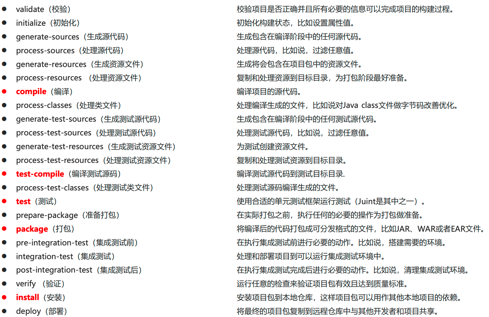

> 生命周期执行到compile(编译) 会把前面的生命周期全部执行一遍。

- site构建生命周期
  - pre-site 执行一些需要在生成站点文档之前完成的工作
  - site 生成项目的站点文档
  - post-site 执行一些需要在生成站点文档之后完成的工作，并且为部署做准备
  - site-deploy 将生成的站点文档部署到特定的服务器上

#### 1.7.2 插件

- 插件与生命周期内的阶段绑定，在执行到对应生命周期时执行对应的插件功能
-  默认maven在各个生命周期上绑定有预设的功能
- 通过插件可以自定义其他功能

~~~xml
<?xml version="1.0" encoding="UTF-8"?>
<project>
    <modelVersion>4.0.0</modelVersion>

    <groupId>com.itheima</groupId>
    <artifactId>project03</artifactId>
    <version>1.0-SNAPSHOT</version>

    <dependencies>
    </dependencies>
    <build>
      <plugins>
        <plugin>
          <groupId>org.apache.maven.plugins</groupId>
          <artifactId>maven-source-plugin</artifactId> <!--源码打包插件-->
          <version>2.2.1</version>
          <executions> <!--执行插件-->
            <execution>
              <goals>
                <goal>jar</goal> <!--jar 对源码打包，test-jar对测试代码打包-->
              </goals>
              <!--插件执行在哪个阶段(即当程序执行到generate-test-resources生成测试资源文件阶段，就执行插件。)-->
              <phase>generate-test-resources</phase> 
            </execution>
          </executions>
        </plugin>
      </plugins>
    </build>
</project>
~~~

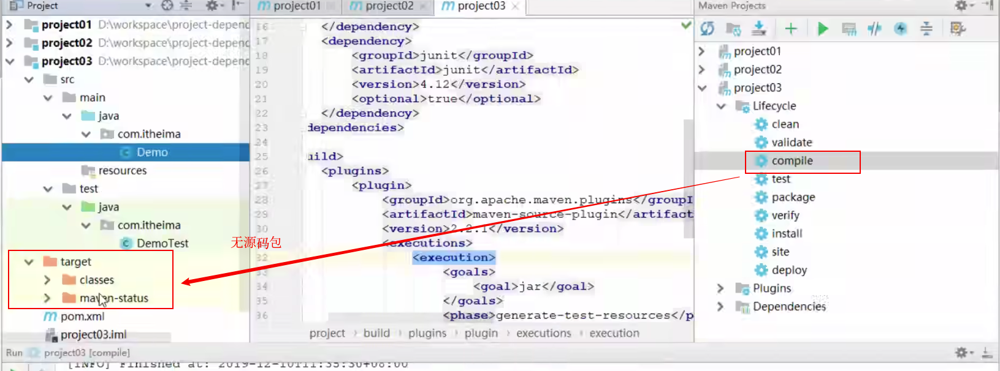

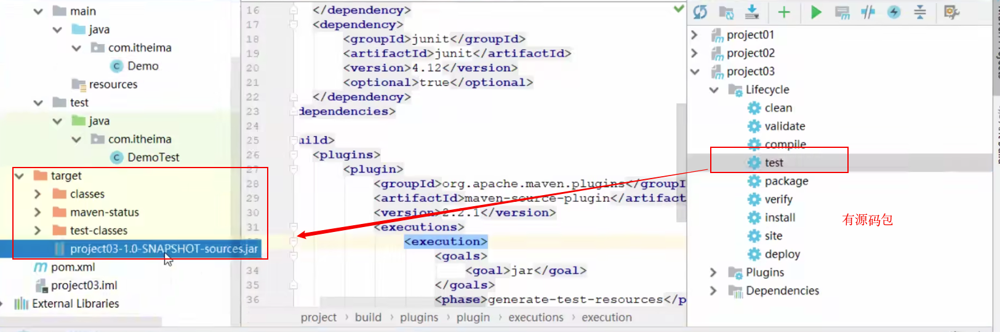

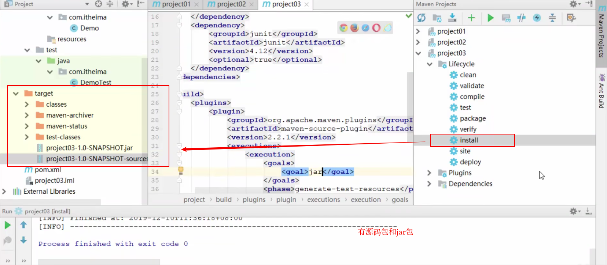

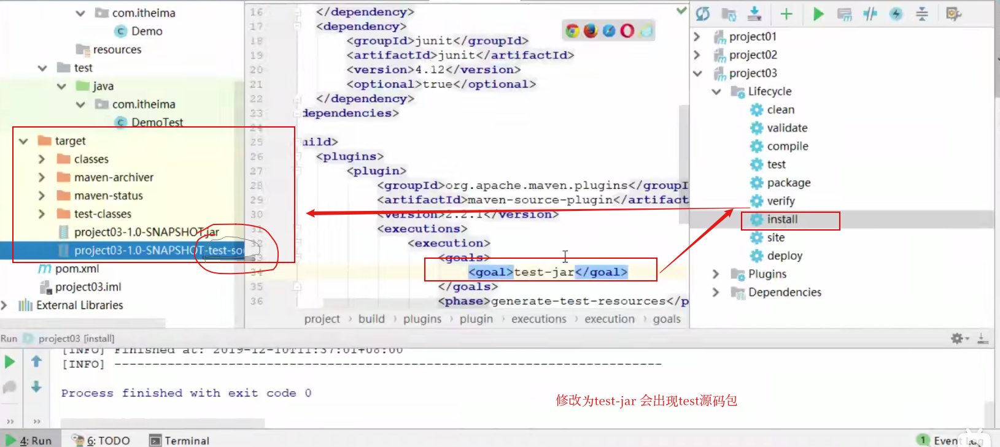

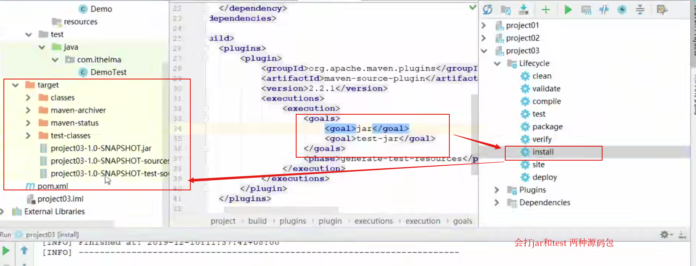

> 生命周期是指哪个阶段，插件是指哪个生命周期阶段应该做什么。

## 2. Maven 高级

### 2.1 分模块开发与设计

【01-分模块开发与设计-模块拆分思想与pojo模块拆分~1】

【02-分模块开发与设计-dao模块拆分】 

【03-分模块开发与设计-service模块拆分】

【04-分模块开发与设计-controller模块拆分】 

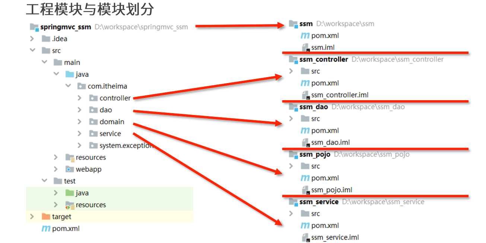

 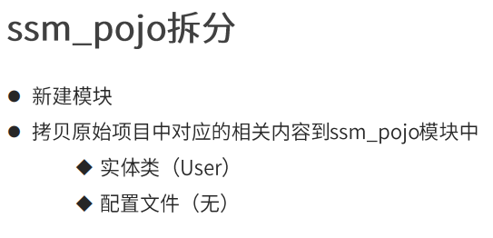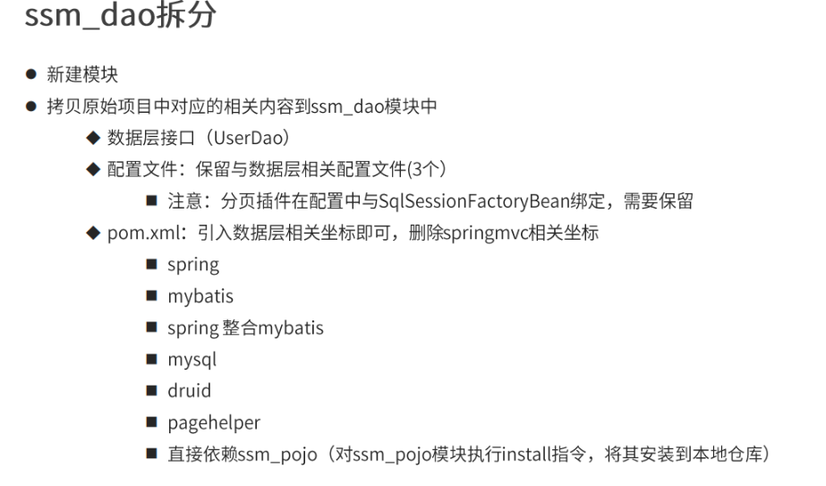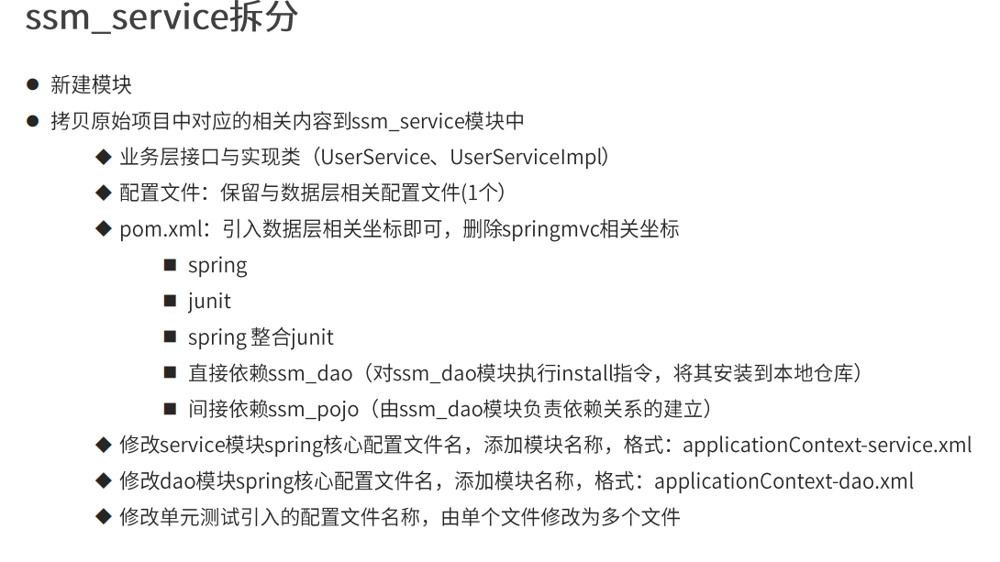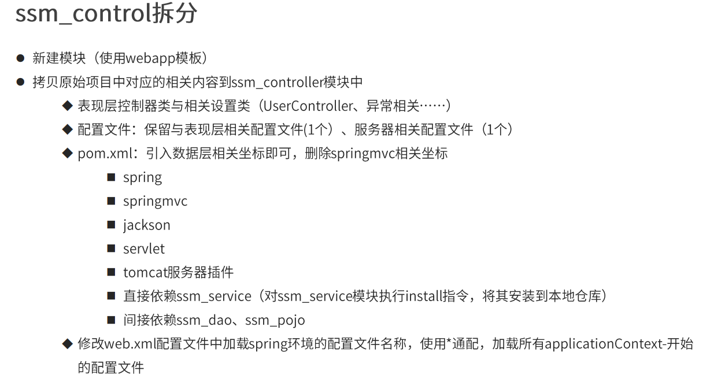

> 注意：service层pom.xml文件不需要再引用pojo节点，因为dao层已经引入了pojo节点，maven的传递依赖相当于service层间接依赖引入了pojo。

### 2.2聚合  【05-聚合-模块聚合】

- 作用：聚合用于快速构建maven工程，一次性构建多个项目/模块

- 制作方式：

  - 创建一个空模块，打包类型定义为pom

    ~~~xml
    <packaging>pom</packaging>
    ~~~

  - 定义当前模块进行构建操作时关联的其他模块名称

    ~~~xml
    	<modules>
    <!--其中..是返回上级目录，是以当前pom.xml文件所在目录为根，向上查找ssm_controller这个模块，注意：是按文件夹路径查找的，如果文件夹名错误，查找失败！-->    
    	  <module>../ssm_controller</module> 
    	  <module>../ssm_service</module>
    	  <module>../ssm_dao</module>
    	  <module>../ssm_pojo</module> <!--与写的先后顺序无关-->
    	</modules>
    ~~~

> 注意事项：参与聚合操作的模块最终执行顺序与模块间的依赖关系有关，与配置先后顺序无关。
>
> 模块类型：
> 	● pom
> 	● war
> 	● jar 默认 <packaging>jar</packaging> 可省略不写

### 2.3 继承  【06-继承-模块继承】

- 作用：通过继承可以实现在子工程中沿用父工程中的配置

  - maven中的继承与java中的继承相似，在子工程中配置继承关系

- 制作方式：

  - 在子工程中声明其父工程坐标与对应的位置

    ~~~xml
    <!--定义父工程-->
    <parent>
      <groupId>com.itheima</groupId>
      <artifactId>ssm</artifactId>
      <version>1.0-SNAPSHOT</version>
      <!--相对路径填写父工程的pom文件-->
      <relativePath>../ssm/pom.xml</relativePath>
    </parent> 
    
    <!--原则上子工程应该与父工程属于同一组织机构，所以groupId节点应该删除-->
    <!--<groupId>com.itheima</groupId>-->
    <artifactId>ssm_pojo</artifactId>
    <!--原则上子工程应该与父工程属于同一版本号，所以version节点应该删除-->
    <!--<version>1.0-SNAPSHOT</version>-->
    <!--<packaging>jar</packaging>--> <!--默认打包方式jar可省略不写-->
    ~~~

- 继承依赖定义

  - 父工程pom.xml文件中添加整个项目中所有要引入的依赖节点，统一在此处管理起来。

  ~~~xml
  <!--声明此处进行依赖管理-->
  <dependencyManagement>
    <!--具体依赖-->
    <dependencies>
      <!--spring-->
      <dependency>
      <groupId>org.springframework</groupId>
      <artifactId>spring-context</artifactId>
      <version>5.1.9.RELEASE</version>
    </dependency>
    </dependencies>
  </dependencyManagement>
  一句话：<dependencyManagement>节点统一管理整个项目所有依赖，被使用在父工程中，子工程只需要从这里挑选自己需要的节点，而无需再写版本号。
  <pluginManagement>节点统一管理所有插件依赖
  ~~~

- 继承依赖使用

  - 在子工程中定义依赖关系，无需声明依赖版本，版本参照父工程中依赖的版本

    ~~~xml
    <dependencies>
      <!--spring环境-->
      <dependency>
        <groupId>org.springframework</groupId>
        <artifactId>spring-context</artifactId>
      </dependency>
    </dependencies>
    ~~~

- 继承的资源

~~~tex
● groupId：项目组ID，项目坐标的核心元素
● version：项目版本，项目坐标的核心元素
● description：项目的描述信息
● organization：项目组织信息
● inceptionYear：项目的创始年份
● url：项目URL地址
● developers：项目的开发者信息
● contributors：项目的贡献者信息
● distributionManagement：项目的部署配置
● issueManagement：项目的缺陷跟踪系统信息
● ciManagement：项目的持续集成系统信息
● scm：项目的版本控制系统信息
● malilingList：项目的邮件列表信息
● properties：自定义的Maven属性
● dependencies：项目依赖配置
● dependencyManagement：项目的依赖管理配置
● repositories：项目仓库配置
● build：包括项目的源码目录配置、输出目录配置、插件管理配置等
● reporting：包括项目的报告输出目录配置、报告插件配置等
~~~

- 继承与聚合

> ● 作用
> 	• 聚合用于快速构建项目
> 	• 继承用于快速配置
> ● 相同点
> 	• 聚合与继承的pom.xml文件 打包方式均为pom，可以将两种关系制作到同一个pom文件中
> 	• 聚合与继承均属于设计型模块，并无实际的模块内容。
> ● 不同点
> 	• 聚合是在当前模块中配置关系，聚合可以感知到参与聚合的模块有哪些
> 	• 继承是在子模块中配置关系，父模块无法感知哪些子模块继承了自己

### 2.4 属性  【07-属性-属性定义与使用】

- 版本统一管理的重要性

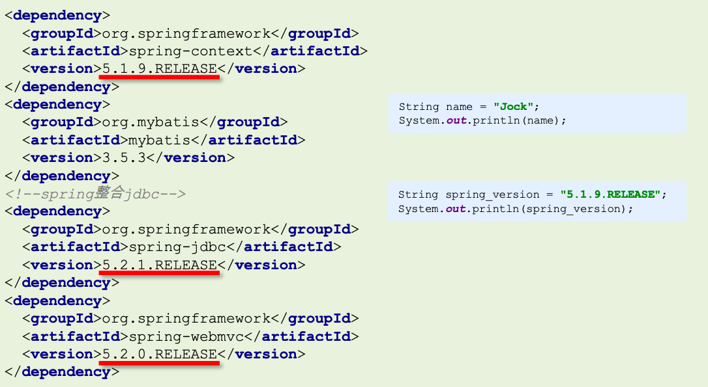

- 属性类别

  - 自定义属性
  - 内置属性
  - Setting属性
  - Java系统属性
  - 环境变量属性

- 属性类别：自定义属性

  - 作用：
    - 等同于定义变量，方便统一管理
  - 定义格式：

  ~~~xml
  <!--定义自定义属性-->
  	<properties>
  <!--版本号命名规则，默认jar包名.version，但spring各个模块都是统一版本号，我们可以直接取spring名作版本号名。-->    
  	  <spring.version>5.1.9.RELEASE</spring.version> 
  	  <junit.version>4.12</junit.version> <!--版本号命名规则，默认jar包名.version-->
  	</properties>
  ~~~

  > ​	一句话：<properties>节点统一管理整个项目所有的版本号，被使用在父工程中，子工程无需要管理版本号，会自动引用父工程里的版本号，实现统一管理版本号的功能。

  - 调用格式

  ~~~xml
  	<dependency>
  	  <groupId>org.springframework</groupId>
  	  <artifactId>spring-context</artifactId>
  	  <version>${spring.version}</version>
  	</dependency>
  ~~~

- 属性类别：内置属性

  - 作用
    - 使用maven内置属性同，快速配置
  - 调用格式：

  ~~~xml
  ${basedir}
  ${version} 等价 ${project.version} 其中 project 可省略不写，因为这是内置属性。取工程版本号。
  ~~~

- 属性类别：Setting属性

  - 作用
    - 使用maven配置文件settings.xml中的标签属性，用于动态配置
  - 调用格式：
    - ${settings.localRepository} 读取maven配置文件settings.xml里的节点值

- 属性类别：Java系统属性

  - 作用
    - 读取Java系统属性
  -  调用格式
    - ${user.home}
  - 系统属性查询方式
    - mvn help:system

- 属性类别：环境变量属性

  - 作用
    - 使用maven配置文件settings.xml中的标签属性，用于动态配置
  -  调用格式
    - ${env.JAVA_HOME}
  - 环境变量属性查询方式
    - mvn help:system

### 2.5 版本管理   【08-版本管理-版本管理】

- 工程版本
  - SNAPSHOT 快照版本
    -  项目开发过程 ，为方便团队成员合作，解决模块间相互依赖和实时更新的问题，开发者对每个模块进行构建的时候，输出的临时性版本叫快照版本(测试阶段版本)。
    -  快照版本会随着开发的进展不断更新
  -  RELEASE 发布版本
    -  项目开发到进入阶段里程碑后，向团队外部发布较为稳定的版本，这种版本对应的构件文件是稳定的，即便进行功能的后续开发，也不会改变当前发布版本内容，这种版本称为发布版本。
- 工程版本号约定
  - 约定规范
    - <主版本>.<次版本>.<增量版本>.<里程碑版本>
    - 主版本：表示项目重大架构的变更，如：spring5相较于spring4的迭代
    - 次版本：表示有较大的功能增加和变化，或者全面系统地修复漏洞
    - 增量版本：表示有重大漏洞的修复
    - 里程碑版本：表明一个版本的里程碑(版本内部)。这样的版本同下一个正式版本相比，相对来说不是很稳定，有待更多的测试。
  - 范例
    - 5.1.9.RELEASE

### 2.6 资源配置   【09-资源配置-资源加载属性值】 

- 资源配置多文件维护

  

- 配置文件引用pom属性

  - 作用

    - 在任意配置文件中加载pom文件中定义的属性

  - 调用格式

    - ${jdbc.url}

  - 开启配置文件加载pom属性

    ~~~xml
    <!--配置资源文件对应的信息-->
    <resources>
      <resource>
        <!—设定配置文件对应的位置目录，支持使用属性动态设定路径-->
        <directory>${project.basedir}/src/main/resources</directory>
        <!--开启对配置文件的资源加载过滤-->
        <filtering>true</filtering>
      </resource>
    </resources>
    ~~~

- 最终源码

  ~~~xml
  E:\1、Maven从基础到高级应用\资料-Maven\代码\属性、版本管理、资源配置、多环境配置\ssm\pom.xml
  <?xml version="1.0" encoding="UTF-8"?>
  <project>
      <!--定义自定义属性-->
      <properties>
          <spring.version>5.1.9.RELEASE</spring.version>
          <junit.version>4.12</junit.version>
          <jdbc.url>jdbc:mysql://127.0.0.1:3306/ssm_db</jdbc.url>
      </properties>
      <build>
          <!--配置资源文件对应的信息-->
          <resources>
              <resource>
                  <!--<directory>../ssm_dao/src/main/resources</directory>--> <!--这样指定写死了，只找ssm_dao项目目录下的资源文件，我想要所有项目下都自动查找，而不是写死这样。-->
                  <directory>${project.basedir}/src/main/resources</directory> <!--我们采用项目路径，在这个根路径下查找所有匹配/src/main/resources这个规则下的所有资源文件我都要。-->
                  <filtering>true</filtering>
              </resource>
          </resources>
          <!--配置测试资源文件对应的信息-->
          <testResources>
              <testResource>
                  <directory>${project.basedir}/src/test/resources</directory>
                  <filtering>true</filtering>
              </testResource>
          </testResources>
      </build>
  </project>
  
  E:\1、Maven从基础到高级应用\资料-Maven\代码\属性、版本管理、资源配置、多环境配置\ssm_dao\src\main\resources\jdbc.properties
  jdbc.driver=com.mysql.jdbc.Driver
  jdbc.url=${jdbc.url}
  jdbc.username=root
  jdbc.password=itheima
  
  IDEA右侧 → Maven标签 → 
  ssm
  └── Lifecycle 生命周期
  	└── install → 双击安装
   → 到本地maven仓库D:\maven\repository\com\itheima\ssm_dao\1.0-SNAPSHOT中找到ssm_dao-1.0-SNAPSHOT.jar → 右键 winrar 打开 → jdbc.properties
  jdbc.driver=com.mysql.jdbc.Driver
  jdbc.url=jdbc:mysql://127.0.0.1:3306/ssm_db 
  jdbc.username=root
  jdbc.password=itheima
  已经被正确解析成想要的地址
  ~~~

### 2.7 多环境开发配置  【10-环境配置-多环境配置】

- 多环境兼容

  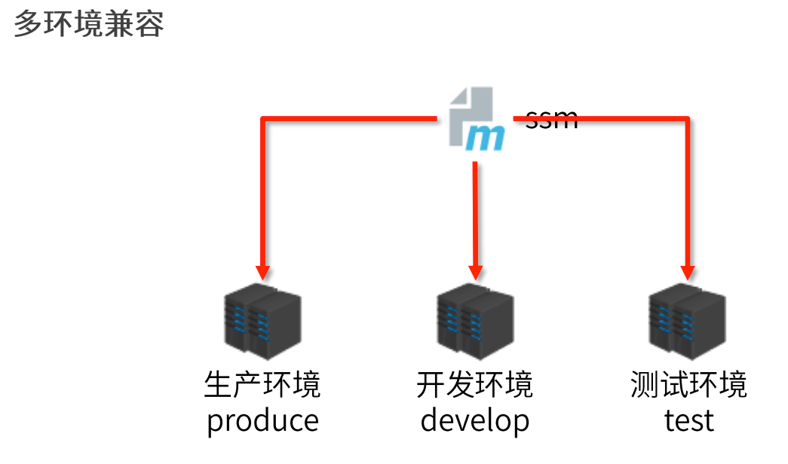

- 多环境开发配置

  ~~~xml
  <!--创建多环境-->
  <profiles>
    <!--定义具体的环境：生产环境-->
    <profile>
      <!--定义环境对应的唯一名称-->
      <id>pro_env</id>
      <!--定义环境中专用的属性-->
      <properties>
        <jdbc.url>jdbc:mysql://127.1.1.1:3306/ssm_db</jdbc.url>
      </properties>
      <!--设置默认启动-->
      <activation>
        <activeByDefault>true</activeByDefault>
      </activation>
    </profile>
    <!--定义具体的环境：开发环境-->
    <profile>
      <id>dev_env</id>
      <properties>
  	  <jdbc.url>jdbc:mysql://127.2.2.2:3306/ssm_db</jdbc.url>
  	</properties>
    </profile>
  </profiles>
  ~~~

- 加载指定环境

  - 作用
    - 加载指定环境配置
  - 调用格式
    - mvn 指令 –P 环境定义id
  - 范例
    - mvn install –P pro_env

~~~properties
Edit Configurations… → 点 + → Maven → Name: ssm-dep_env-install | Working directory: D:\workspace\ssm | Command line: install –P dep_env → OK
Edit Configurations… → 点 + → Maven → Name: ssm-pro_env-install | Working directory: D:\workspace\ssm | Command line: install –P pro_env → OK
点小三角运行 → 到本地maven仓库D:\maven\repository\com\itheima\ssm_dao\1.0-SNAPSHOT中找到ssm_dao-1.0-SNAPSHOT.jar → 右键 winrar 打开 → jdbc.properties
jdbc.driver=com.mysql.jdbc.Driver
jdbc.url=jdbc:mysql://127.1.1.1:3306/ssm_db 
jdbc.username=root
jdbc.password=itheima
已经被正确解析成想要的地址
这里有一个问题就是我们每次切换环境都需要创建上面的环境，我们设置一个默认的环境<activeByDefault>，每次启动就走默认环境就不用再创建上面的步骤了。
实际工作中
IDEA右侧 → Maven标签 → Profiles → 
√ dep_env
  pro_env
ssm
└── Lifecycle 生命周期
	└── install → 双击安装
勾选你要打包的环境，而不需要向上面那样操作，太麻烦。
注意：install 安装你去本地仓库目录里找ssm_dao-1.0-SNAPSHOT.jar，如果 package 打包，你直接去target目录下找就可以了。
~~~

### 2.8 跳过测试. 【11-跳过测试-跳过测试的三种方式】

- 跳过测试环节的应用场景

  -  整体模块功能未开发
  - 模块中某个功能未开发完毕
  - 单个功能更新调试导致其他功能失败
  - 快速打包
  -   …… 

- 使用命令跳过测试

  - 命令
    - mvn 指令 –D skipTests
  -  注意事项
    - 执行的指令生命周期必须包含测试环节

- 使用界面操作跳过测试

  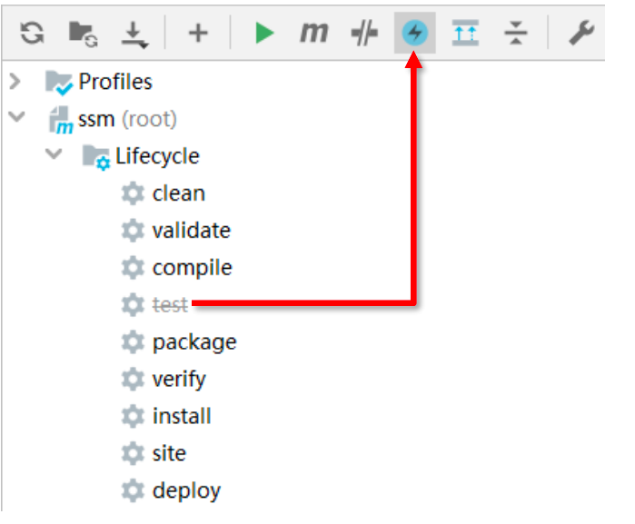

- 也可以IDEA左侧Project标签 →

  > ssm
  > └── pom.xml → 右键 → Run Maven → New Goal… → Command line: install –D skipTests → OK
  > 第二次使用时直接
  > ssm
  > └── pom.xml → 右键 → Install 即可，第一次输入的命令，第二次已经存在可以直接使用。

- 也可以用pom.xml配置文件

  ~~~xml
  <plugin>
    <!--<groupId>org.apache.maven</groupId>--><!--默认可以不写，直接删除掉，因为它是apache的插件。-->
    <artifactId>maven-surefire-plugin</artifactId>
    <version>2.22.1</version>
    <configuration>
      <skipTests>true</skipTests> <!--设置跳过测试-->
      <includes> <!--包含指定的测试用例-->
        <include>**/User*Test.java</include>
      </includes>
      <excludes> <!--排除指定的测试用例-->
        <exclude>**/User*TestCase.java</exclude>
      </excludes>
    </configuration>
  </plugin>
  ~~~

### 2.9 私服. 【12-私服-nexus服务器安装与启动】

#### 2.9.1 私服-nexus服务器安装与启动

- Nexus

  - Nexus是Sonatype公司的一款maven私服产品
  - 下载地址：https://help.sonatype.com/repomanager3/download

- Nexus安装、启动与配置

  - 启动服务器(命令行启动) D:\nexus\nexus-3.20.1-01\bin 启动时间比较长，直到看见 Started Sonatype Nexus OSS 3.20.1-01 说明启动成功。
    - nexus.exe /run nexus
  - 访问服务器 默认端口 8081
    - http://localhost:8081

  > 用户 admin 密码 D:\nexus\sonatype-work\nexus3\admin.password → Sign in → Next → 重设密码 admin → Next → Disable anonymous access 是否开启匿名访问 → Next → Finish

  - 修改基础配置信息

    - 安装路径下D:\nexus\nexus-3.20.1-01\etc目录中nexus-default.properties文件保存有nexus基础配置信息，例如默认访问端口

    > application-port=8081
    >
    > 修改完成后重启生效

  - 修改服务器运行配置信息

    - 安装路径下D:\nexus\nexus-3.20.1-01\bin目录中nexus.vmoptions文件保存有nexus服务器启动对应的配置信息，例如默认占用内存空间。

> 小提示
> nexus 发音，别让人笑话不专业 
> 英['neksəs]	美['neksəs]
> n.	关系; (错综复杂的)联结; 联系;

#### 2.9.2 仓库分类与手动上传组件  【13-私服-仓库分类与手动上传组件】

- 宿主
- hosted
  - 保存无法从中央仓库获取的资源
    - 自主研发
    - 第三方非开源项目
- 仓库组group
  - 将若干个仓库组成一个群组，简化配置
  - 仓库不能保存资源，属于设计型仓库。
- 代理仓库proxy
  -  代理远程仓库，通过nexus访问其他公共仓库，例如中央仓库

> 3种仓库的由来：
>
> - 代理仓库：避免频繁地网络访问maven中央仓库，网络访问太慢，我们做一个代理仓库，代理中央仓库，把本地仓库没有的资源通过代理仓库去访问中央仓库，下次再请求同样的资源，不需要网络访问了，直接从代理仓库里取即可。
> - 宿主仓库：我们内部开发的像ssm_dao、ssm_pojo、ssm_service、ssm_controller这样的jar包保存在内网中，方便团队成员之间获取，在项目中引入。还有第三方给的jar包，我们也需要保存，供团队成员下载使用。
> -  仓库组：由于团队成员上传的jar包保存在哪个仓库中只有他本人知道，而想要使用这个jar包的成员不知道他上传到哪一个仓库里了，所以就产生了这样一个仓库组的概念，几个供团队使用的仓库组成一个组，想要下载的成员不需要知道上传者上传到哪一个仓库上了，只需要找这个仓库组要即可，仓库里会把这个组里的每一个仓库遍历一遍去查找你需要的jar包。

#####  2.9.2.1 创建仓库

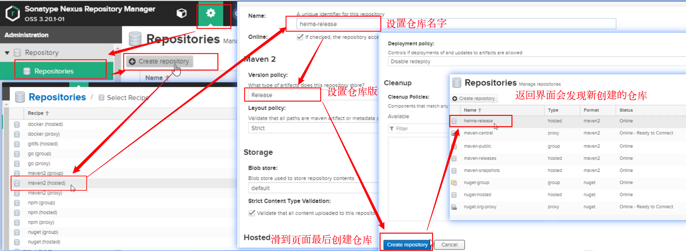

##### 2.9.2.2 将创建仓库加入公共仓库中

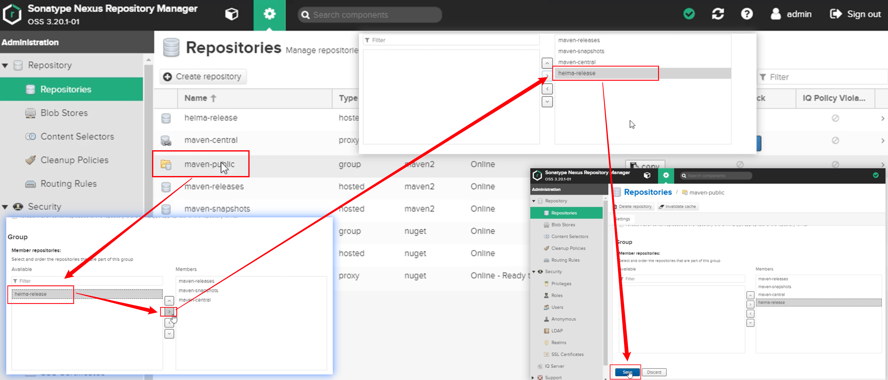

##### 2.9.2.3上传jar包

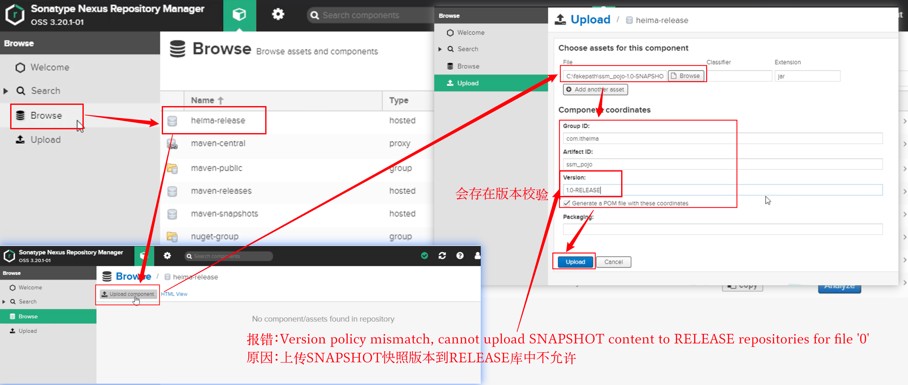

##### 2.9.2.4 查看jar包与删除

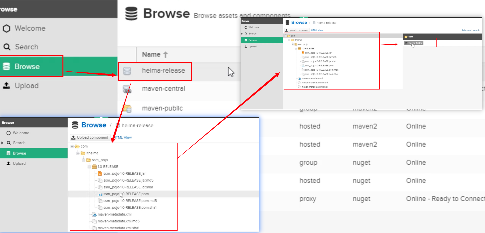

> ● 获取仓库地址
> 顶层菜单栏 立方体(浏览仓库) → 左侧菜单 Browse 浏览仓库 → 
> Name				Type	URL
> maven-public		group	copy → 点击 → 弹出 http://localhost:8081/repository/maven-public/ 地址 Ctrl+C 拷贝 → Close

#### 2.9.3 本地仓库访问私服【14-私服-本地仓库访问私服】

- 资源上传时提供对应的信息

  - 保存的位置(宿主仓库)
  - 资源文件
  -  对应坐标

- 访问私服配置(本地仓库访问私服)

  ~~~xml
  D:\soft\apache-maven-3.6.3\conf\settings.xml
  ~~~

- 配置本地仓库访问私服的权限(settings.xml)

~~~xml
<!--配置访问私服的用户名密码-->
<servers>
  <server>
    <id>heima-release</id> <!--第一台服务器名称，任意，但是后面要用，也不能乱写-->
    <username>admin</username> <!--用户名-->
    <password>admin</password> <!--密码-->
  </server>
  <server>
    <id>heima-snapshots</id> <!--第二台服务器名称，任意，但是后面要用，也不能乱写-->
    <username>admin</username> <!--用户名-->
    <password>admin</password> <!--密码-->
  </server>
</servers>
~~~

- 配置本地仓库资源来源(settings.xml)

~~~xml
<!--自定义的heima私服-->
<mirrors>
  <mirror>
    <id>nexus-heima</id>
	<!--<mirrorOf>central</mirrorOf>--> <!--镜像中央仓库，所有资源都从镜像仓库获取-->
    <mirrorOf>*</mirrorOf> <!--镜像所有仓库，所有资源都从私服获取-->
    <url>http://localhost:8081/repository/maven-public/</url>
  </mirror>
</mirrors>
~~~

#### 2.9.4 idea访问私服与组件上传  【15-私服-idea访问私服与组件上传】

- 访问私服配置(项目工程访问私服)

~~~xml
ssm\pom.xml
<!--发布配置管理-->
<distributionManagement>
  <repository> <!--发布正式版到私服的heima-release仓库中去-->
    <id>heima-release</id> <!--第一台服务器名称-->
    <url>http://localhost:8081/repository/heima-release/</url> <!--服务器地址-->
  </repository>
  <snapshotRepository> <!--发布快照版到私服的heima-snapshots仓库中去-->
    <id>heima-snapshots</id> <!--第二台服务器名称-->
    <url>http://localhost:8081/repository/heima-snapshots/</url> <!--服务器地址-->
  </snapshotRepository>
</distributionManagement>
~~~

- 发布资源到私服命令

~~~tex
mvn deploy

IDEA右侧 → Maven标签 → 
ssm
└── Lifecycle
	└── deploy
	
顶层菜单栏 立方体(浏览仓库) → 左侧菜单 Search 查询jar → Keyword: dao → 点击 More criteria 
没有结果
 → Keyword: ssm_dao → 点击 More criteria 
Name		Group
ssm_dao 	com.itheima
查询必须输入全关键字才可以匹配到，不支持模糊匹配。
~~~

