# Mysql进阶命令

## 1.存储引擎

#### 1.命令

~~~sql
#查询当前数据库支持的存储引擎
show engines;
#查询建表语句
show create table account;
~~~

创建表 my_myisam , 并指定MyISAM存储引擎

~~~sql
create table my_myisam(
    id int,
    name varchar(10)
) engine = MyISAM ;
~~~

创建表 my_memory , 指定Memory存储引擎

~~~sql
create table my_memory(
    id int,
    name varchar(10)
) engine = Memory ;
~~~

#### 2. **存储引擎特点**

重点提到的三种存储引擎 InnoDB、MyISAM、Memory的特点

##### 2.1 **InnoDB**

1). 介绍
 InnoDB是一种兼顾高可靠性和高性能的通用存储引擎，在 MySQL 5.5 之后，InnoDB是默认的MySQL 存储引擎。

2). 特点

- DML操作遵循ACID模型，支持事务; 
- 行级锁，提高并发访问性能;
- 支持外键FOREIGN KEY约束，保证数据的完整性和正确性;

3). 文件 

xxx.ibd:xxx代表的是表名，innoDB引擎的每张表都会对应这样一个表空间文件，存储该表的表结构(frm-早期的 、sdi-新版的)、数据和索引。 

参数:innodb_file_per_table

~~~sql
show variables like 'innodb_file_per_table';
~~~


如果该参数开启，代表对于InnoDB引擎的表，每一张表都对应一个ibd文件。 我们直接打开MySQL的 数据存放目录: C:\ProgramData\MySQL\MySQL Server 8.0\Data ， 这个目录下有很多文件 夹，不同的文件夹代表不同的数据库，我们直接打开user文件夹。

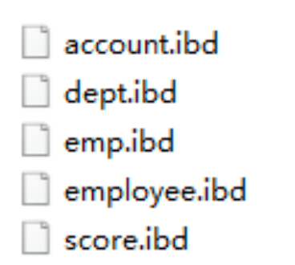

可以看到里面有很多的ibd文件，每一个ibd文件就对应一张表，比如:我们有一张表 account，就 有这样的一个account.ibd文件，而在这个ibd文件中不仅存放表结构、数据，还会存放该表对应的 索引信息。 而该文件是基于二进制存储的，不能直接基于记事本打开，我们可以使用mysql提供的一 个指令 ibd2sdi ，通过该指令就可以从ibd文件中提取sdi信息，而sdi数据字典信息中就包含该表的表结构。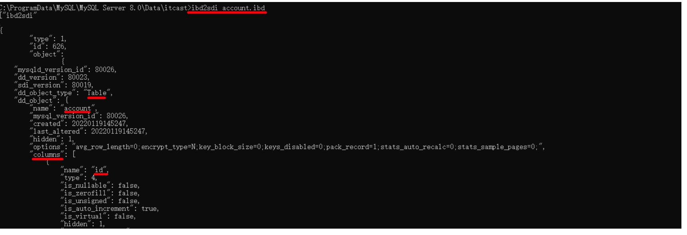

4). 逻辑存储结构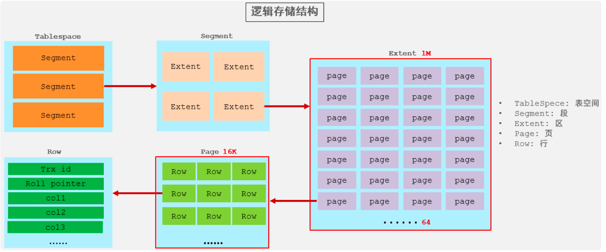

- 表空间 : InnoDB存储引擎逻辑结构的最高层，ibd文件其实就是表空间文件，在表空间中可以 包含多个Segment段。
- 段 : 表空间是由各个段组成的， 常见的段有数据段、索引段、回滚段等。InnoDB中对于段的管 理，都是引擎自身完成，不需要人为对其控制，一个段中包含多个区。
- 区 : 区是表空间的单元结构，每个区的大小为1M。 默认情况下， InnoDB存储引擎页大小为 16K， 即一个区中一共有64个连续的页。
- 页 : 页是组成区的最小单元，**页也是InnoDB** **存储引擎磁盘管理的最小单元**，每个页的大小默 认为 16KB。为了保证页的连续性，InnoDB 存储引擎每次从磁盘申请 4-5 个区。
- 行 : InnoDB 存储引擎是面向行的，也就是说数据是按行进行存放的，在每一行中除了定义表时 所指定的字段以外，还包含两个隐藏字段(后面会详细介绍)。

##### 2.2 **MyISAM**

1). 介绍 

MyISAM是MySQL早期的默认存储引擎。

2). 特点 

不支持事务，不支持外键 

支持表锁，不支持行锁 

访问速度快

3). 文件 

xxx.sdi:存储表结构信息 

xxx.MYD: 存储数据 

xxx.MYI: 存储索引


##### 2.3 **Memory**

1). 介绍 

Memory引擎的表数据时存储在内存中的，由于受到硬件问题、或断电问题的影响，只能将这些表作为临时表或缓存使用。

2). 特点
 内存存放 hash索引(默认)

3).文件 

xxx.sdi:存储表结构信息

##### 2.4  **区别及特点**

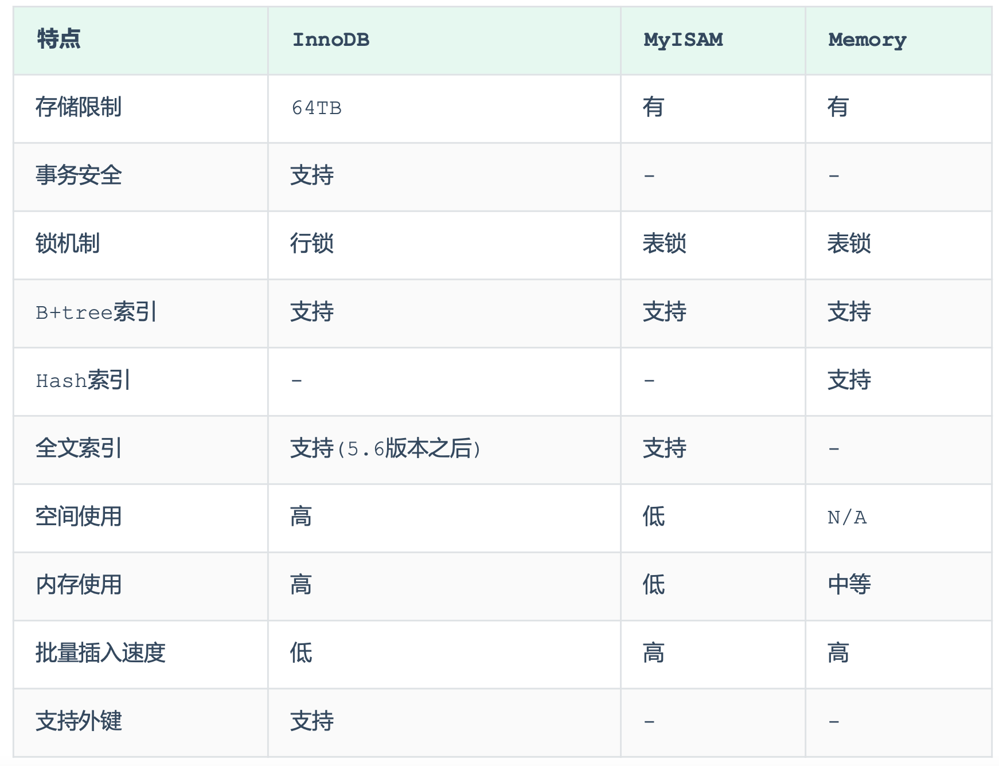

> 面试题:
>  InnoDB引擎与MyISAM引擎的区别 ?
>
> 1. InnoDB引擎, 支持事务, 而MyISAM不支持。
>
> 2. InnoDB引擎, 支持行锁和表锁, 而MyISAM仅支持表锁, 不支持行锁。 
> 3. InnoDB引擎, 支持外键, 而MyISAM是不支持的。
>
> 主要是上述三点区别，当然也可以从索引结构、存储限制等方面，更加深入的回答，具体参考如下官方文档:
>     https://dev.mysql.com/doc/refman/8.0/en/innodb-introduction.html
>     https://dev.mysql.com/doc/refman/8.0/en/myisam-storage-engine.html

## 2 索引

#### 2.1 **SQL性能分析**

MySQL 客户端连接成功后，通过 show [session|global] status 命令可以提供服务器状态信 息。通过如下指令，可以查看当前数据库的INSERT、UPDATE、DELETE、SELECT的访问频次:

~~~sql
-- session 是查看当前会话 ;
-- global 是查询全局数据 ;
SHOW GLOBAL STATUS LIKE 'Com_______';
~~~

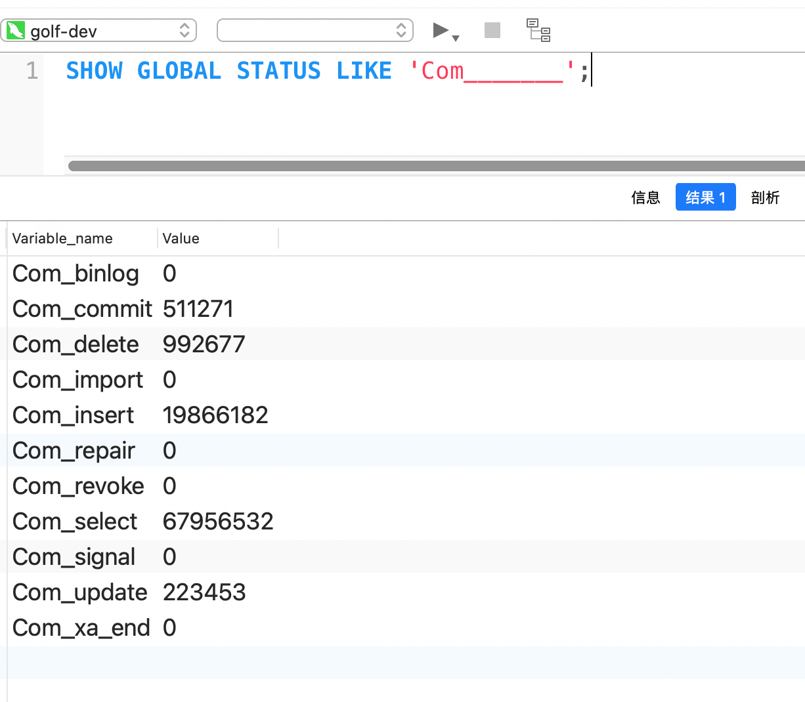

#### 2.2**慢查询日志**

慢查询日志记录了所有执行时间超过指定参数(long_query_time，单位:秒，默认10秒)的所有SQL语句的日志。

MySQL的慢查询日志默认没有开启，我们可以查看一下系统变量 slow_query_log。

~~~sql
show variables like 'slow_query_log';
~~~

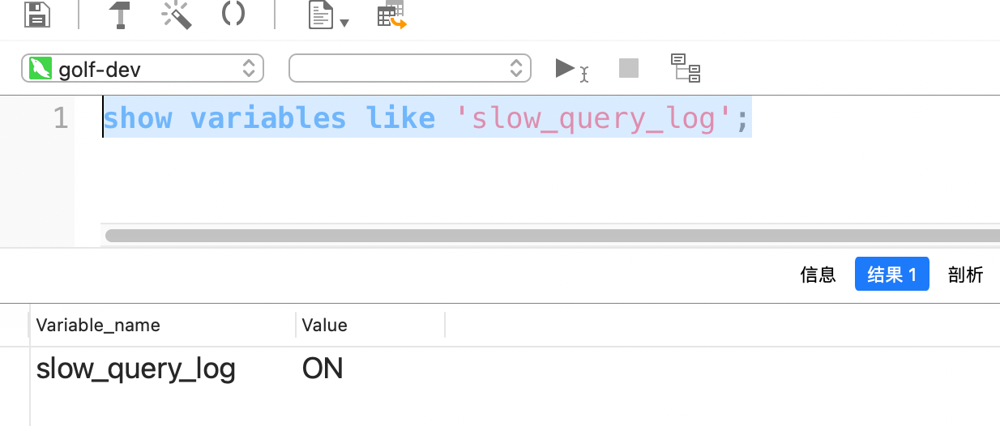

如果要开启慢查询日志，需要在MySQL的配置文件(/etc/my.cnf)中配置如下信息:

~~~sql
# 开启MySQL慢日志查询开关
slow_query_log=1
# 设置慢日志的时间为2秒，SQL语句执行时间超过2秒，就会视为慢查询，记录慢查询日志 
long_query_time=2
~~~

配置完毕之后，通过以下指令重新启动MySQL服务器进行测试，查看慢日志文件中记录的信息 /var/lib/mysql/localhost-slow.log。

~~~sql
systemctl restart mysqld
~~~

检查慢查询日志 :

最终我们发现，在慢查询日志中，只会记录执行时间超多我们预设时间(2s)的SQL，执行较快的SQL是不会记录的。

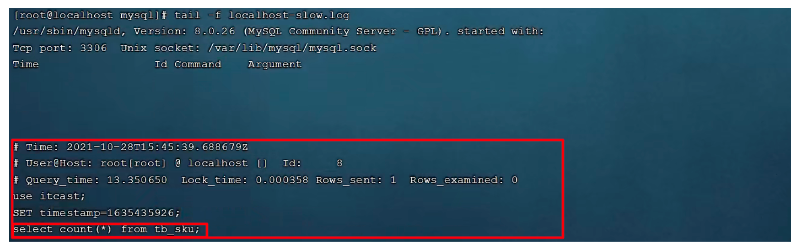

那这样，通过慢查询日志，就可以定位出执行效率比较低的SQL，从而有针对性的进行优化。

#### 2.3 **profile详情**

show profiles 能够在做SQL优化时帮助我们了解时间都耗费到哪里去了。通过have_profiling 参数，能够看到当前MySQL是否支持profile操作:

~~~sql
 SELECT @@have_profiling ;
~~~


可以看到，当前MySQL是支持 profile操作的，但是开关是关闭的。可以通过set语句在 session/global级别开启profiling:

~~~sql
SET profiling = 1;
~~~

开关已经打开了，接下来，我们所执行的SQL语句，都会被MySQL记录，并记录执行时间消耗到哪儿去 了。 我们直接执行如下的SQL语句:

~~~sql
select * from tb_user;
select * from tb_user where id = 1; select * from tb_user where name = '白起'; 
select count(*) from tb_sku;
~~~

执行一系列的业务SQL的操作，然后通过如下指令查看指令的执行耗时:

~~~sql
-- 查看每一条SQL的耗时基本情况 
show profiles;
-- 查看指定query_id的SQL语句各个阶段的耗时情况 
show profile for query query_id;
-- 查看指定query_id的SQL语句CPU的使用情况 
show profile cpu for query query_id;
~~~

查看每一条SQL的耗时情况:


查看指定SQL各个阶段的耗时情况 :


#### 2.4 explain

EXPLAIN 或者 DESC命令获取 MySQL 如何执行 SELECT 语句的信息，包括在 SELECT 语句执行 过程中表如何连接和连接的顺序。

语法:

~~~sql
-- 直接在select语句之前加上关键字 explain / desc
EXPLAIN SELECT 字段列表 FROM 表名 WHERE 条件 ;
~~~

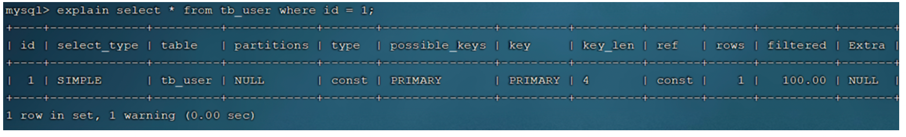

Explain 执行计划中各个字段的含义: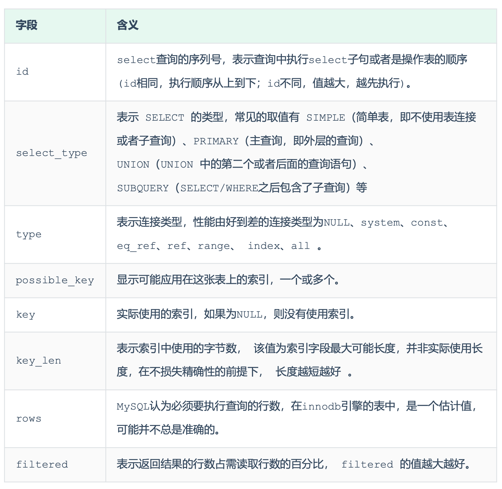

#### 2.5 SQL提示

1). use index : 建议MySQL使用哪一个索引完成此次查询(仅仅是建议，mysql内部还会再次进 行评估)。

~~~sql
explain select * from tb_user use index(idx_user_pro) where profession = '软件工 程';
~~~

2). ignore index : 忽略指定的索引。

~~~sql
explain select * from tb_user ignore index(idx_user_pro) where profession = '软件工 程';
~~~

3). force index : 强制使用索引。

~~~sql
 explain select * from tb_user force index(idx_user_pro) where profession = '软件工程';
~~~

#### 2.6 **覆盖索引**

尽量使用覆盖索引，减少select *。 那么什么是覆盖索引呢? 覆盖索引是指 查询使用了索引，并 且需要返回的列，在该索引中已经全部能够找到 。

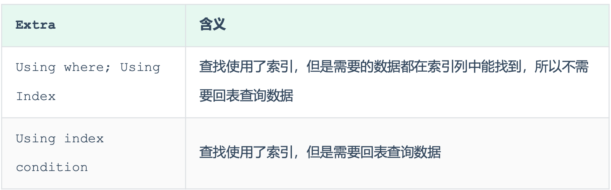

#### 2.7 **前缀索引**

当字段类型为字符串(varchar，text，longtext等)时，有时候需要索引很长的字符串，这会让 索引变得很大，查询时，浪费大量的磁盘IO， 影响查询效率。此时可以只将字符串的一部分前缀，建 立索引，这样可以大大节约索引空间，从而提高索引效率。

1). 语法

~~~sql
create index idx_xxxx on table_name(column(n)) ;
~~~

示例: 

为tb_user表的email字段，建立长度为5的前缀索引。

~~~sql
create index idx_email_5 on tb_user(email(5));
~~~

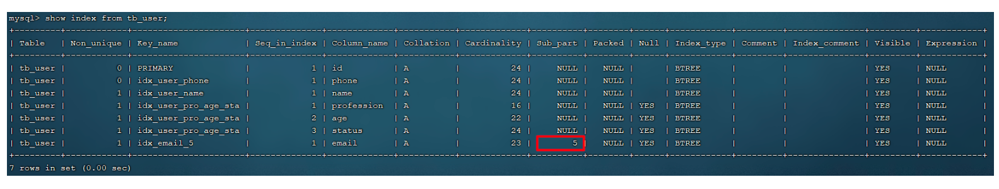

2). 前缀长度 

可以根据索引的选择性来决定，而选择性是指不重复的索引值(基数)和数据表的记录总数的比值，索引选择性越高则查询效率越高， 唯一索引的选择性是1，这是最好的索引选择性，性能也是最好的。

~~~sql
select  count(distinct email) / count(*)   from  tb_user ;
select  count(distinct substring(email,1,5)) / count(*)  from  tb_user ;
~~~

3). 前缀索引的查询流程

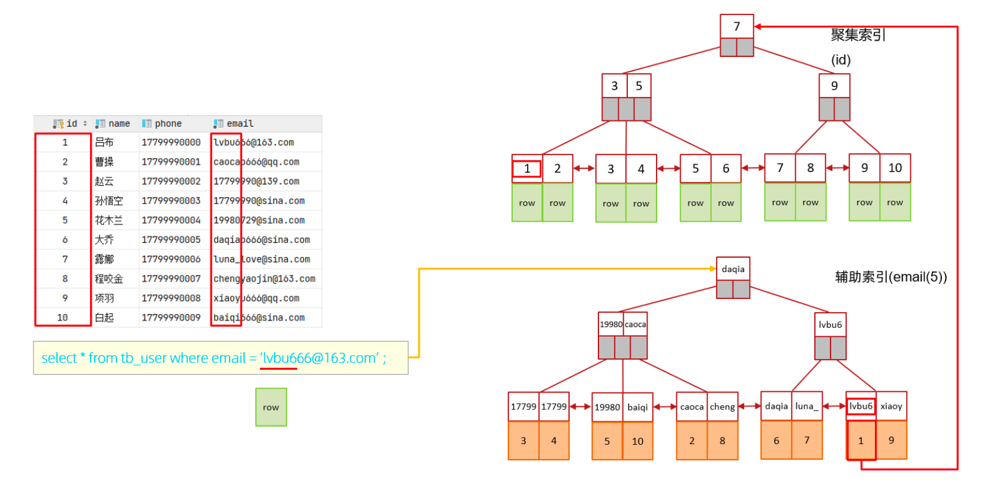

#### 2.8 **索引设计原则**

1).  针对于数据量较大，且查询比较频繁的表建立索引。

2).  针对于常作为查询条件(where)、排序(order by)、分组(group by)操作的字段建立索引。

3).  尽量选择区分度高的列作为索引，尽量建立唯一索引，区分度越高，使用索引的效率越高。

4).  如果是字符串类型的字段，字段的长度较长，可以针对于字段的特点，建立前缀索引。

5).  尽量使用联合索引，减少单列索引，查询时，联合索引很多时候可以覆盖索引，节省存储空间，避免回表，提高查询效率。

6). 要控制索引的数量，索引并不是多多益善，索引越多，维护索引结构的代价也就越大，会影响增 删改的效率。

7). 如果索引列不能存储NULL值，请在创建表时使用NOT NULL约束它。当优化器知道每列是否包含 NULL值时，它可以更好地确定哪个索引最有效地用于查询。

## 3 **SQL**优化

### **3.1** **插入数据**
#### **3.1.1 insert**

如果我们需要一次性往数据库表中插入多条记录，可以从以下三个方面进行优化。

1). 优化方案一 

批量插入数据

~~~sql
Insert into tb_test values(1,'Tom'),(2,'Cat'),(3,'Jerry');
~~~

2). 优化方案二 

手动控制事务

~~~sql
start  transaction;
insert  into  tb_test  values(1,'Tom'),(2,'Cat'),(3,'Jerry');
insert  into  tb_test  values(4,'Tom'),(5,'Cat'),(6,'Jerry');
insert  into  tb_test  values(7,'Tom'),(8,'Cat'),(9,'Jerry');
commit;
~~~

3). 优化方案三

主键顺序插入，性能要高于乱序插入。

~~~sql
主键乱序插入 : 8 1 9 21 88 2 4 15 89 5 7 3 
主键顺序插入 : 1 2 3 4 5 7 8 9 15 21 88 89
~~~

**3.1.2** **大批量插入数据
** 如果一次性需要插入大批量数据(比如: 几百万的记录)，使用insert语句插入性能较低，此时可以使用MySQL数据库提供的load指令进行插入。操作如下:

可以执行如下指令，将数据脚本文件中的数据加载到表结构中:

~~~sql
-- 客户端连接服务端时，加上参数 -–local-infile 
mysql –-local-infile -u root -p
-- 设置全局参数local_infile为1，开启从本地加载文件导入数据的开关 
set global local_infile = 1;
-- 执行load指令将准备好的数据，加载到表结构中
load data local infile '/root/sql1.log' into table tb_user fields terminated by ',' lines terminated by '\n';
~~~

> 主键顺序插入性能高于乱序插入

### **3.2** **主键优化**

### **3.5 limit**优化

~~~sql
explain select * from tb_sku t , (select id from tb_sku order by id limit 2000000,10) a where t.id = a.id;
~~~

## 4  **锁**

MySQL中的锁，按照锁的粒度分，分为以下三类:

```
  全局锁:锁定数据库中的所有表。
  表级锁:每次操作锁住整张表。
  行级锁:每次操作锁住对应的行数据。
```

### 4.1 全局锁

1). 加全局锁

~~~sql
flush tables with read lock ;
~~~

2). 数据备份

~~~sql
mysqldump -uroot –p1234 itcast > itcast.sql
~~~

数据备份的相关指令, 在后面MySQL管理章节, 还会详细讲解. 

3). 释放锁

~~~sql
unlock tables ;
~~~

#### **4.1.2** **特点** 

数据库中加全局锁，是一个比较重的操作，存在以下问题:

- 如果在主库上备份，那么在备份期间都不能执行更新，业务基本上就得停摆。 
- 如果在从库上备份，那么在备份期间从库不能执行主库同步过来的二进制日志(binlog)，会导 致主从延迟。

在InnoDB引擎中，我们可以在备份时加上参数 --single-transaction 参数来完成不加锁的一致 性数据备份。

~~~sql
mysqldump --single-transaction -uroot –p123456 itcast > itcast.sql
~~~

### 4.2 **表级锁**

#### 4.2.1 **介绍**

表级锁，每次操作锁住整张表。锁定粒度大，发生锁冲突的概率最高，并发度最低。应用在MyISAM、 InnoDB、BDB等存储引擎中。

对于表级锁，主要分为以下三类:

- 表锁
- 元数据锁(meta data lock，MDL) 
- 意向锁

#### 4.2.2 **表锁**

对于表锁，分为两类:

- 表共享读锁(read lock) 
- 表独占写锁(write lock)

语法:

- 加锁:lock tables 表名... read/write。
- 释放锁:unlock tables / 客户端断开连接 。

特点:

A. 读锁

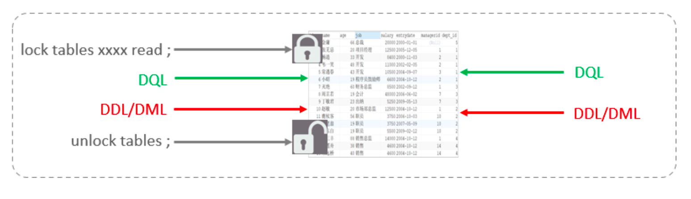

左侧为客户端一，对指定表加了读锁，不会影响右侧客户端二的读，但是会阻塞右侧客户端的写。

测试:

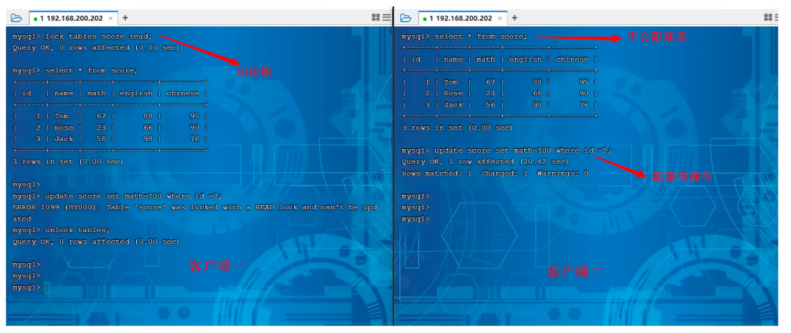

B. 写锁

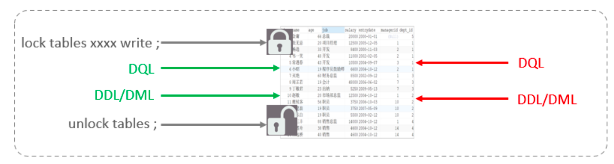

左侧为客户端一，对指定表加了写锁，会阻塞右侧客户端的读和写。 

测试:

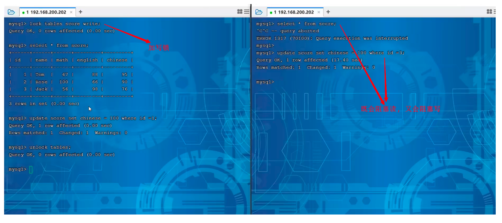

> 结论: 读锁不会阻塞其他客户端的读，但是会阻塞写。写锁既会阻塞其他客户端的读，又会阻塞 其他客户端的写。

#### 4.2.3 **元数据锁**

java.lang.reflect.InvocationTargetException
	at sun.reflect.NativeMethodAccessorImpl.invoke0(Native Method)
	at sun.reflect.NativeMethodAccessorImpl.invoke(NativeMethodAccessorImpl.java:62)
	at sun.reflect.DelegatingMethodAccessorImpl.invoke(DelegatingMethodAccessorImpl.java:43)
	at java.lang.reflect.Method.invoke(Method.java:498)
	at com.womi.java.modules.cp.execute.ScheduleJob.executeInternal(ScheduleJob.java:79)
	at org.springframework.scheduling.quartz.QuartzJobBean.execute(QuartzJobBean.java:75)
	at org.quartz.core.JobRunShell.run(JobRunShell.java:202)
	at org.quartz.simpl.SimpleThreadPool$WorkerThread.run(SimpleThreadPool.java:573)
Caused by: java.lang.NullPointerException
	at com.womi.java.modules.cp.service.impl.WecomAddMsgTemplateServiceImpl.removeById(WecomAddMsgTemplateServiceImpl.java:584)
	at com.womi.java.modules.cp.service.impl.WecomAddMsgTemplateServiceImpl.pause(WecomAddMsgTemplateServiceImpl.java:361)
	at com.womi.java.modules.cp.service.impl.WecomAddMsgTemplateServiceImpl$$FastClassBySpringCGLIB$$f8b51182.invoke(<generated>)
	at org.springframework.cglib.proxy.MethodProxy.invoke(MethodProxy.java:218)
	at org.springframework.aop.framework.CglibAopProxy$CglibMethodInvocation.invokeJoinpoint(CglibAopProxy.java:771)
	at org.springframework.aop.framework.ReflectiveMethodInvocation.proceed(ReflectiveMethodInvocation.java:163)
	at org.springframework.aop.framework.CglibAopProxy$CglibMethodInvocation.proceed(CglibAopProxy.java:749)
	at org.springframework.transaction.interceptor.TransactionAspectSupport.invokeWithinTransaction(TransactionAspectSupport.java:366)
	at org.springframework.transaction.interceptor.TransactionInterceptor.invoke(TransactionInterceptor.java:118)
	at org.springframework.aop.framework.ReflectiveMethodInvocation.proceed(ReflectiveMethodInvocation.java:186)
	at org.springframework.aop.framework.CglibAopProxy$CglibMethodInvocation.proceed(CglibAopProxy.java:749)
	at org.springframework.aop.framework.CglibAopProxy$DynamicAdvisedInterceptor.intercept(CglibAopProxy.java:691)
	at com.womi.java.modules.cp.service.impl.WecomAddMsgTemplateServiceImpl$$EnhancerBySpringCGLIB$$4875d6ce.pause(<generated>)
	at com.womi.java.modules.cp.task.WecomTask.run(WecomTask.java:50)
	... 8 more

