# Mysql基础

## 1.SQL

### 1.1 **SQL分类**

SQL语句，根据其功能，主要分为四类:DDL、DML、DQL、DCL。

### 1.2 DDL

Data Definition Language，数据定义语言，用来定义数据库对象(数据库，表，字段) 。

#### **1.2.1 数据库操作**

**1).** **查询所有数据库**

~~~sql
show databases;
~~~

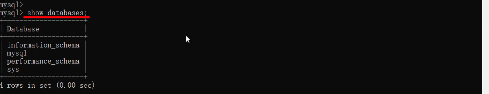

**2).** **查询当前数据库**

~~~sql
select database() ;
~~~

**3).** **创建数据库**

~~~sql
create database [ if not exists ] 数据库名 [ default charset 字符集 ] [ collate 排序 规则 ] 
~~~

**4).** **删除数据库**

~~~sql
drop database [ if exists ] 数据库名 ;
~~~

**5).** **切换数据库**

~~~sql
use 数据库名 ;
~~~

#### **1.2.2** **表操作** 

##### **1.2.2.1 表操作查询创建**

**1).** **查询当前数据库所有表**

~~~sql
show tables;
~~~

**2).** **查看指定表结构**

~~~sql
desc 表名 ;
~~~

**3).** **查询指定表的建表语句**

~~~sql
show create table 表名 ;
~~~

**4).** **创建表结构**

~~~sql
CREATE TABLE 表名(
  字段1 字段1类型  [ COMMENT 字段1注释 ],
  字段2 字段2类型  [ COMMENT 字段2注释 ],
  字段3 字段3类型  [ COMMENT 字段3注释 ],
  ......
  字段n 字段n类型  [ COMMENT 字段n注释 ]
) [ COMMENT 表注释 ] ;
~~~

> 注意: [...] 内为可选参数，最后一个字段后面没有逗号

##### **1.2.2.2** **表操作数据类型**

**1). 数值类型**

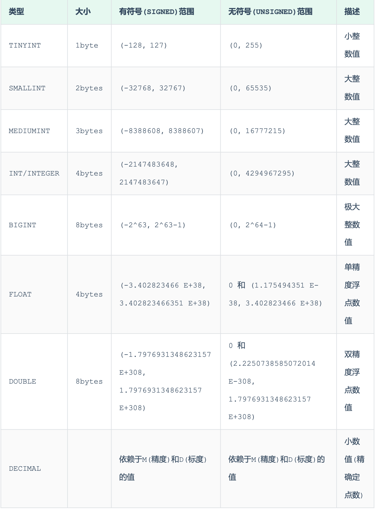

2). 字符串类型

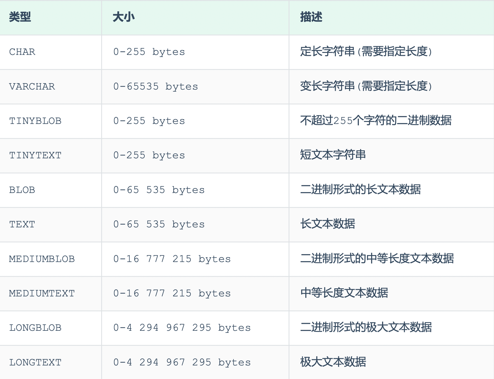

char 与 varchar 都可以描述字符串，char是定长字符串，指定长度多长，就占用多少个字符，和 字段值的长度无关 。而varchar是变长字符串，指定的长度为最大占用长度 。相对来说，char的性 能会更高些。

3). 日期时间类型

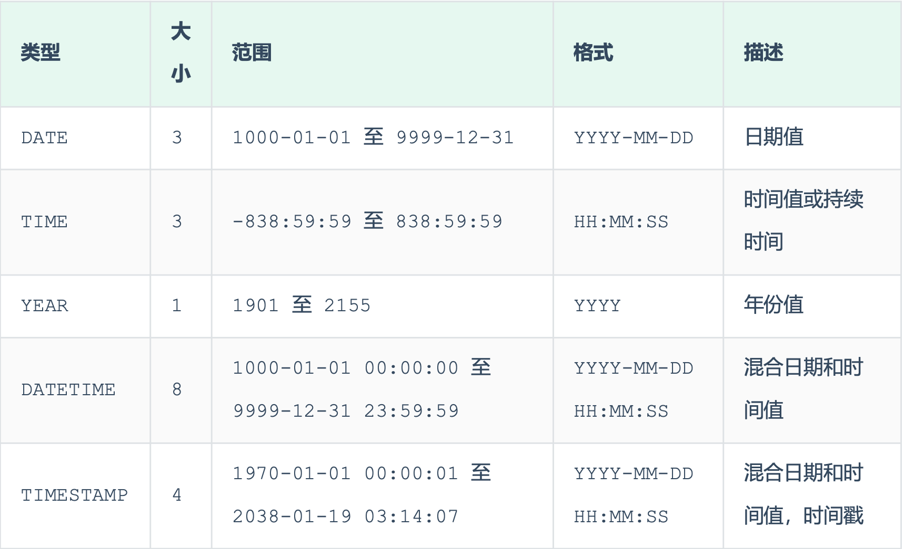

##### **1.2.2.3 表操作修改**

1). 添加字段

~~~sql
ALTER  TABLE 表名 ADD 字段名 类型 (长度) [COMMENT 注释 ] [ 约束 ];
~~~

2). 修改数据类型

~~~sql
ALTER TABLE 表名 MODIFY 字段名 新数据类型 (长度);
~~~

3). 修改字段名和字段类型

~~~sql
ALTER TABLE 表名 CHANGE 旧字段名 新字段名 类型 (长度) [ COMMENT 注释 ] [ 约束 ];
~~~

4). 删除字段

~~~sql
ALTER TABLE 表名 DROP 字段名;
~~~

5). 修改表名

~~~sql
ALTER TABLE 表名 RENAME TO 新表名;
~~~

##### **1.2.2.4 表操作删除**

1). 删除表

~~~sql
DROP TABLE [ IF EXISTS ] 表名;
~~~

2). 删除指定表, 并重新创建表

~~~sql
TRUNCATE TABLE 表名;
~~~

> 注意: 在删除表的时候，表中的全部数据也都会被删除。

### 1.3DML

DML英文全称是Data Manipulation Language(数据操作语言)，用来对数据库中表的数据记录进 行增、删、改操作。

-  添加数据(INSERT) 

- 修改数据(UPDATE) 

- 删除数据(DELETE)

#### 1.3.1 添加数据

**1).** **给指定字段添加数据**

~~~sql
INSERT INTO 表名 (字段名1, 字段名2, ...) VALUES (值1, 值2, ...);
~~~

**2).** **给全部字段添加数据**

~~~sql
INSERT INTO 表名 VALUES (值1, 值2, ...);
~~~

**3).** **批量添加数据**

~~~sql
INSERT INTO 表名 (字段名1, 字段名2, ...) VALUES (值1, 值2, ...), (值1, 值2, ...), (值 1, 值2, ...) ;
~~~

~~~sql
INSERT INTO 表名 VALUES (值1, 值2, ...), (值1, 值2, ...), (值1, 值2, ...) ;
~~~

#### 1.3.2 **修改数据**

修改数据的具体语法为:

~~~sql
UPDATE 表名 SET 字段名1= 值1, 字段名2= 值2,....[WHERE 条件 ];
~~~

> 注意事项: 修改语句的条件可以有，也可以没有，如果没有条件，则会修改整张表的所有数据。

#### 1.3.3 删除数据

删除数据的具体语法为:

~~~sql
DELETE FROM 表名 [WHERE 条件 ];
~~~

> 注意事项:
>
> - DELETE 语句的条件可以有，也可以没有，如果没有条件，则会删除整张表的所有数据。
> - DELETE 语句不能删除某一个字段的值(可以使用UPDATE，将该字段值置为NULL即可)。
> - 当进行删除全部数据操作时，datagrip会提示我们，询问是否确认删除，我们直接点击 Execute即可

### 1.4DQL

DQL英文全称是Data Query Language(数据查询语言)，数据查询语言，用来查询数据库中表的记 录。

查询关键字: SELECT

#### 1.4.1 **基本语法**

DQL 查询语句，语法结构如下:

~~~sql
SELECT
	字段列表 
FROM
	表名列表 
WHERE
	条件列表 
GROUP BY
	分组字段列表 
HAVING
	分组后条件列表 
ORDER BY
	排序字段列表 
	LIMIT 分页参数
~~~

#### 1.4.2 **基础查询**

**1).** **查询多个字段**

~~~sql
SELECT 字段1, 字段2, 字段3 ... FROM 表名 ;
~~~

~~~sql
SELECT * FROM 表名;
~~~

> 注意 : * 号代表查询所有字段，在实际开发中尽量少用(不直观、影响效率)。

**2).** **字段设置别名**

~~~sql
SELECT 字段1 [AS 别名1], 字段2 [AS 别名2] ... FROM 表名;
~~~

~~~sql
SELECT 字段1 [ 别名1], 字段2 [ 别名2] ... FROM 表名;
~~~

**3).** **去除重复记录**

~~~sql
SELECT DISTINCT 字段列表 FROM 表名;
~~~

#### 1.4.3 **条件查询**

**1).** **语法**

~~~sql
SELECT 字段列表 FROM 表名 WHERE 条件列表 ;
~~~

**2).** **条件**

常用的比较运算符如下:

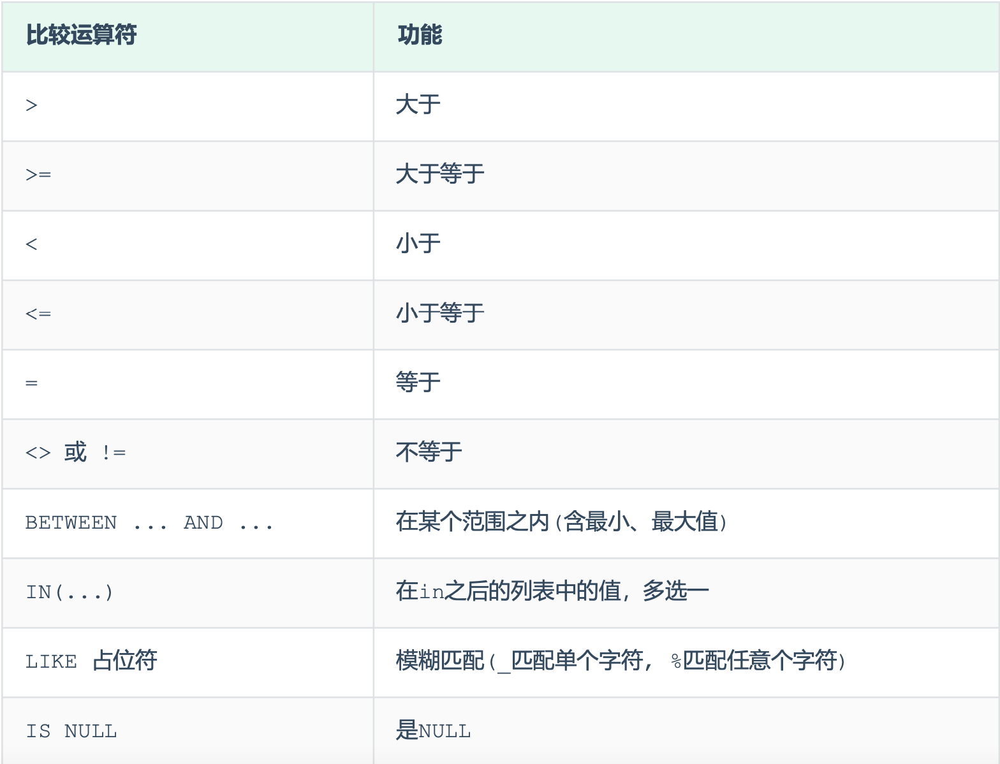

常用的逻辑运算符如下:

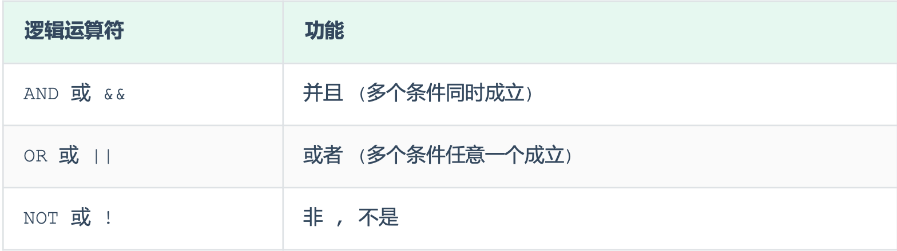

案例:
 A. 查询年龄等于 88 的员工

~~~sql
select * from emp where age = 88;
~~~

B. 查询年龄小于 20 的员工信息

~~~sql
select * from emp where age < 20;
~~~

C.查询年龄小于等于 20 的员工信息

~~~sql
select * from emp where age <= 20;
~~~

 D. 查询没有身份证号的员工信息

~~~sql
select * from emp where idcard is null;
~~~

 E. 查询有身份证号的员工信息

~~~sql
select * from emp where idcard is not null;
~~~

 F. 查询年龄不等于 88 的员工信息

~~~sql
select * from emp where age != 88;
select * from emp where age <> 88;
~~~

 G. 查询年龄在15岁(包含) 到 20岁(包含)之间的员工信息

~~~sql
select * from emp where age >= 15 && age <= 20;
select * from emp where age >= 15 and age <= 20;
select * from emp where age between 15 and 20;
~~~

 H.查询性别为 女 且年龄小于 25岁的员工信息

~~~sql
select * from emp where gender = '女' and age < 25;
~~~

 I. 查询年龄等于18 或 20 或 40 的员工信息

~~~sql
select * from emp where age = 18 or age = 20 or age =40;
select * from emp where age in(18,20,40);
~~~

 J. 查询姓名为两个字的员工信息 _ %

~~~sql
select * from emp where name like '__';
~~~

 K. 查询身份证号最后一位是X的员工信息

~~~sql
select * from emp where idcard like '%X';
select * from emp where idcard like '_________________X';
~~~

 #### 1.4.4 **聚合函数**

将一列数据作为一个整体，进行纵向计算 。

2). 常见的聚合函数

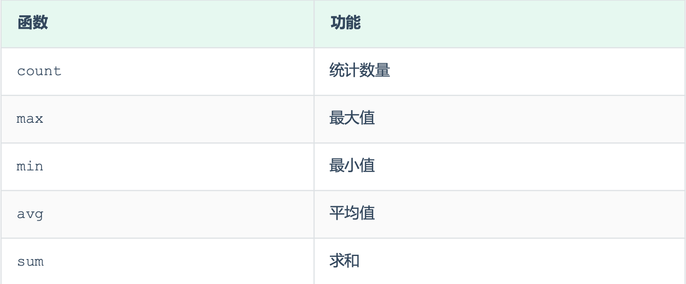

3). 语法

~~~sql
SELECT 聚合函数(字段列表) FROM 表名 ;
~~~

> 注意 : NULL值是不参与所有聚合函数运算的。

A. 统计该企业员工数量

~~~sql
select count(*) from emp; -- 统计的是总记录数
select count(idcard) from emp; -- 统计的是idcard字段不为null的记录数
select count(1) from emp;
~~~

B. 统计该企业员工的平均年龄

~~~sql
select avg(age) from emp;
~~~

C. 统计该企业员工的最大年龄

~~~sql
select max(age) from emp;
~~~

D.统计该企业员工的最小年龄

~~~sql
select min(age) from emp;
~~~

E.统计西安地区员工的年龄之和

~~~sql
select sum(age) from emp where workaddress = '西安';
~~~

#### 1.4.5 **分组查询**

1). 语法

~~~sql
SELECT 字段列表 FROM 表名 [ WHERE 条件 ] GROUP BY 分组字段名 [ HAVING 分组 后过滤条件 ];
~~~

2). where与having区别

- 执行时机不同:where是分组之前进行过滤，不满足where条件，不参与分组;而having是分组 之后对结果进行过滤。
- 判断条件不同:where不能对聚合函数进行判断，而having可以。

> 注意事项:
>
> - 分组之后，查询的字段一般为聚合函数和分组字段，查询其他字段无任何意义。
> - 执行顺序: where > 聚合函数 > having 。
> - 支持多字段分组, 具体语法为 : group by columnA,columnB

案例:
 A. 根据性别分组 , 统计男性员工 和 女性员工的数量

~~~sql
select gender, count(*) from emp group by gender ;
~~~

B. 根据性别分组 , 统计男性员工 和 女性员工的平均年龄

~~~sql
select gender, avg(age) from emp group by gender ;
~~~

C. 查询年龄小于45的员工 , 并根据工作地址分组 , 获取员工数量大于等于3的工作地址

~~~sql
select workaddress, count(*) address_count from emp where age < 45 group by workaddress having address_count >= 3;
~~~

D. 统计各个工作地址上班的男性及女性员工的数量

~~~sql
select workaddress, gender, count(*) '数量' from emp group by gender , workaddress ;
~~~

#### 1.4.6 **排序查询**

1). 语法

~~~sql
SELECT 字段列表 FROM 表名 ORDER BY 字段1 排序方式1 , 字段2 排序方式2 ;
~~~

2). 排序方式

-  ASC : 升序(默认值)
- DESC: 降序

> 注意事项:
>  • 如果是升序, 可以不指定排序方式ASC ;
>  • 如果是多字段排序，当第一个字段值相同时，才会根据第二个字段进行排序 ;

案例:
 A. 根据年龄对公司的员工进行升序排序

~~~sql
select * from emp order by age asc;
select * from emp order by age;
~~~

B. 根据入职时间, 对员工进行降序排序

~~~sql
 select * from emp order by entrydate desc;
~~~

C. 根据年龄对公司的员工进行升序排序 , 年龄相同 , 再按照入职时间进行降序排序

~~~sql
select * from emp order by age asc , entrydate desc;
~~~

#### 1.4.7 分页查询

1). 语法

~~~sql
SELECT 字段列表 FROM 表名 LIMIT 起始索引, 查询记录数 ;
~~~

> 注意事项:
>  • 起始索引从0开始，起始索引 = (查询页码 - 1)* 每页显示记录数。
>  • 分页查询是数据库的方言，不同的数据库有不同的实现，MySQL中是LIMIT。 • 如果查询的是第一页数据，起始索引可以省略，直接简写为 limit 10。

案例:
 A. 查询第1页员工数据, 每页展示10条记录

~~~sql
select * from emp limit 0,10;
select * from emp limit 10;
~~~

B. 查询第2页员工数据, 每页展示10条记录 --------> (页码-1)*页展示记录数

~~~sql
select * from emp limit 10,10;
~~~

#### 1.4.8 **案例**

1). 查询年龄为20,21,22,23岁的员工信息。

~~~sql
select * from emp where gender = '女' and age in(20,21,22,23);
~~~

2). 查询性别为 男 ，并且年龄在 20-40 岁(含)以内的姓名为三个字的员工。

~~~sql
select * from emp where gender = '男' and ( age between 20 and 40 ) and name like '___';
~~~

3). 统计员工表中, 年龄小于60岁的 , 男性员工和女性员工的人数。

~~~sql
select gender, count(*) from emp where age < 60 group by gender;
~~~

4). 查询所有年龄小于等于35岁员工的姓名和年龄，并对查询结果按年龄升序排序，如果年龄相同按 入职时间降序排序。

~~~sql
select name , age from emp where age <= 35 order by age asc , entrydate desc;
~~~

5). 查询性别为男，且年龄在20-40 岁(含)以内的前5个员工信息，对查询的结果按年龄升序排序，年龄相同按入职时间升序排序。

~~~sql
select * from emp where gender = '男' and age between 20 and 40 order by age asc , entrydate asc limit 5 ;
~~~

#### 1.4.9 **执行顺序**

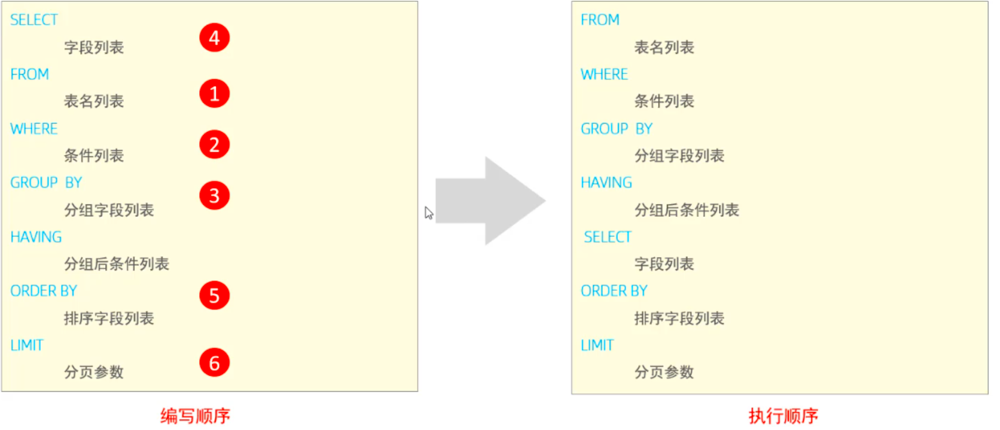

验证: 查询年龄大于15的员工姓名、年龄，并根据年龄进行升序排序。

~~~sql
select name , age from emp where age > 15 order by age asc;
~~~

在查询时，我们给emp表起一个别名 e，然后在select 及 where中使用该别名。

~~~sql
select e.name , e.age from emp e where e.age > 15 order by age asc;
~~~

### 1.5DCL

DCL英文全称是**Data Control Language**(数据控制语言)，用来管理数据库用户、控制数据库的访 问权限。

#### 1.5.1  **管理用户**

1). 查询用户

~~~sql
select * from mysql.user;
~~~

查询的结果如下:

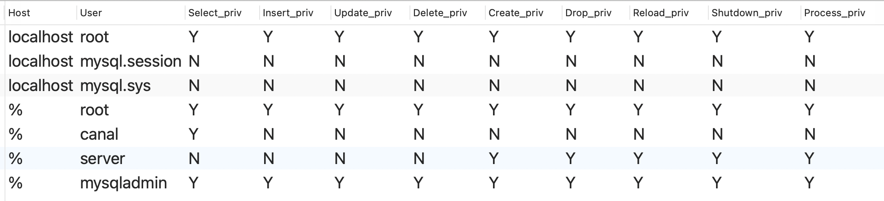

其中 Host代表当前用户访问的主机, 如果为localhost, 仅代表只能够在当前本机访问，是不可以 远程访问的。 User代表的是访问该数据库的用户名。在MySQL中需要通过Host和User来唯一标识一 个用户。

2). 创建用户

~~~sql
CREATE USER '用户名'@'主机名' IDENTIFIED BY '密码';
~~~

3). 修改用户密码

~~~sql
ALTER USER '用户名'@'主机名' IDENTIFIED WITH mysql_native_password BY '新密码' ;
~~~

4). 删除用户

~~~sql
DROP USER '用户名'@'主机名' ;
~~~

> 注意事项:
>
> -  在MySQL中需要通过用户名@主机名的方式，来唯一标识一个用户。
> - 主机名可以使用 % 通配。
> - 这类SQL开发人员操作的比较少，主要是DBA( Database Administrator 数据库 管理员)使用。

A. 创建用户canal, 只能够在当前主机localhost访问, 密码123456;

~~~sql
create user 'canal'@'localhost' identified by '123456';
~~~

B. 创建用户walter, 可以在任意主机访问该数据库, 密码123456; 

~~~sql
create user 'walter'@'%' identified by '123456';
~~~

C. 修改用户walter的访问密码为1234;

~~~sql
alter user 'walter'@'%' identified with mysql_native_password by '1234';
~~~

D. 删除 canal@localhost 用户

~~~sql
drop user 'canal'@'localhost';
~~~

#### 1.5.2 **权限控制**

MySQL中定义了很多种权限，但是常用的就以下几种:

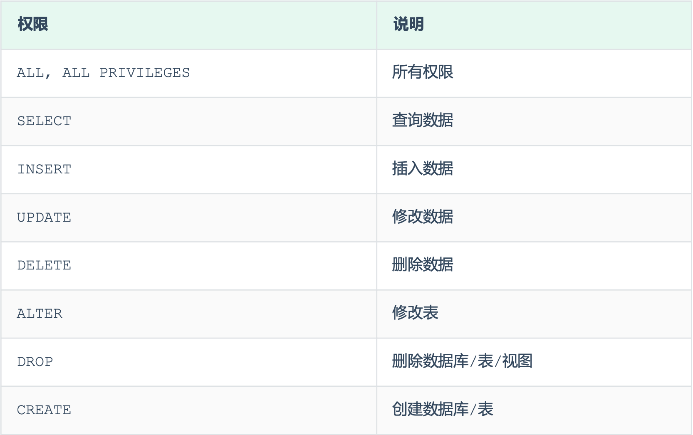

上述只是简单罗列了常见的几种权限描述，其他权限描述及含义，可以直接参考 **官方文档https://dev.mysql.com/doc/refman/8.0/en/privileges-provided.html** 。

1). 查询权限

~~~sql
 SHOW GRANTS FOR '用户名'@'主机名' ;
~~~

2). 授予权限

~~~sql
GRANT 权限列表 ON 数据库名.表名 TO '用户名'@'主机名';
~~~

3). 撤销权限

~~~sql
REVOKE 权限列表 ON 数据库名.表名 FROM '用户名'@'主机名';
~~~

> 注意事项:
>
> - 多个权限之间，使用逗号分隔
> - 授权时， 数据库名和表名可以使用 * 进行通配，代表所有。

案例:
 A. 查询 'walter'@'%' 用户的权限

~~~SQL
show grants for 'walter'@'%';
~~~

B. 授予 'walter'@'%' 用户user数据库所有表的所有操作权限

~~~sql
grant all on user.* to 'walter'@'%';
~~~

C. 撤销 'walter'@'%' 用户的user数据库的所有权限

~~~sql
revoke all on user.* from 'walter'@'%';
~~~

## 2.  **函数**

MySQL中的函数主要分为以下四类: 字符串函数、数值函数、日期函数、流程函数。

#### 2.1  **字符串函数**

MySQL中内置了很多字符串函数，常用的几个如下:

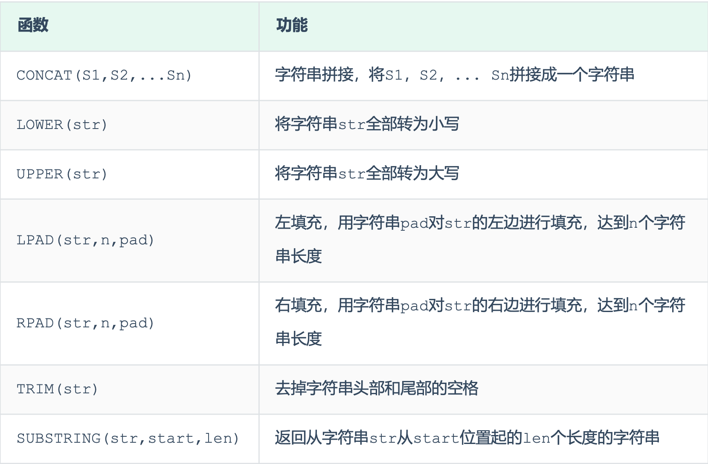

演示如下:

1. concat : 字符串拼接 

   ~~~sql
   select concat('Hello' , ' MySQL');
   ~~~

2. lower : 全部转小写

   ~~~sql
   select lower('Hello');
   ~~~

3. upper : 全部转大写

   ~~~sql
    select upper('Hello');
   ~~~

4. lpad : 左填充

   ~~~sql
   select lpad('01', 5, '-');
   ~~~

5. rpad : 右填充

   ~~~sql
   select rpad('01', 5, '-');
   ~~~

6. trim : 去除空格

   ~~~sql
   select trim(' Hello MySQL ');
   ~~~

7. substring : 截取子字符串

   ~~~sql
   select substring('Hello MySQL',1,5);
   ~~~

#### 2.2 **数值函数**

常见的数值函数如下: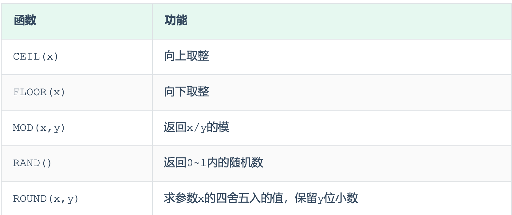

A. ceil:向上取整

~~~sql
select ceil(1.1);
~~~

B. floor:向下取整

~~~sql
select floor(1.9);
~~~

C. mod:取模

~~~sql
select mod(7,4);
~~~

D. rand:获取随机数

~~~sql
select rand();
~~~

E. round:四舍五入

~~~sql
select round(2.344,2);
~~~

#### 2.3 **日期函数**

常见的日期函数如下:

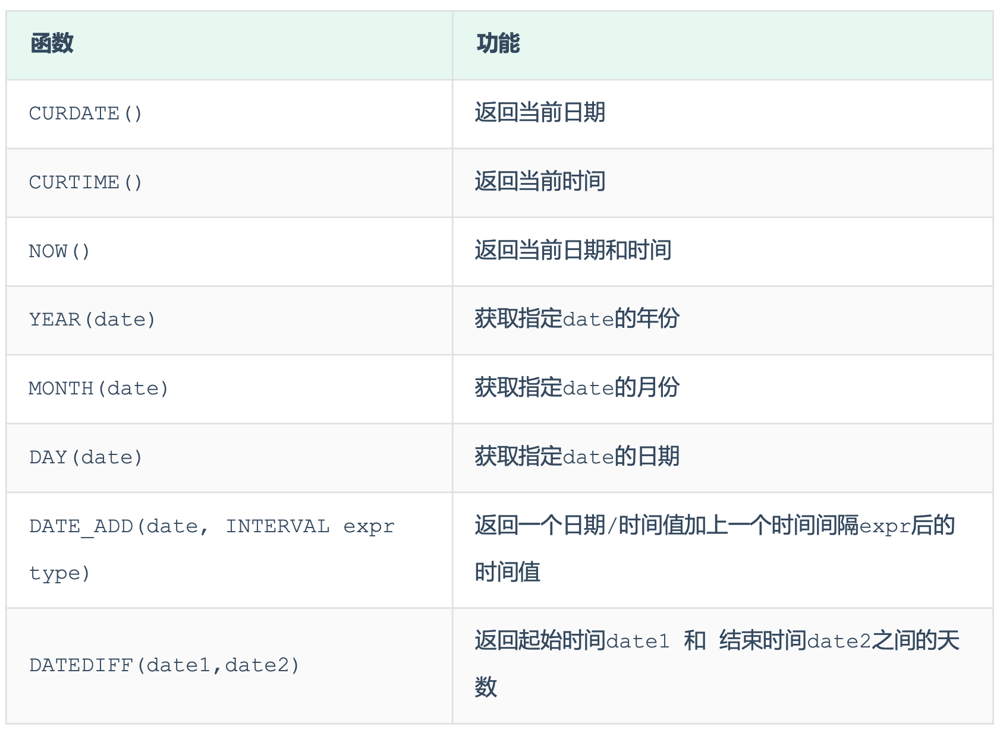

演示如下:
 A. curdate:当前日期

~~~sql
select curdate();
~~~

B. curtime:当前时间

~~~sql
select curtime();
~~~

C. now:当前日期和时间

~~~sql
select now();
~~~

D. YEAR , MONTH , DAY:当前年、月、日

~~~sql
select YEAR(now());
select MONTH(now());
select DAY(now());
~~~

E. date_add:增加指定的时间间隔

~~~sql
select date_add(now(), INTERVAL 70 YEAR );
~~~

F. datediff:获取两个日期相差的天数

~~~sql
select datediff('2021-10-01', '2021-12-01');
~~~

**3.4** **流程函数**

流程函数也是很常用的一类函数，可以在SQL语句中实现条件筛选，从而提高语句的效率。

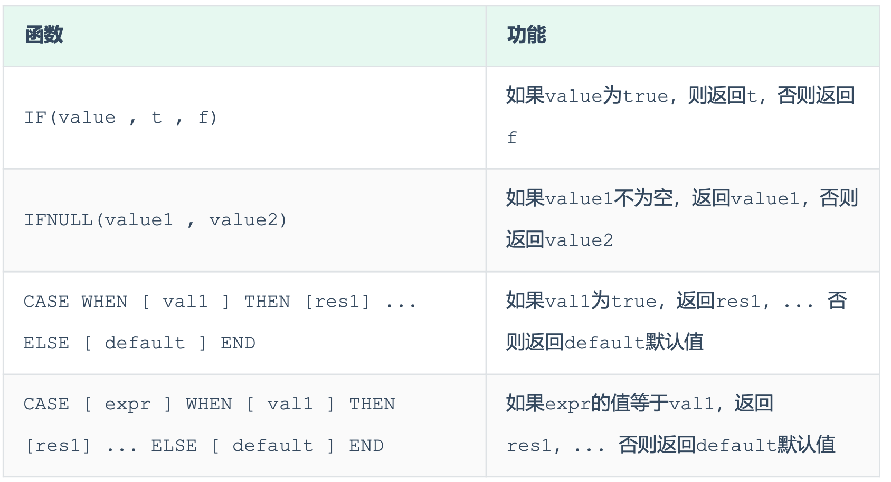

演示如下:

A. if

~~~sql
select if(false, 'Ok', 'Error');
~~~

B. ifnull

~~~sql
select ifnull('Ok','Default');
select ifnull('','Default');
select ifnull(null,'Default');
~~~

C. case when then else end
 需求: 查询emp表的员工姓名和工作地址 (北京/上海 ----> 一线城市 , 其他 ----> 二线城市)

~~~sql
select
name,
( case workaddress when '北京' then '一线城市' when '上海' then '一线城市' else '二线城市' end ) as '工作地址'
from emp;
~~~

## 3 事务

#### 3.1 **事务四大特性**

- 原子性(Atomicity):事务是不可分割的最小操作单元，要么全部成功，要么全部失败。 
- 一致性(Consistency):事务完成时，必须使所有的数据都保持一致状态。
-  隔离性(Isolation):数据库系统提供的隔离机制，保证事务在不受外部并发操作影响的独立 环境下运行。 
- 持久性(Durability):事务一旦提交或回滚，它对数据库中的数据的改变就是永久的。

#### 3.2 **事务隔离级别**

为了解决并发事务所引发的问题，在数据库中引入了事务隔离级别。主要有以下几种: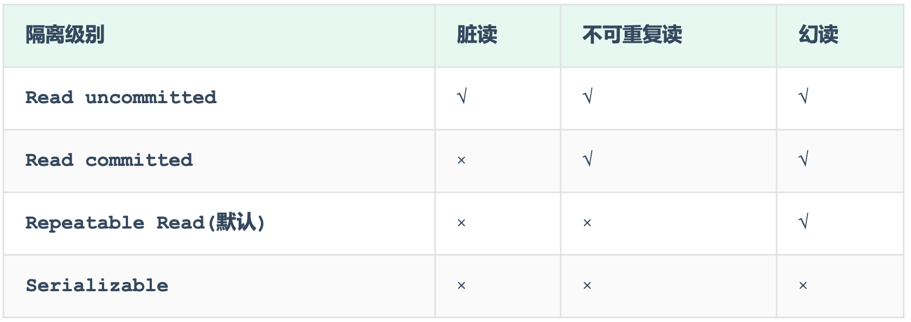

1). 查看事务隔离级别

~~~sql
SELECT @@TRANSACTION_ISOLATION;
~~~

2). 设置事务隔离级别

~~~sql
SET [ SESSION | GLOBAL ] TRANSACTION ISOLATION LEVEL { READ UNCOMMITTED | READ COMMITTED | REPEATABLE READ | SERIALIZABLE }
~~~

> 注意:事务隔离级别越高，数据越安全，但是性能越低。

